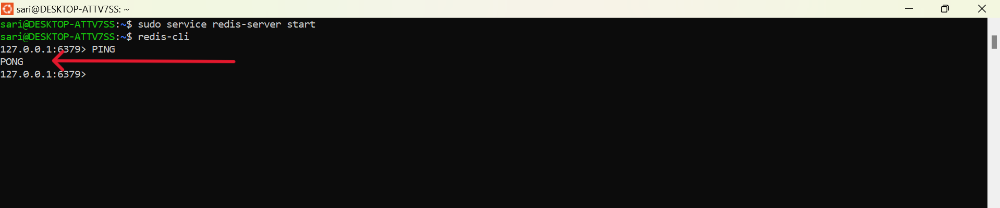

# Caching Using Redis
**Redis** ( **RE**mote **DI**ctionary **S**erver ) is an open-source, in-memory data structure store that can be used as a database, cache, and message broker. Renowned for its exceptional speed and flexibility, Redis is ideal for real-time applications where low latency and high performance are critical. It supports a variety of data structures, including strings, hashes(key-), lists, sets, and sorted sets, enabling developers to address diverse use cases efficiently. Additionally, Redis offers features like persistence, publish-subscribe messaging, replication, and clustering, making it a versatile tool for modern applications. 


Trusted by leading companies such as Twitter, Pinterest, GitHub, and StackOverflow, Redis has become a popular choice for scenarios requiring fast data access and scalable solutions. Its ability to combine simplicity with powerful functionality makes it a cornerstone in the world of high-performance computing.


## Installation

### Step 1 : Install WSL  ( Windows Subsystem for Linux )
- Redis is designed for Linux environments, and WSL allows it to run natively on Windows without any porting issues. 
- It allows us to run a Linux environment directly on our Windows machine without the need for a virtual machine or dual boot. 
- It provides a lightweight and seamless way to run Linux tools and applications alongside your Windows setup.

- Open PowerShell as Administrator and enable WSL :
    ```
        wsl --install
    ```
    This will install WSL with the default Linux distribution (usually Ubuntu)

    

### Step 2 : Open WSL Terminal

- Ubuntu Installed
    

- After installation, open WSL terminal by searching for "Ubuntu" or the Linux distribution installed.

    

### Step 3 : Update Linux Packages

- Update the package manager inside WSL

    ```
        sudo apt update
    ```
    

- Upgrade the package manager inside WSL

    - Run the below command

        ```
            sudo apt upgrade
        ```
        
    
    - Type **"Y"** and press **Enter**

        

### Step 4 : Install Redis

- Install Redis:
    ```
        sudo apt install redis-server
    ```
    

- Type the *password* and press **Enter**

    

### Step 5 : Start Redis

- After installation, start the Redis server

    ```
        sudo service redis-server start
    ```

    

### Step 6 : Verify Redis Installation

- Check if Redis is running

    ```
        redis-cli
    ```
    

- Once in the Redis-CLI, type `PING`

    ```
        PING
    ```

    If everything is set up correctly, it will respond with `PONG`

    

## Using Redis with Node.js

The project we are going to implement integrates Redis caching into a NodeJS app to improve performance and reduce API calls. It checks Redis for cached GitHub user data and fetches from the GitHub API `(https://api.github.com/users/:username)` if not cached, storing the result with a 1-hour expiration. 

Here is a step-by-step guide:

### Step 1 : Setup a basic Node.js App

```    
    npm init -y
```

Now, create **app.js** file for the Node.js backend server.

```
    // File : app.js

    const express=require("express")
    const app=express()
    const PORT=8080
    app.use(express.json())

    app.listen(PORT,(err)=>{
        if(err){
            console.log(err)
        }
        else{
            console.log(`Listening on PORT: ${PORT}`)
        }
    })
```

### Step 2 : Install the required dependencies

```
    npm i express               // To run a Node.js server
    npm i axios                // To make HTTP requests from the server
    npm i redis               // To integrate Redis as a caching mechanism
    //  or
    npm i express axios redis       // both will work

```

Updated dependencies in the **package.json** file 

```
    "dependencies": {
    "axios": "^1.7.9",
    "express": "^4.21.2",
    "redis": "^4.7.0"
  }
```

### Step 3 : Connect to Redis

- **Import Required Modules**

    ```
        // File : app.js

        const { createClient } = require('redis');
    ```
    `Redis` provides Redis client functionalities for connecting and interacting with a Redis server

- **Set Up the Redis Client**

    ```
        // File : app.js

        const client = createClient();
    ```
    `Client` creates a Redis client instance to interact with the Redis server.

- **Connecting to Redis Server**

    ```
        //File : app.js

        // This immediately executes an asynchronous function.

        (async () => {
            try {
                await client.connect();
                console.log('Connected to Redis');
            } catch (error) {
                console.error('Failed to connect to Redis:', error);
            }
        })();
    ```

    `client.connect()` establishes a connection to the Redis server.

### Step 4 : Make a GitHub API Route

- **Define the Route**

    The route `/github/:username` listens for incoming `GET` requests with a GitHub username parameter `(:username)`.

- **Check Cache for Existing Data**

    We need to check if the data for the given username already exists in Redis before fetching it from `GitHub`.
    For this we will write a middleware `checkCache`. 
    - This middleware intercepts incoming requests before the main route handler.
    - It checks if the requested GitHub user’s data is already cached in Redis.
    - If cached, data is retrieved from Redis and sent as the response with a source indicator `('cache')`.
    - If not cached the request is passed to the next middleware/route handler using `next()`.

    ```
        // File : app.js

        const checkCache = async (req, res, next) => {
            // Extract the GitHub username(passed as params) from the URL
            const { username } = req.params;

            try {
                // Check if the username exists in the Redis cache
                const cachedData = await client.get(username);

                if (cachedData) {
                    // If data exists in cache, return it with the source as 'cache'
                    return res.status(200).json({
                        source: 'cache',
                        data: JSON.parse(cachedData)  // Redis stores data as strings, so parse it back to JSON
                    });
                }
                // If no cache found, proceed to the route and fetch from API
                next();
            } catch (err) {
                console.error('Error checking cache:', err);
                // If error occurs, proceed to the route and fetch from API
                next();
            }
        };
    ```

- **Fetch Data from GitHub API using axios**

    If the data is not found in the cache, the server sends a request to the `GitHub API` using `axios` to fetch the user data for the provided username.

- **Store Data in Redis Cache**

    - Once the GitHub data is fetched, it is stored in the Redis cache using the `client.set` method. 
    - The data is stored with a **1-hour expiration time** `(EX: 3600 seconds)`
    - The data is stored with a condition that it should only be set if it does not already exist `(NX: true)`

- **Send Response to Client**
    
    After successfully storing the data in the cache, the server sends a response to the client, indicating the source of the data `(API)` and including the user data in the response body.

- **Handle Errors**

    If there’s an error during the API request or Redis operation, an error message is logged and a `500 Internal Server Error` response is sent to the client.


```
    // File : app.js

    // defining the route 
    app.get('/github/:username', checkCache, async (req, res) => {
        const { username } = req.params;
        try {
            // Fetching Data from GitHub API using axios
            const response = await axios.get(`https://api.github.com/users/${username}`);

            // Store the response in Redis with an expiration time of 1 hour (3600 seconds)

            await client.set(username, JSON.stringify(response.data), {
            EX: 3600,      // 1hr of expiration time
            NX: true       // data should only be set if it does not already exist in cache
            });
        
            // Sending Response to Client with source as API
            res.status(200).json({
            source: 'api',
            data: response.data,
            });
        } catch (err) {
            // Handling Errors
            console.error('Error fetching data:', err);
            res.status(500).json({ error: 'Internal Server Error' });
        }
    });
```

### Step 5 : Run the Application

- **Start the Redis Server** 

    - **Open WSL terminal by searching for "Ubuntu" or the Linux distribution installed.**
        
        

    - **Start the Redis server.**

        ```
            sudo service redis-server start
        ```

        

- **Start the NODE server.**

    ```
        nodemon app
    ```
    

- **Open *Postman or Insomnia* to test the route.**

    

- **Make a GET request for the same username to the endpoint (http://localhost:8080/github/:username)**

    

- **Make a GET request again for the same username to the endpoint (http://localhost:8080/github/:username)**

    

### Step 6 : Testing and Debugging

1. **Handling 404 Errors (Page Not Found)** : 
    
    For routes that don’t exist, send a 404 response to indicate the resource isn’t found.

    ```
        // File : /app.js

        // Handling 404 Errors (Page Not Found)
        app.use((req, res, next) => {
            res.status(404).json({ error: 'Page not found' });
        });
    ```

2. **Basic Error-Handling Middleware** : 
    
    Set up a basic error-handling middleware that catches all errors and sends a response to the user.

    ```
        // File : /app.js

        // General error handling middleware
        app.use((err, req, res, next) => {
            console.error(err)                  // Optionally log the error for debugging
            res.status(500).json({ error: 'Something went wrong!' })
        })
    ```
3. **Verify whether the Redis Server is running or not** :

    - Run this command

        ```
            redis-cli
        ```

    - Once in the Redis-CLI, type `PING`

        ```
            PING
        ```

        If everything is set up correctly, it will respond with `PONG`

    

4. **If Redis Server is not running, Error occur will be** :

    


5. **Return Meaningful Error Messages** : 

    If there’s an error, provide a user-friendly message without exposing sensitive information.


## Implementation (refer GitHub Repo)

[GITHUB LINK](https://github.com/sarikasingh30/code_skiller_CB/tree/main/caching-using-Redis/implementation)


## References and Resources

### Links 
- [Redis Documentation](https://redis.io/docs/latest/develop/clients/nodejs/)
- [NodeJS Official Documentation](https://nodejs.org/docs/latest/api/)
- [Express Documentation](https://expressjs.com/)
- [Redis NPM Package](https://www.npmjs.com/package/redis)
- [Axios Documentation](https://axios-http.com/docs/intro)
- [Axios NPM package](https://www.npmjs.com/package/axios)

### FAQs (Frequently Asked Questions)

1. **How can Redis help in improving application performance?**
    
    Redis helps by storing frequently accessed data in memory, reducing the need to fetch it from slower sources like databases or external APIs. This significantly speeds up response times and reduces the load on your backend systems.

2. **Why use Redis with Node.js?**

    Redis integrates well with Node.js due to its asynchronous nature, allowing efficient caching, session management, and real-time data storage. By using Redis, you can reduce frequent database queries, cache API responses, and improve performance.

3. **How long does the data stay in Redis?**

    The data is stored in Redis with an expiration time, meaning it will automatically be removed after the specified time. In the example provided, the cached GitHub data expires after 1 hour (3600 seconds).

4. **What happens if the same data is already cached in Redis?**

    Redis only stores new data if it doesn't already exist, thanks to the `NX (set only if not exists)` option. If the data is already cached, it will not be overwritten, ensuring that the cache remains efficient and up to date.

5. **Is Redis suitable for all types of applications?**

    Redis is ideal for applications where speed and low latency are critical, such as real-time applications, caching, messaging, and session storage. For long-term data storage, databases like MySQL or MongoDB may be more appropriate.

---