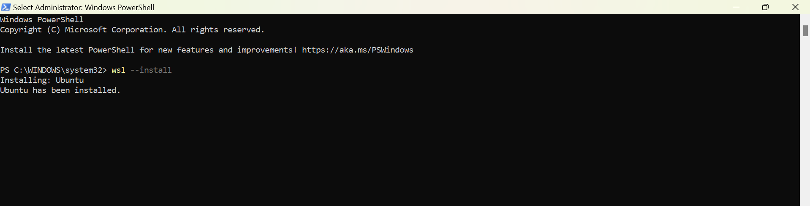

# Caching Using Redis
**Redis** ( **RE**mote **DI**ctionary **S**erver ) is an open-source, in-memory data structure store that can be used as a database, cache, and message broker. Renowned for its exceptional speed and flexibility, Redis is ideal for real-time applications where low latency and high performance are critical. It supports a variety of data structures, including strings, hashes(key-), lists, sets, and sorted sets, enabling developers to address diverse use cases efficiently. Additionally, Redis offers features like persistence, publish-subscribe messaging, replication, and clustering, making it a versatile tool for modern applications. 


Trusted by leading companies such as Twitter, Pinterest, GitHub, and StackOverflow, Redis has become a popular choice for scenarios requiring fast data access and scalable solutions. Its ability to combine simplicity with powerful functionality makes it a cornerstone in the world of high-performance computing.


## Installation

### Step 1 : Install WSL  ( Windows Subsystem for Linux )
- Redis is designed for Linux environments, and WSL allows it to run natively on Windows without any porting issues. 
- It allows us to run a Linux environment directly on our Windows machine without the need for a virtual machine or dual boot. 
- It provides a lightweight and seamless way to run Linux tools and applications alongside your Windows setup.

- Open PowerShell as Administrator and enable WSL :
    ```
        wsl --install
    ```
    This will install WSL with the default Linux distribution (usually Ubuntu)

    

### Step 2 : Open WSL Terminal

- Ubuntu Installed
    

- After installation, open WSL terminal by searching for "Ubuntu" or the Linux distribution installed.

    

### Step 3 : Update Linux Packages

- Update the package manager inside WSL

    ```
        sudo apt update
    ```
    

- Upgrade the package manager inside WSL

    - Run the below command

        ```
            sudo apt upgrade
        ```
        
    
    - Type **"Y"** and press **Enter**

        

### Step 4 : Install Redis

- Install Redis:
    ```
        sudo apt install redis-server
    ```
    

- Type the *password* and press **Enter**

    

### Step 5 : Start Redis

- After installation, start the Redis server

    ```
        sudo service redis-server start
    ```

    

### Step 6 : Verify Redis Installation

- Check if Redis is running

    ```
        redis-cli
    ```
    

- Once in the Redis-CLI, type `PING`

    ```
        PING
    ```

    If everything is set up correctly, it will respond with `PONG`

    
