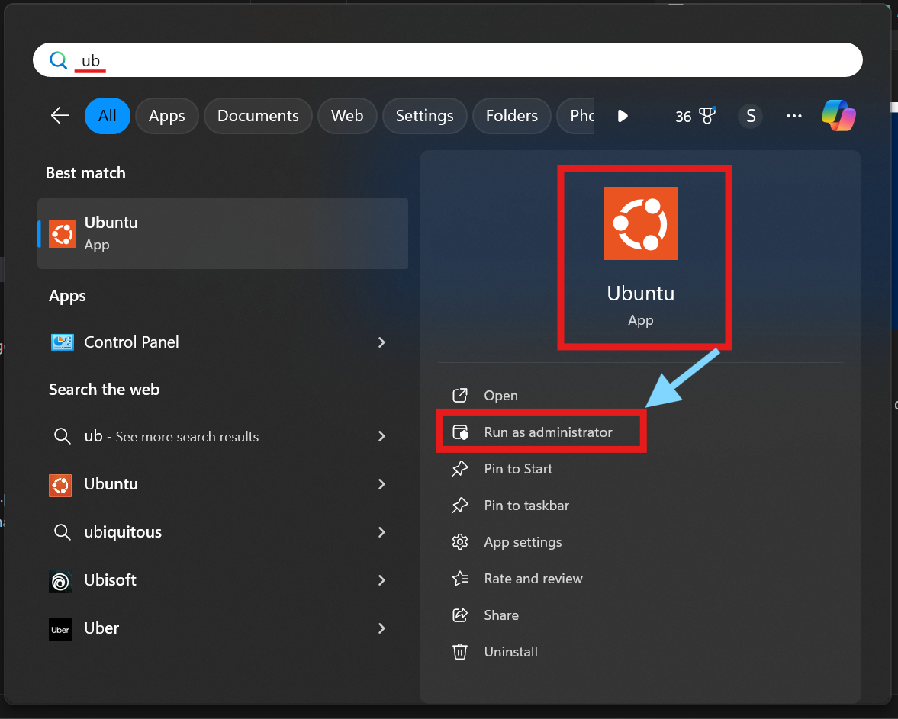
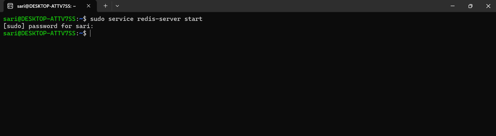
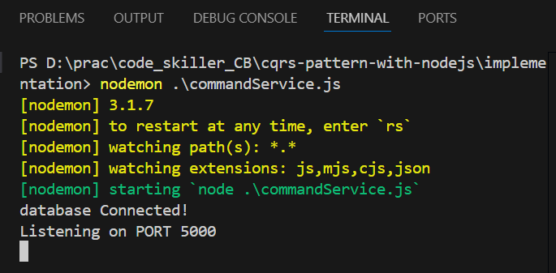
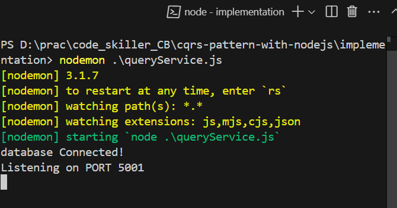
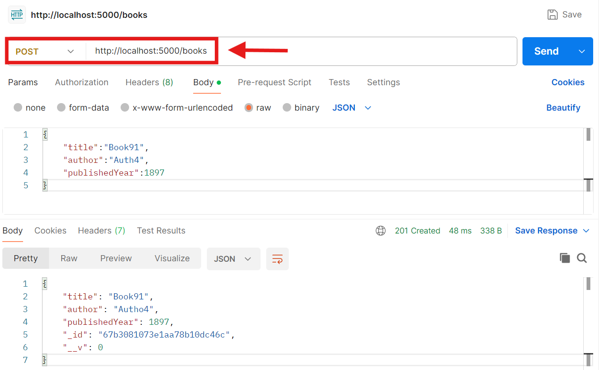
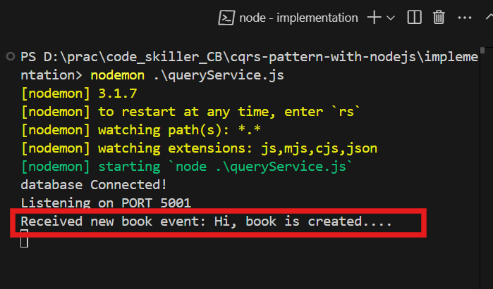
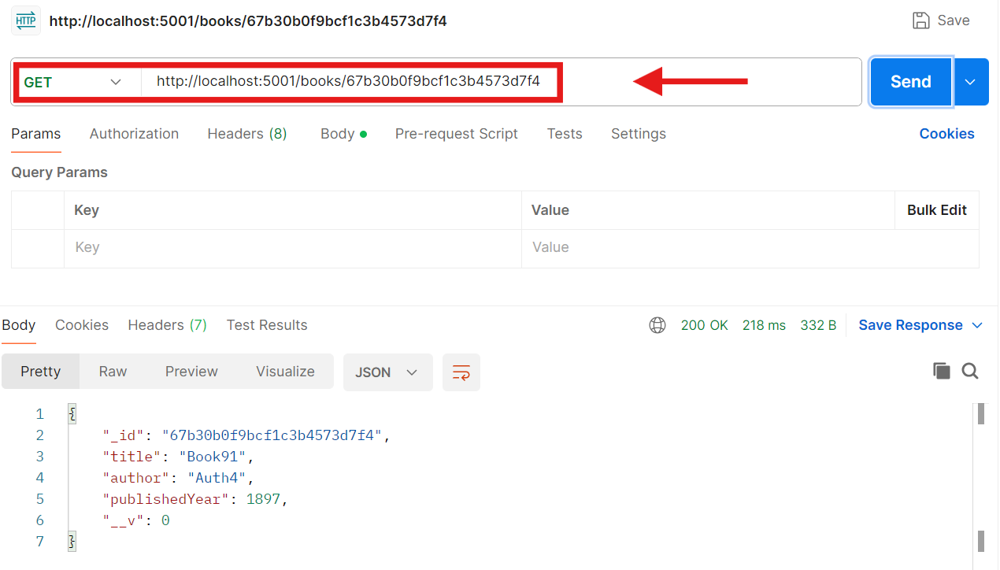

# CQRS Design Pattern in Microservices Architectures
CQRS **(Command Query Responsibility Segregation)** is a microservice pattern that separates read and write operations into different models to optimize performance, scalability, and security.

Traditional applications often use the same data model for both reading (queries) and writing (commands). While this works for small-scale applications, it introduces significant performance issues due to the growing load on the database, where both read and write operations compete for resources.

Instead of a monolithic approach where the same model handles both reads and writes, CQRS provides an efficient solution by separating read and write operations into distinct models :

- **Command Model (Write Operations)** :

    - Responsible for handling data modifications, such as Insert, Update, and Delete operations.
    - Ensures data integrity and validation before updating the database.
    - Processes requests asynchronously, improving system responsiveness.

- **Query Model (Read Operations)** :

    - Optimized for fast and efficient data retrieval.
    - Stores preprocessed, ready-to-use data in a structure tailored for queries.
    - Can use denormalization or caching (e.g., Redis) to improve read performance.

## Why Use CQRS ?

1. **Improved Performance & Scalability :**
    - Writes and reads are processed separately, preventing heavy read operations from slowing down write operations.

2. **Enhanced Security :**
    - The read model is strictly read-only, reducing the risk of accidental data modifications.
    - Write operations can be restricted to authorized users only.

3. **Event-Driven Architecture :**
    - CQRS works well with event sourcing, where every change is stored as an event.
    - The query model listens to these events and updates itself in real-time.
    - This enables event-driven microservices that respond efficiently to system changes.

4. **Better Maintainability & Flexibility :**
    - The read model and write model evolve independently, making future enhancements easier.


## CQRS Implementation Overview

To implement CQRS in Node.js and MongoDB, we will :

1. **Set up two separate models** – one for writing (books), one for reading (book summary).
2. **Use an event-driven approach** – every write operation triggers an event, updating the read model asynchronously.
3. **Optimize the read model** – using caching (Redis) for faster queries.

Here is a step-by-step guide :

### Set Up the Project
Create a new Node.js project and install the required dependencies.

#### Step 1 : Initialize a Node.js Project

```
    mkdir implementation
    cd implementation
    npm init -y
```

Now, create **commandService.js** file for the Node.js backend server Command Service.

```
    // File: /commandService.js

    const express=require("express")
    const app=express()
    const PORT=5000
    // Express.js Middleware
    app.use(express.json())

    app.listen(PORT,(err)=>{
        if(err){
            console.log(err)
        }
        else{
            console.log(`Listening on PORT: ${PORT}`)
        }
    })
```
Now, create **queryService.js** file for the Node.js backend server Query Service.

```
    // File: /queryService.js

    const express=require("express")
    const app=express()
    const PORT=5001
    // Express.js Middleware
    app.use(express.json())

    app.listen(PORT,(err)=>{
        if(err){
            console.log(err)
        }
        else{
            console.log(`Listening on PORT: ${PORT}`)
        }
    })
```
#### Step 2 : Install Required Dependencies

```
    npm install express mongoose redis dotenv
```
- express → Web framework
- mongoose → MongoDB ORM
- redis → Redis for event handling
- dotenv → For environment variables

#### Step 3 : Create **.env** file and add MongoDB Url to it.
- **.env file** is used to store sensitive information.
- Now, we save the MongoDB URL of the MongoDB Atlas.

    ```
        MONGO_URL=""    
    ```

### Step 4 : Connect MongoDB database using mongoose in `commandService.js` and `queryService.js`

- commandService.js

    ```
        // File: /commandService.js

        const express = require("express")
        const mongoose = require('mongoose');
        const app = express()
        const dotEnv = require("dotenv")    // import dotenv npm package
        const PORT = 5000
        dotEnv.config()                     // configuring dotenv
        //Express.js Middleware
        app.use(express.json())
        //Express.js Middleware
        app.use(express.urlencoded({ extended: true }))
        mongoose.connect(process.env.MONGO_URL)               // fetching MONGO_URL from .env file
            .then(() => {
                console.log('database Connected!')
                app.listen(PORT, (err) => {
                    if (err) {
                        console.log(err)
                    }
                    else {
                        console.log(`Listening on PORT ${PORT}`)
                    }
                })
            }).catch((err) => console.log(err));
    ```
- queryService

    ```
        // File: /commandService.js

        const express = require("express")
        const mongoose = require('mongoose');
        const app = express()
        const dotEnv = require("dotenv")    // import dotenv npm package
        const PORT = 5001
        dotEnv.config()                     // configuring dotenv
        //Express.js Middleware
        app.use(express.json())
        //Express.js Middleware
        app.use(express.urlencoded({ extended: true }))
        mongoose.connect(process.env.MONGO_URL)               // fetching MONGO_URL from .env file
            .then(() => {
                console.log('database Connected!')
                app.listen(PORT, (err) => {
                    if (err) {
                        console.log(err)
                    }
                    else {
                        console.log(`Listening on PORT ${PORT}`)
                    }
                })
            }).catch((err) => console.log(err));
    ```

### Create the Write Model (Command Service)
This service handles creating books and publishes events to Redis.

#### Step 1 : Create `Book Model` for Command Service (Write Model)

```
    // File : /commandService.js

    // Define a simple Book schema
    const Book = mongoose.model("Book", {
    title: String,
    author: String,
    publishedYear: Number,
    });

```

#### Step 2 : Create `Redis Publisher` in `commandService.js` (Redis Connection)

```
    // File : /commandService.js

    const redis = require("redis");

    // Create Redis Publisher
    const redisClient = redis.createClient();

    redisClient.connect();
```

#### Step 3 : Create a `POST route` to add a book (Book API) in `commandService.js`

```
    // File : /commandService.js

    // ** Create a New Book (Command) **
    app.post("/books", async (req, res) => {
        try {
            const book = new Book(req.body);
            await book.save();

            // Publish event to Redis
            const msg="Hi, book is created...."
            await redisClient.publish("bookCreated", JSON.stringify(msg));
            res.status(201).json(book);
        } catch (err) {
            res.status(500).json({ error: err.message });
        }
    });
```

### Create the Read Model (Query Service)
This service listens to Redis and updates its own copy of the data.

#### Step 1 : Create `Book Model` for Query Service (Read Model)

```
    // File : /queryService.js

    // Define a simple Book schema
    const Book = mongoose.model("Book", {
        title: String,
        author: String,
        publishedYear: Number,
        }
    );
```

#### Step 2 : Create `Redis Subscriber` in `queryService.js` (Redis Connection)

```
    // File : /queryService.js

    const redis = require("redis");

    const subscriberClient = redis.createClient();

    // Connect Redis Subscriber
    subscriberClient.connect();

    // Subscribe to book creation events
    subscriberClient.subscribe("bookCreated", async (message) => {
        const bookData = JSON.parse(message);
        console.log("Received new book event:", bookData);
    });
```

#### Step 3 : Create a `GET route` to get a book (Book API) in `queryService.js`

```
    // File : /queryService.js

    app.get("/books/:id", async (req, res) => {
        try {
        const book = await Book.findById(req.params.id);
        if (!book) return res.status(404).json({ error: "Book not found" });
        
        res.json(book);
        } catch (error) {
        res.status(500).json({ error: error.message });
        }
    });
```

### Run the Application

#### Start the Redis Server

- **Open WSL terminal by searching for "Ubuntu" or the Linux distribution installed.**
        
    

- **Start the Redis server.**

    ```
        sudo service redis-server start
    ```    

    

#### Start the Command Service

- Open terminal and run following command:

    ```
        nodemon commandService.js
    ```
    

#### Start the Query Service

- Open terminal and run following command:

    ```
        nodemon queryService.js
    ```
    

#### Open Postman or Insomnia to test the route.

- `POST` a Book

    

- Query Service received message from redis

    

- `GET` a Book

    
    

## Implementation (refer GitHub Repo)
[GITHUB LINK](https://github.com/sarikasingh30/code_skiller_CB/tree/main/cqrs-pattern-with-nodejs/implementation)


## Conclusion 
CQRS is a powerful microservice pattern that improves scalability, security, and maintainability by separating read and write operations.
By implementing CQRS, organizations can :
- Scale efficiently in high-traffic applications.
- Reduce database load for complex read-heavy systems.
- Ensure better security by restricting write access.
- Build event-driven, real-time architectures

## References and Resources

### Links 

- [NodeJS Official Documentation](https://nodejs.org/docs/latest/api/)
- [Express Documentation](https://expressjs.com/)
- [MongoDB Atlas Documentation](https://www.mongodb.com/docs/atlas/)
- [Mongoose Official Documentation](https://mongoosejs.com/docs/)
- [Redis Documentation](https://redis.io/docs/latest/develop/clients/nodejs/)
- [Redis NPM Package](https://www.npmjs.com/package/redis)

### FAQs (Frequently Asked Questions)

1. **Why Use Redis in CQRS ?**

    For Real-Time Event Propagation (Pub/Sub) => If you update the write model, Redis publishes an event when the write model updates, and the read model subscribes to it.

2. **What are the advantages of using Redis in a CQRS-based architecture?**

    **Asynchronous Event Handling:** Redis allows for asynchronous processing by using Pub/Sub for event propagation. The Write Service doesn’t have to wait for the Read Service to update, improving the overall speed.
    **Scalability:** Redis can handle a high volume of messages and ensures that even under heavy loads, the data is propagated efficiently to the Read Model.
    **Decoupling:** Redis enables decoupling between the Write Model and Read Model, ensuring that each can scale independently.

3. **How do the Write and Read services communicate in this architecture?**

    The Write Service creates or updates data and then publishes events to Redis (e.g., orderCreated). The Read Service is continuously listening to Redis for these events, and when an event is received, the Read Service updates its own database with the new data to keep its copy of the data up-to-date.

4. **What kind of performance improvements can I expect from CQRS?**

    **Read Performance** : By separating read and write operations, the Read Model can be optimized for querying, which reduces latency and improves performance, especially when there is a heavy load of read requests.
    **Write Performance** : The Write Model can focus on processing write operations quickly, while the Read Model takes care of query optimizations, reducing the overall load on the database.
---