# Introduction to the Dart Programming Language: A Beginner’s Guide

Have you ever wondered what makes Flutter so powerful for mobile app development? At the core of every Flutter application is **Dart** — *a modern, flexible, and efficient programming language designed by Google*. Whether you're developing a mobile, web, or desktop application, understanding Dart is the first step to mastering Flutter.


Dart is known for its fast execution, null safety, and object-oriented structure, making it an excellent choice for cross-platform development. It supports both **Just-in-Time (JIT)** and **Ahead-of-Time (AOT)** compilation, Enabling developers to create applications with **hot reload (feature in Dart and Flutter that allows developers to see changes in their code instantly without restarting the entire application)** for quick iterations during development and optimized performance for production. 

Additionally, Dart’s asynchronous programming capabilities simplify handling network requests, database operations, and background tasks. With a syntax similar to JavaScript and Java, it’s easy for developers to learn and transition into Flutter development.

Now that we understand why Dart is essential for Flutter, let’s start with setting up Dart on our system. 🚀

## Dart Setup

### Download Dart SDK

1. **Open the link =>** *https://dart.dev/get-dart*

    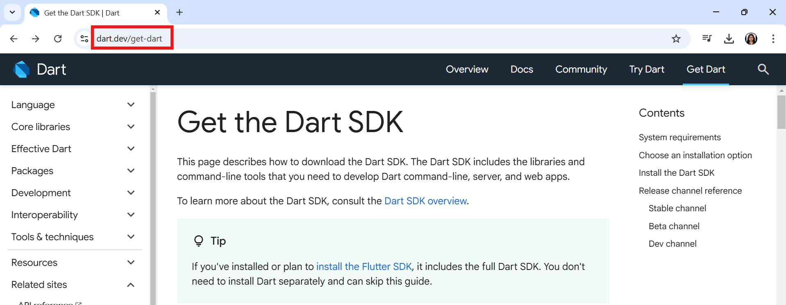

2. **Scroll down and click on Download *SDK as a ZIP file***

    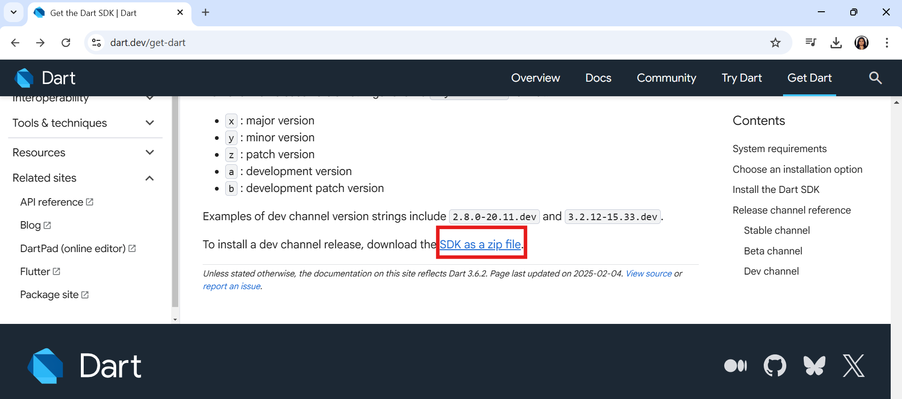

3. **After navigating to the new link, scroll down and click on *Dart SDK* under the Stable channel**

    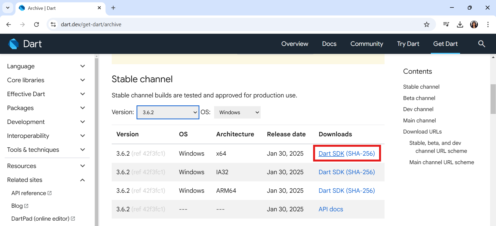

### Unzip the Folder and Update Environment Variables

1. **Place the extracted folder in the Program Files directory on the C drive or While extracting select destination of Program Files in C drive.**

    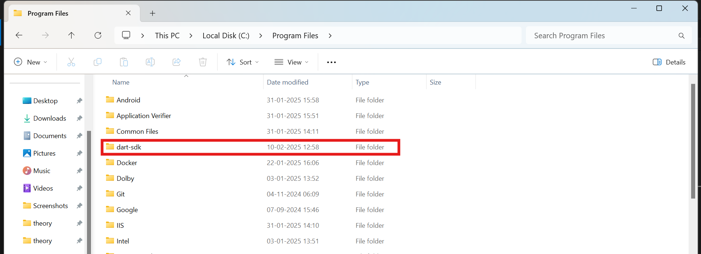

2. **Add Dart bin folder path to System PATH**

    To make dart is accessible globally, add its directory to the system's PATH variable:

    - **Open Environment variables** 

        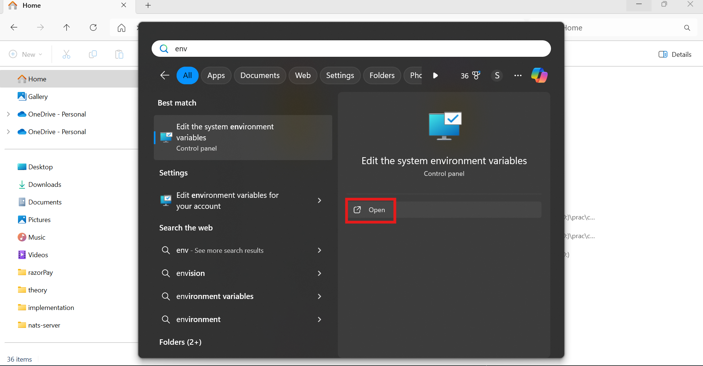
        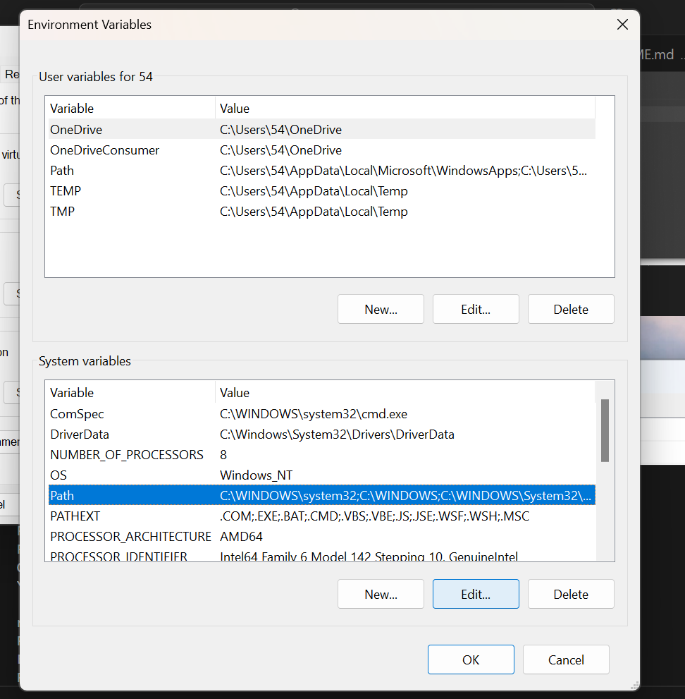

    - **Paste the bin folder path here and click *OK***
        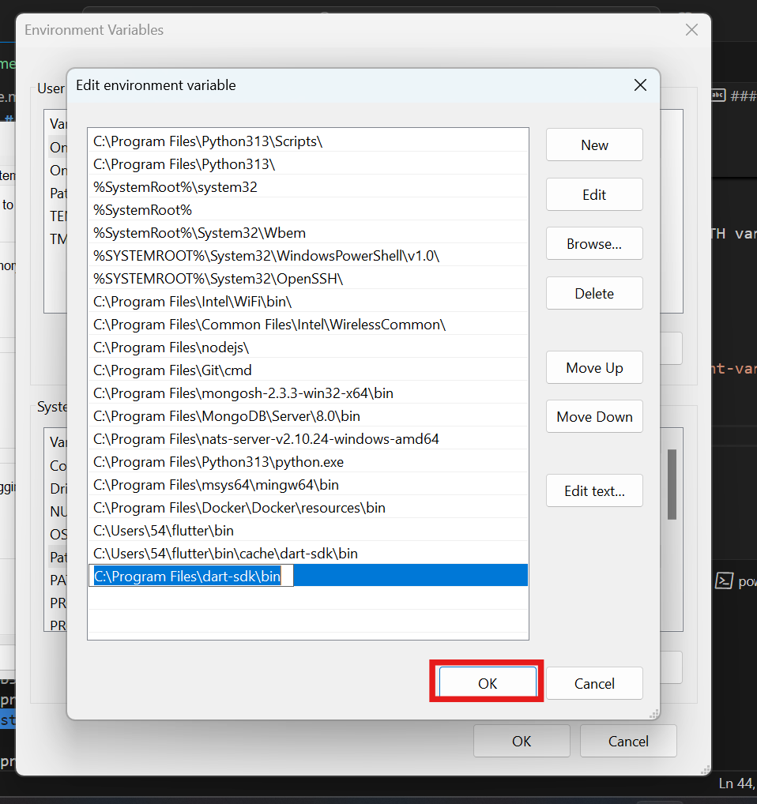

### Verification

1. **Open Command Prompt (cmd) and type**

    ```
        dart --version
    ```
    
    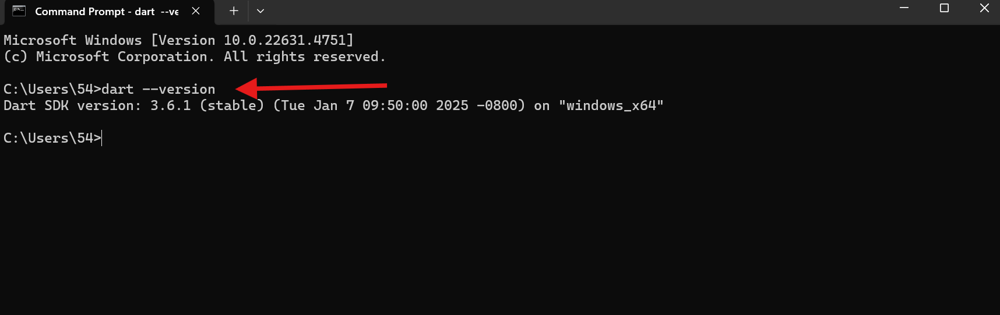

## First Dart Program

### Open a folder in VS Code and Add "Dart" Extension

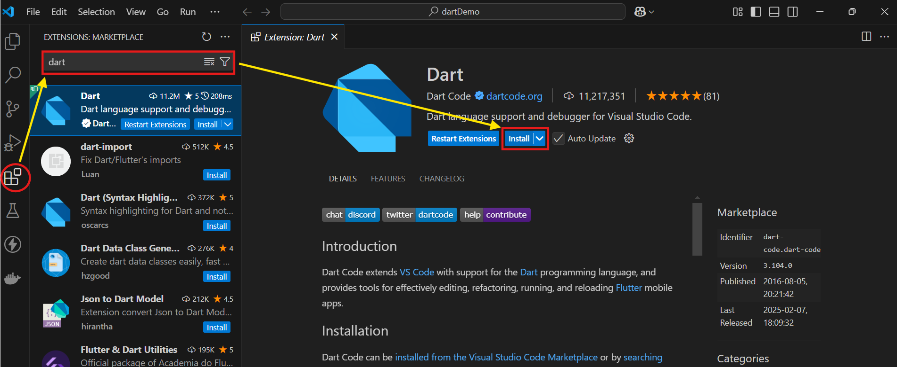

### Create a File with extension ".dart"

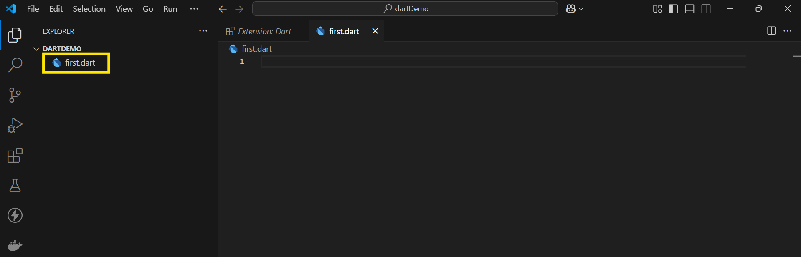

### Change the Dart Cli Console 

1. **Open Settings**

    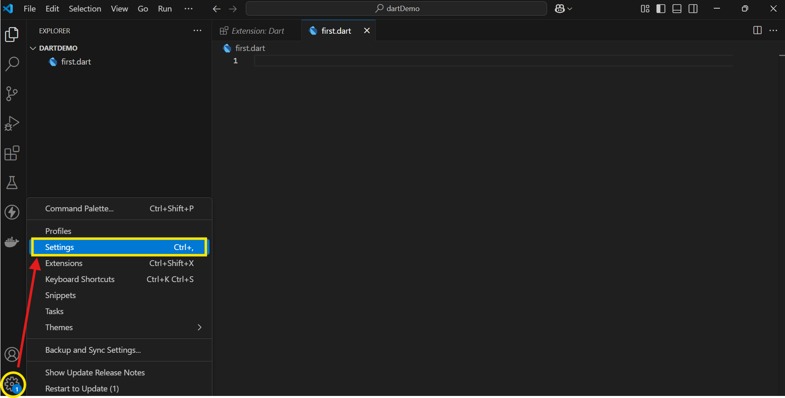

2. **Search for dart in the search bar, scroll down to CLI Console, and change it to Terminal**

    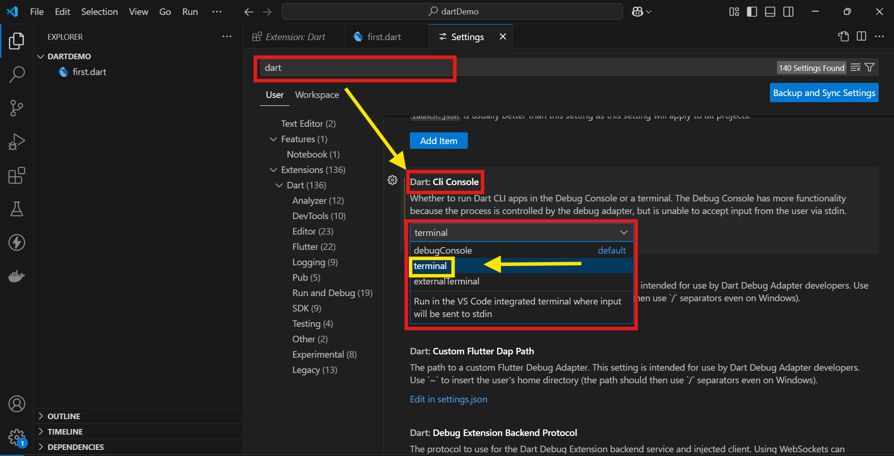

### Add the given code to the file

```
    void main(){
        print("Hello! Dart, Here is My First Program...");
    }
```
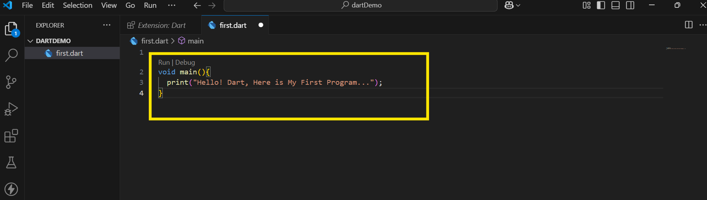


### Run the code 

1. **Click on Run**

    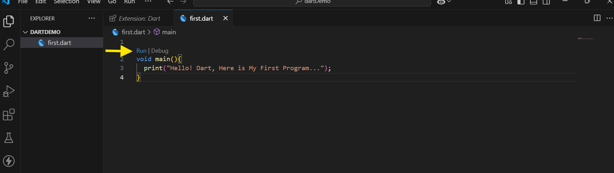

2. **Output**

    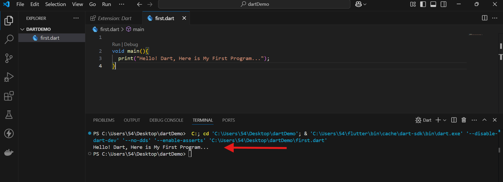

## Dart Syntax Basics
