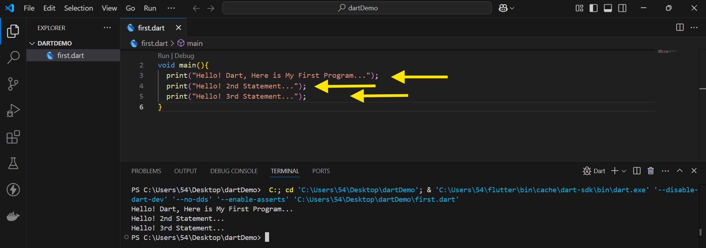

# Introduction to the Dart Programming Language: A Beginner’s Guide

Have you ever wondered what makes Flutter so powerful for mobile app development? At the core of every Flutter application is **Dart** — *a modern, flexible, and efficient programming language designed by Google*. Whether you're developing a mobile, web, or desktop application, understanding Dart is the first step to mastering Flutter.


Dart is known for its fast execution, null safety, and object-oriented structure, making it an excellent choice for cross-platform development. It supports both **Just-in-Time (JIT)** and **Ahead-of-Time (AOT)** compilation, Enabling developers to create applications with **hot reload (feature in Dart and Flutter that allows developers to see changes in their code instantly without restarting the entire application)** for quick iterations during development and optimized performance for production. 

Additionally, Dart’s asynchronous programming capabilities simplify handling network requests, database operations, and background tasks. With a syntax similar to JavaScript and Java, it’s easy for developers to learn and transition into Flutter development.

Now that we understand why Dart is essential for Flutter, let’s start with setting up Dart on our system. 🚀

## Dart Setup

### Download Dart SDK

1. **Open the link =>** *https://dart.dev/get-dart*

    

2. **Scroll down and click on Download *SDK as a ZIP file***

    

3. **After navigating to the new link, scroll down and click on *Dart SDK* under the Stable channel**

    

### Unzip the Folder and Update Environment Variables

1. **Place the extracted folder in the Program Files directory on the C drive or While extracting select destination of Program Files in C drive.**

    

2. **Add Dart bin folder path to System PATH**

    To make dart is accessible globally, add its directory to the system's PATH variable:

    - **Open Environment variables** 

        
        

    - **Paste the bin folder path here and click *OK***
        

### Verification

1. **Open Command Prompt (cmd) and type**

    ```
        dart --version
    ```
    
    

## First Dart Program

### Open a folder in VS Code and Add "Dart" Extension


### Create a File with extension ".dart"


### Change the Dart Cli Console 

1. **Open Settings**

    

2. **Search for dart in the search bar, scroll down to CLI Console, and change it to Terminal**

    

### Add the given code to the file

```
    void main(){
        print("Hello! Dart, Here is My First Program...");
    }
    // void main() → The main function is where execution begins.
    // print() → Used to display output in the console.
```


### Run the code 

1. **Click on Run**

    

2. **Output**

    

## Dart Syntax Basics

### Dart Statements

Every statement in Dart must end with a **semicolon (;)**, which tells the compiler that the statement is complete.




### Dart program starts with a *main()* function, which serves as the entry point.


### Comments in Dart
Comments are non-executable line of codes. These are essential for writing readable code.

1. **Single-line Comments**

    ```
        // Hi! I am Single Line Comment
    ```
2. **Multi-line Comments**

    ```
        /* Hi! I am 
        Muti Line 
        Comment */
    ```

### Dart Data Types

- Dart is a statically typed language, meaning that variables have a specific type at compile time. 
- Various data types categorized into 
    - **primitive types :** 
        - the basic building blocks of the language that represent simple values
        - It includes :
            - **int** :  Used for whole numbers without decimal points.
            - **double** : Used for decimal numbers.
            - **String** : Used for Sequence of characters enclosed in single (') or double (") quotes.
            - **bool** : Used to represent true or false values.

        ```
            void main(){
                int a=23;
                double b=45.09;
                String c="dart_program";
                bool d=true;
                print(a);    //23
                print(b);   // 45.09
                print(c);  // dart_program
                print(d); // true
            }
        ```

    - **collection types :** 
        - Collections help store multiple values in a single variable
        - It includes :
            - **List (Ordered Collection, Similar to Arrays)** : A List is an ordered collection of values that can be fixed or growable in size.
            - **Set (Unordered Collection with Unique Elements)** : A Set is an unordered collection of unique values.
            - **Map (Key-Value Pair Collection)** : A Map is a collection of key-value pairs, like a dictionary.

        ```
            void main(){
                List <int> num2=[9,0,8,7,6,5];
                print(num2);                   // [9, 0, 8, 7, 6, 5]
                Set <int> num3={1,4,5,7,8,8,3};
                print(num3);                   // {1, 4, 5, 7, 8, 3}
                Map <String,int> num4={"A":4,"B":8,"C":4};
                print(num4);                   // {A: 4, B: 8, C: 4}
            } 
        ```

    - **special types :**
        - These types provide flexibility in how variables are declared and used.
        - It includes 
            - **dynamic** :  
                - It can hold a value of any type.
                - It can be reassigned to another type later.
                - It is used when the "type" is determined at runtime.

                ```
                    void main(){
                        dynamic c="Demo";
                        c=45;
                        print(c);   // 45
                    }
                ```
            - **var** :  
                - It is similar to dynamic but the type is determined at compile time.
                - Once a type is assigned to a var variable, it cannot change.

                ```
                    void main(){
                        var c="Demo";
                        // c=45;  // Error: A value of type 'int' can't be assigned to a variable of type 'String'
                        c="dart-program";
                        print(c);      // dart-program
                    }
                ```

            - **Object** : 
                - Object is the root class of all Dart types, meaning every type in Dart (whether built-in or user-defined) is a subclass of Object.
                - It is used when the "type" is determined at compile time.

                ```
                    void main(){
                        Object a="45";
                        a=89;             // Dart does not track the latest type of Object at runtime.
                        int b=a as int;   // forcefully casting "a" to an int, but if "a" was still a String, it would crash
                        print(b+30);     // 119
                    }
                ```

    - **nullable types :**
        - Nullable types allow a variable to store either a value or null. 
        - By default, Dart follows null safety, meaning variables cannot be null unless explicitly specified.

        ```
            void main(){
                String? name="aka";  // Can store a string or null (without "?" null is not allowed)
                print(name);         // aka
            }
        ```


