# Docker : A Beginner's Guide

Docker is an open-source platform designed to automate the deployment, scaling, and management of applications. It provides tools and services for creating isolated environments for software development and execution. Docker enables consistency across different environments and simplifies the software lifecycle. It integrates seamlessly with modern development workflows and supports a wide range of infrastructure. Docker is widely used in DevOps practices and cloud-native development.


When developing an application, we set up a development environment with various tools and dependencies. However, when sharing the code with others or deploying it to production, recreating this environment can be challenging and time-consuming. If anything is missed during the setup, the code that works on one machine may fail on another. Docker solves this problem by providing a consistent and portable solution for managing application environments.

Using Docker :
- We create a Docker container.
- Add our code to the container.
- Include all the tools and dependencies required.
- Perform all the required work within the container itself.

If a new team member joins in the future, we can provide them with a copy of the container. When they run the container, the exact same configuration will work on their system, regardless of whether they are using macOS, Windows, or Linux.

## Difference between VirtualBox and Docker

In the past, developers and system administrators often relied on tools like VirtualBox to create isolated environments. 

**VirtualBox**                                                                 | **Docker**                                                               |
-------------------------------------------------------------------------------|-------------------------------------------------------------------------|
 Runs a full virtual machine (VM) inside your computer. It's helpful for testing apps on different operating systems or running old apps. | Packages just the app and its needed tools into a lightweight container, without needing a full operating system. |
 Uses a lot of your computer's resources like CPU, memory, and storage because it runs an entire operating system. | Uses fewer resources because it only needs the app and its dependencies, not a full OS. |
 Takes a few minutes to start because it has to boot up a full operating system. | Starts in just a few seconds, making it much faster and more convenient. |
 Can be hard to manage many VMs and share them with others.                    | Easier to manage and share since containers run the same way on any machine with Docker. |
Less efficient because it runs a full OS, which can slow things down.         | More efficient because it uses the host’s operating system, which saves time and resources. |

## Key-Concepts of Docker

### DOCKER CONTAINER => 
A Docker container is a lightweight, portable, and isolated environment that packages an application and its dependencies together, ensuring it runs consistently across different systems. Containers share the host operating system's kernel, making them efficient and faster to start compared to virtual machines.

### DOCKER IMAGE =>
A Docker image is a lightweight, standalone, and executable package that includes everything needed to run an application: the code, runtime, libraries, environment variables, and dependencies. It acts as a blueprint for creating Docker containers.

### DOCKER REGISTRY (www.hub.docker.com) => 
is Docker's official online platform for hosting and sharing container images. It serves as a public registry where developers can store, manage, and distribute their Docker images. Users can search for pre-built images, such as official images for Node.js, Python, or MySQL, and pull them for use in their projects. It also supports private repositories for storing proprietary images securely.
It is known as Docker Hub is like GitHub but specifically designed for storing and sharing Docker images.

### DOCKER VOLUME =>
A Docker volume is a way to store data outside a container so it doesn’t get lost when the container stops or is deleted. It helps keep data safe and can be shared between containers.

## Workflow

1. Set up Docker in your machine.
2. Create a Docker Container.
3. Set up all other tools inside the docker container.
4. Push that docker container to the docker registry.
5. Others can pull it from docker registry and can run the app on their local machine.
6. After making the required changes, they can push the code to the docker registry again.

## Step-by-Step Guide to Docker Installation and Setup

### Step 1 : Go to Website (www.docker.com) and download Docker Desktop

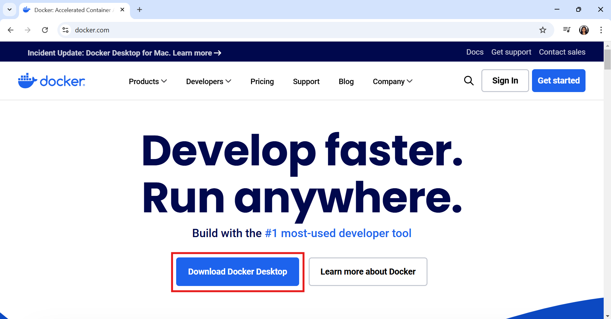

### Step 2 : Download Criteria
Choose : 
- AMD64 for Window's desktops, laptops, and servers
- Apple Silicon for Macs with Apple's own chips 
- Intel for Macs with Intel processors

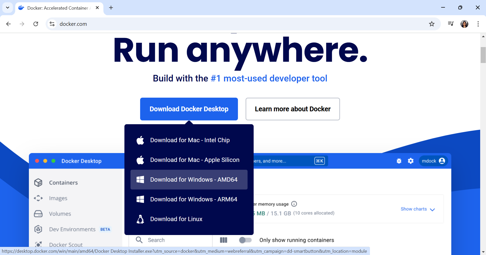

### Step 3 : Install Docker Desktop

- **Click "OK"**

    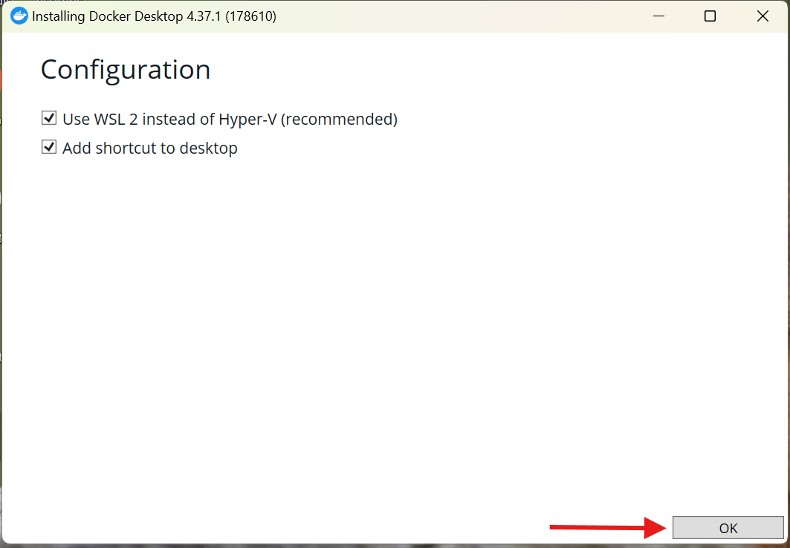
- **Processing**

    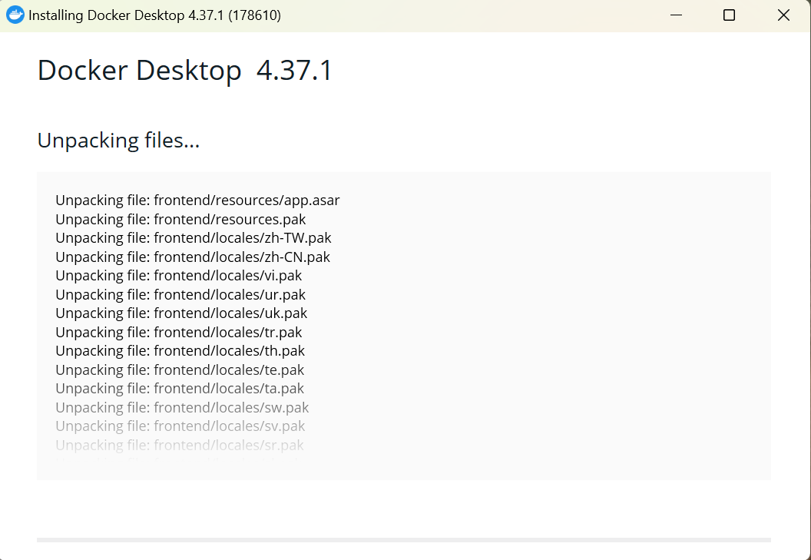
- **Click on "Close and restart"**
    
    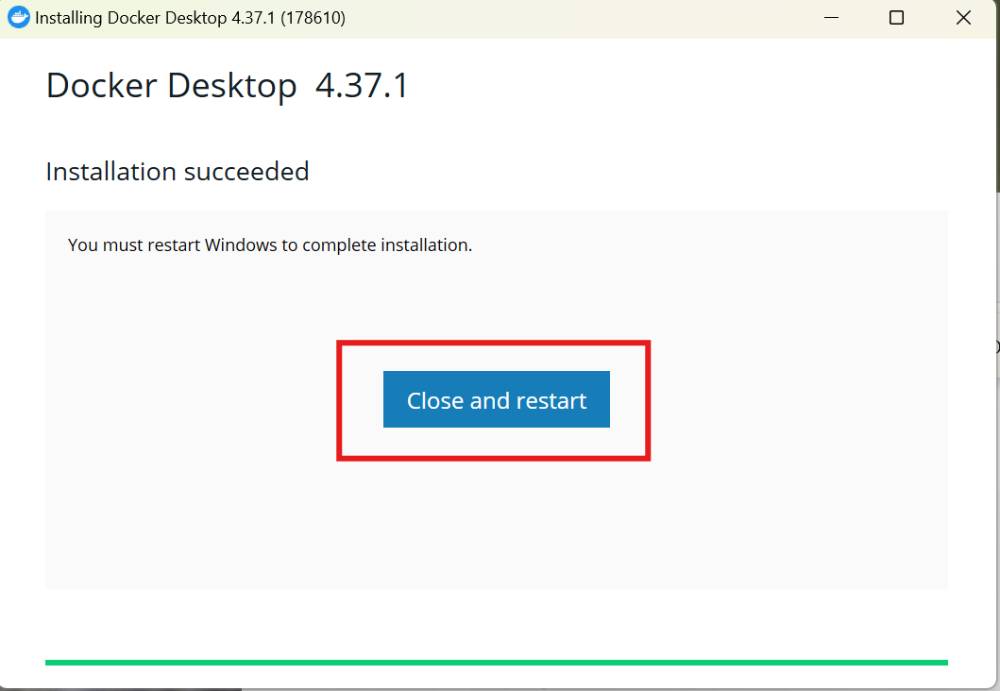


### Step 4 : After the system restarts, you will get a pop-up. Click on 'Accept'."

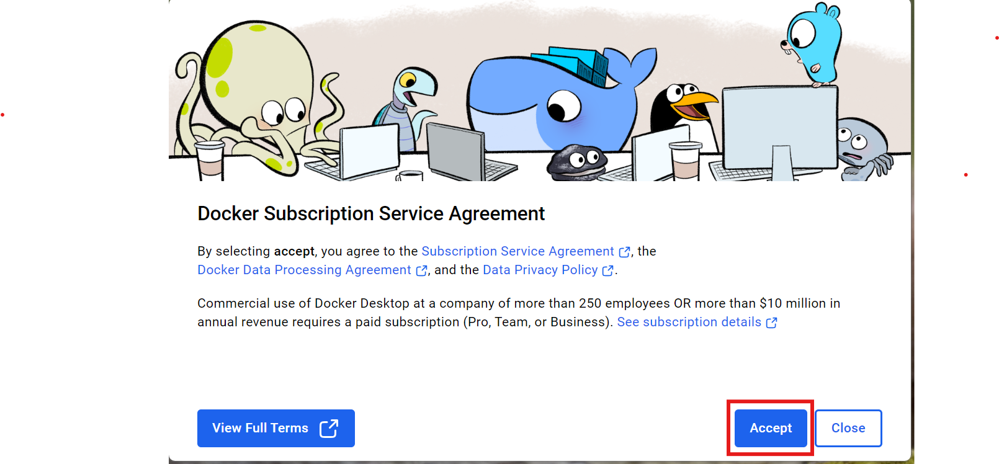

### Step 5 : Click on 'Skip'


### Step 6 : Click on 'Skip'

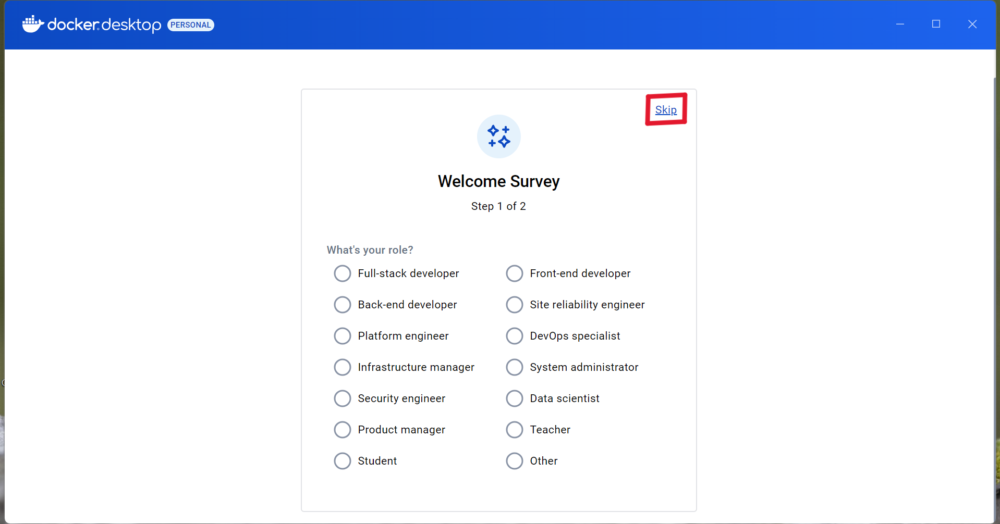

### Step 7 : Docker Desktop Dashboard

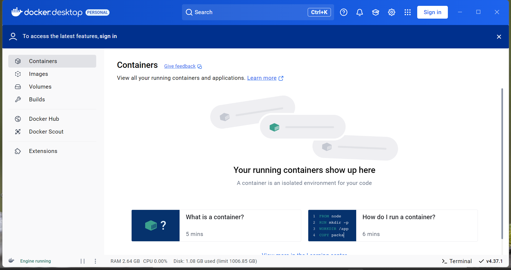


**DOCKER DAEMON** : 
The Docker Daemon is a background process that manages Docker containers, images, networks, and volumes on the host machine. It listens for Docker API requests from the client and executes them, such as building images or starting containers.

When Docker Desktop runs, the Docker Daemon is automatically started. 

### Step 8 : Verification
- Open Windows PowerShell

    ```
        docker version
    ```

    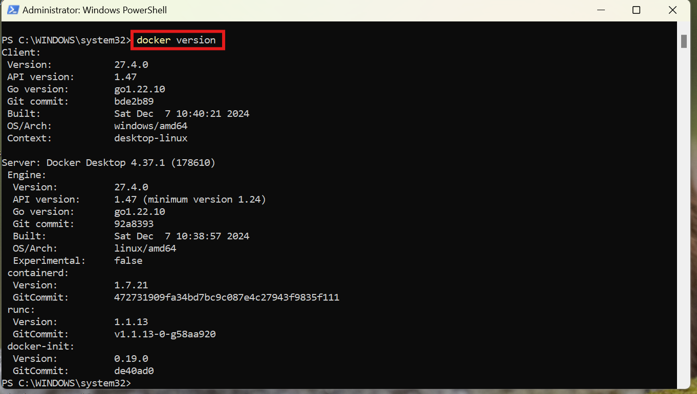

### Step 9 : Login to `https://hub.docker.com/` and create an account

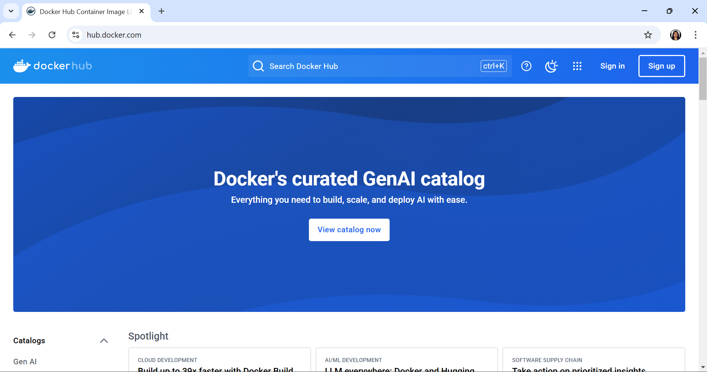

## Lets Download and Run an Ubuntu Docker Image from Docker Hub

### Step 1 : Check your system's OS name
- Open the terminal or powershell and run the below command.
    - **macOS users** =>

        ```
            uname  
        ```
    - **windows users** =>

        ```
            systeminfo | findstr /B /C:"OS Name"
        ```

        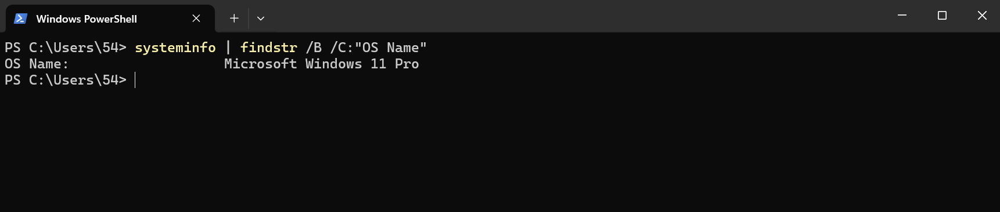

### Step 2 : Open the Explore section on `https://hub.docker.com/` and search for ubuntu

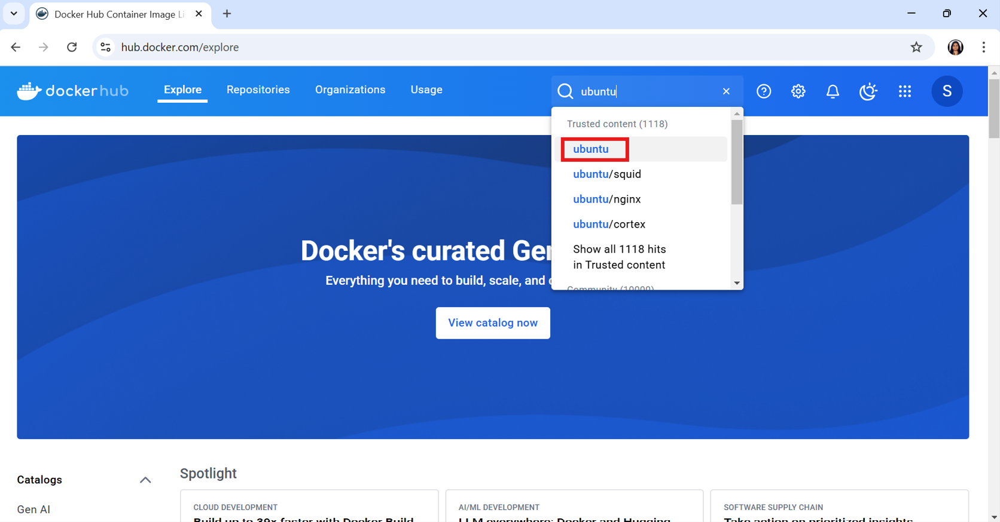

**Click on ubuntu**

### Step 3 : Official Ubuntu Image

This is the official Ubuntu image page on Docker Hub (https://hub.docker.com/). It provides details about the Ubuntu Docker image

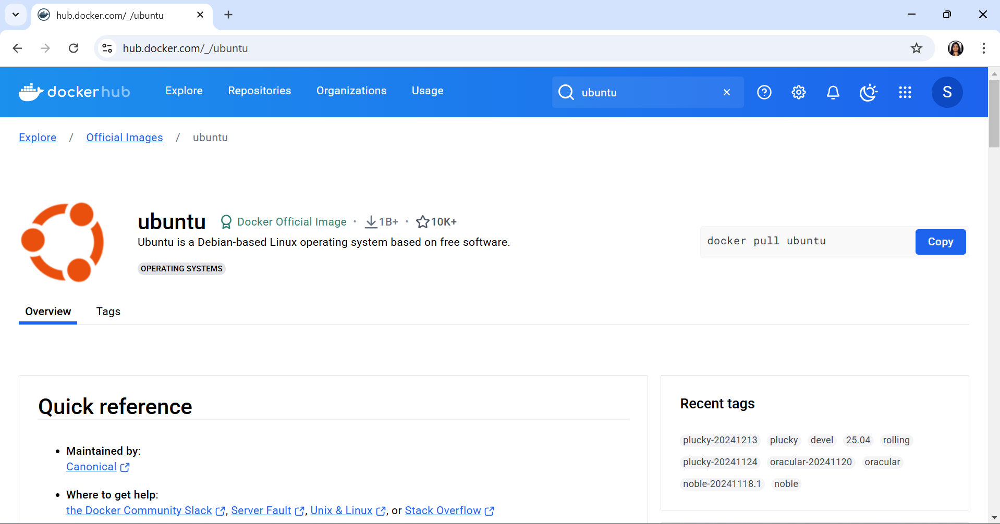


