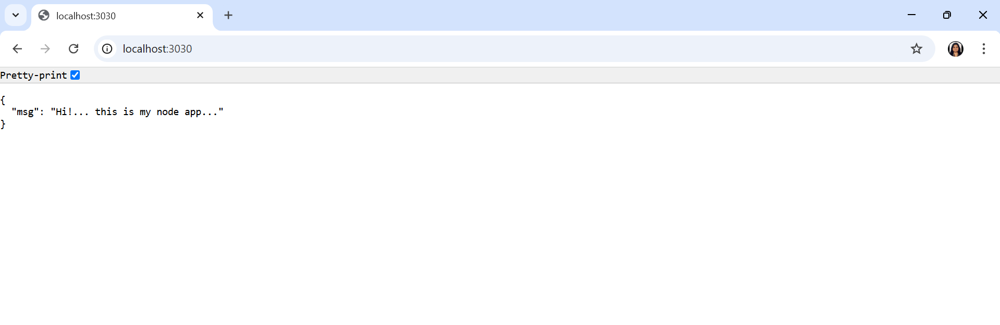

# Docker : A Beginner's Guide

Docker is an open-source platform designed to automate the deployment, scaling, and management of applications. It provides tools and services for creating isolated environments for software development and execution. Docker enables consistency across different environments and simplifies the software lifecycle. It integrates seamlessly with modern development workflows and supports a wide range of infrastructure. Docker is widely used in DevOps practices and cloud-native development.


When developing an application, we set up a development environment with various tools and dependencies. However, when sharing the code with others or deploying it to production, recreating this environment can be challenging and time-consuming. If anything is missed during the setup, the code that works on one machine may fail on another. Docker solves this problem by providing a consistent and portable solution for managing application environments.

Using Docker :
- We create a Docker container.
- Add our code to the container.
- Include all the tools and dependencies required.
- Perform all the required work within the container itself.

If a new team member joins in the future, we can provide them with a copy of the container. When they run the container, the exact same configuration will work on their system, regardless of whether they are using macOS, Windows, or Linux.

## Difference between VirtualBox and Docker

In the past, developers and system administrators often relied on tools like VirtualBox to create isolated environments. 

**VirtualBox**                                                                 | **Docker**                                                               |
-------------------------------------------------------------------------------|-------------------------------------------------------------------------|
 Runs a full virtual machine (VM) inside your computer. It's helpful for testing apps on different operating systems or running old apps. | Packages just the app and its needed tools into a lightweight container, without needing a full operating system. |
 Uses a lot of your computer's resources like CPU, memory, and storage because it runs an entire operating system. | Uses fewer resources because it only needs the app and its dependencies, not a full OS. |
 Takes a few minutes to start because it has to boot up a full operating system. | Starts in just a few seconds, making it much faster and more convenient. |
 Can be hard to manage many VMs and share them with others.                    | Easier to manage and share since containers run the same way on any machine with Docker. |
Less efficient because it runs a full OS, which can slow things down.         | More efficient because it uses the host’s operating system, which saves time and resources. |

## Key-Concepts of Docker

### DOCKER CONTAINER => 
A Docker container is a lightweight, portable, and isolated environment that packages an application and its dependencies together, ensuring it runs consistently across different systems. Containers share the host operating system's kernel, making them efficient and faster to start compared to virtual machines.

### DOCKER IMAGE =>
A Docker image is a lightweight, standalone, and executable package that includes everything needed to run an application: the code, runtime, libraries, environment variables, and dependencies. It acts as a blueprint for creating Docker containers.

### DOCKER REGISTRY (www.hub.docker.com) => 
is Docker's official online platform for hosting and sharing container images. It serves as a public registry where developers can store, manage, and distribute their Docker images. Users can search for pre-built images, such as official images for Node.js, Python, or MySQL, and pull them for use in their projects. It also supports private repositories for storing proprietary images securely.
It is known as Docker Hub is like GitHub but specifically designed for storing and sharing Docker images.

### DOCKER VOLUME =>
A Docker volume is a way to store data outside a container so it doesn’t get lost when the container stops or is deleted. It helps keep data safe and can be shared between containers.

## Workflow

1. Set up Docker in your machine.
2. Create a Docker Container.
3. Set up all other tools inside the docker container.
4. Push that docker container to the docker registry.
5. Others can pull it from docker registry and can run the app on their local machine.
6. After making the required changes, they can push the code to the docker registry again.

## Step-by-Step Guide to Docker Installation and Setup

### Step 1 : Go to Website (www.docker.com) and download Docker Desktop


### Step 2 : Download Criteria
Choose : 
- AMD64 for Window's desktops, laptops, and servers
- Apple Silicon for Macs with Apple's own chips 
- Intel for Macs with Intel processors


### Step 3 : Install Docker Desktop

- **Click "OK"**

    
- **Processing**

    
- **Click on "Close and restart"**
    
    


### Step 4 : After the system restarts, you will get a pop-up. Click on 'Accept'."


### Step 5 : Click on 'Skip'


### Step 6 : Click on 'Skip'


### Step 7 : Docker Desktop Dashboard


**DOCKER DAEMON** : 
The Docker Daemon is a background process that manages Docker containers, images, networks, and volumes on the host machine. It listens for Docker API requests from the client and executes them, such as building images or starting containers.

When Docker Desktop runs, the Docker Daemon is automatically started. 

### Step 8 : Verification
- Open Windows PowerShell

    ```
        docker version
    ```

    

### Step 9 : Login to `https://hub.docker.com/` and create an account


## Lets Download and Run an Ubuntu Docker Image from Docker Hub

### Step 1 : Check your system's OS name
- Open the terminal or powershell and run the below command.
    - **macOS users** =>

        ```
            uname  
        ```
    - **windows users** =>

        ```
            systeminfo | findstr /B /C:"OS Name"
        ```

        

### Step 2 : Open the Explore section on `https://hub.docker.com/` and search for ubuntu


**Click on ubuntu**

### Step 3 : Official Ubuntu Image

This is the official Ubuntu image page on Docker Hub (https://hub.docker.com/). It provides details about the Ubuntu Docker image


### Step 4 : Run the command in Powershell

`docker pull <image-name>` : only downloads the image .

`docker run -it <image-name>` : downloads (if needed) and starts a container .


### Step 5 : Now check again your system's OS name

- Run the command 
    ```
        uname
    ```

    


- The image is added to Docker Desktop as well.

    

We began by checking our system's operating system using terminal commands. Next, we navigated to Docker Hub, searched for the official Ubuntu image, and used Docker commands to pull and run the image. Finally, we confirmed the system's OS again after successfully running the Ubuntu container.

## Let's Create and Push our Own Docker Image to Docker Hub

### Step 1 : Make a NodeJS Server 

1. **Setup a basic Node.js App**

    ```    
        npm init -y
    ```

    Now, create **server.js** file for the Node.js backend server.

    ```
        // File : server.js
        const express=require("express")
        const app=express()
        const PORT=8080
        app.use(express.json())
        app.use(express.static('public'));

        app.listen(PORT,(err)=>{
            if(err){
                console.log(err)
            }
            else{
                console.log(`Listening on PORT: ${PORT}`)
            }
        })
    ```

2. **Install the required dependencies**

    ```
        npm i express              // To run a Node.js server
    ```

    Updated dependencies in the **package.json** file 

    ```
        "dependencies": {
            "express": "^4.21.2"
        }
    ```

3. **Create GET route in *server.js***

    ```
        // File : server.js

        // GET Route
        app.get("/",(req,res)=>{
            res.status(200).json({
                "msg":"Hi!... this is my node app..."
            })
        })

    ```

### Step 2 : Run the Application

1. **Start the server :**

    ```
    nodemon server
    ```
2. **Open `http://localhost:3030` in the browser**

    
    

### Step 3 : Create a file named `Dockerfile` in Node.js application directory

- If we want to dockerise any directory, make a file inside it and name it as `Dockerfile`. 
- It has no extension.

    

### Step 4 : Write Instructions in the Dockerfile

1. **Fetch the most recent version of the Node.js image from Docker Hub**

    ```
        # File : Dockerfile

        FROM node:latest
    ```
2. **Copy the *server.js*, *package.json* and *package-lock.json* file from local machine to the container**

    There are 2 ways to do so: 
    1. **Individually copies the file**
        - **Source** => `server.js` (inside node js app)
        - **Destination** => `/home/app/server.js` (inside the container)

        ```
            # File : Dockerfile

            COPY server.js /home/app/server.js
            COPY package.json  /home/app/package.json
            COPY package-lock.json  /home/app/package-lock.json
        ```
    2. **Copies all files together**
        
        ```
            # File : Dockerfile

            COPY . /home/app
        ```
        - But in doing so `node_modules` will also get copied. In order to avoid this, make a file `.dockerignore`

            
        - Add `node_modules` to it

            ```
                # File : .dockerignore

                node_modules/
            ```


3. **Set `/home/app/` as the working directory for the container**
    
    ```
        # File : Dockerfile

        WORKDIR /home/app/
    ```

4. **Install all the dependencies listed in package.json inside the container**

    ```
        # File : Dockerfile

        RUN npm install
    ```
5. **Specify that the container listens for network connections on port `8080`**

    ```
        # File : Dockerfile

        EXPOSE 8080
    ```
6. **Specify the command to execute when the container starts**

     ```
        # File : Dockerfile

        CMD ["node", "server.js"]
    ```

### Step 5 : Lets build a Docker image from the Dockerfile
- Run this command in your directory's terminal

    ```
        docker build -t myApp .
    ```
-  `docker build -t myapp .` =>  builds a Docker image from the Dockerfile in the current directory (.) and tags it with the name `myApp`


    

### Step 6 : Image Added to the Docker Desktop


### Step 7 : Run the Docker Desktop Image

- **Open Powershell and run the following command :**

    ```
        docker run -t myapp
    ```
    

- **Open `http://localhost:3030` in the browser**

    

    Its not running. We need to map the ports in order to run the app.

- **Run the following command where we map the ports**

    *Command* : 
    `docker run -it -p <host-port>:<container-port> <image-name>`

    ```
        docker run -it -p 3030:3030 myapp
    ```

    

- **Open `http://localhost:3030` in the browser**

    


### Step 8 : Login to `https://hub.docker.com/` and create an account


### Step 9 : Get Username and Password


### Step 10 : Login docker in node server's terminal

```
    // In terminal 
    docker login -u <username>
```


### Step 11 :  Build a Docker image using the Dockerfile in the current directory and tags it as `sarika30docker/myapp`

```
    docker build -t sarika30docker/myapp .
```


### Step 12 : Push the Image to `https://hub.docker.com/`

```
    // In App's terminal 
    docker push sarika30docker/myapp
```


### Step 13 : Check the `https://hub.docker.com/`'s repositories


### Step 14 : Testing and Debugging

1. **Testing the Container Locally :**

    Before pushing your Docker image to the registry, run the container locally to verify that it works as expected. Use the following command:

    ```
        docker run -it -p <host-port>:<container-port> <image-name>
    ```
2. **Debugging with IDE Integration :**

    Use IDE plugins like Docker for VS Code to make debugging easier. These tools let you view logs, manage images, and monitor running containers directly from your IDE.

    

## Implementation (refer GitHub Repo)
[GITHUB LINK](https://github.com/sarikasingh30/code_skiller_CB/tree/main/docker/implementation)


## Conclusion 

Docker is an open-source platform that simplifies application deployment by creating isolated environments called containers. It ensures consistency across different systems by packaging applications with their dependencies. Unlike traditional virtual machines, Docker containers are lightweight, resource-efficient, and start quickly. Developers can create, test, and share applications using Docker images, which act as blueprints for containers. Docker Hub, the official image registry, allows users to store and share images seamlessly. With Docker, collaboration and deployment become effortless, making it an essential tool for modern DevOps and cloud-native development workflows.

## References and Resources

### Links 

- [Docker Documentation](https://docs.docker.com/get-started/)
- [Docker Hub](https://hub.docker.com/)
- [NodeJS Official Documentation](https://nodejs.org/docs/latest/api/)
- [Express Documentation](https://expressjs.com/)

### FAQs (Frequently Asked Questions)

1. **How does Docker differ from Virtual Machines?**

    Unlike virtual machines that run a full operating system, Docker containers share the host system's kernel, making them more lightweight, faster, and less resource-intensive.

2. **What is a Docker Image?**

    A Docker image is a lightweight, executable package that contains everything needed to run an application, including code, libraries, and environment variables.

3. **What is Docker Hub?**

    Docker Hub is a cloud-based registry service where you can find, store, and share Docker images. It allows you to easily pull and push images for various applications.

4. **What are Docker Containers?**

    A Docker container is an isolated environment where your application and its dependencies are bundled together, ensuring consistent execution across different systems.

5. **What is a Dockerfile?**

    A Dockerfile is a script that contains instructions for building a Docker image. It specifies the base image, copies files, installs dependencies, and sets up the execution environment.

6. **How do I test applications inside Docker?**

    You can test applications inside Docker by running unit tests within containers, using Docker Compose for multi-container testing, and integrating CI/CD pipelines to automate testing.

7. **Can I run Docker on Windows and macOS?**

    Yes, Docker Desktop is available for both Windows and macOS, allowing developers on these platforms to build and manage containers.

8. **How do I push my Docker image to Docker Hub?**

    After building your Docker image, you can push it to Docker Hub by logging into your account and using the docker push command to upload the image to your Docker Hub repository.

---
