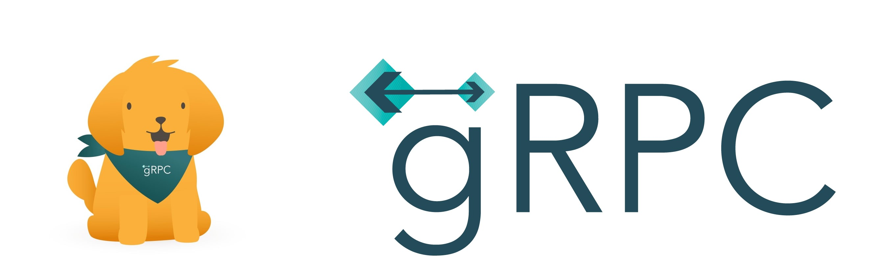
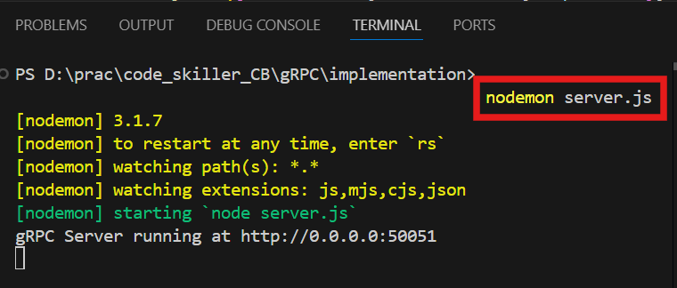
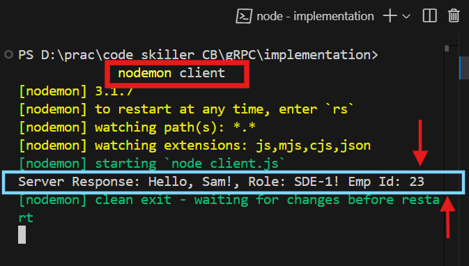

# Mastering gRPC: The Ultimate Developer's Guide
In today's world of distributed systems and microservices, efficient communication between services is critical. Traditional REST APIs often struggle with performance and type safety, leading developers to seek better alternatives. One such alternative is gRPC, a high-performance RPC (Remote Procedure Call) framework developed by Google.



gRPC **(gRPC Remote Procedure Call)** is an open-source RPC framework that enables fast and efficient communication between microservices. It leverages Protocol Buffers (protobufs) for data serialization and supports multiple programming languages.

**gRPC** allows a client application to call methods on a remote server as if they were local, simplifying distributed application development. It is based on defining services with specified methods, parameters, and return types. The server implements this service and runs a gRPC server to handle requests. On the client side, a stub (or client) provides the same methods, enabling seamless communication. This architecture ensures efficient, high-performance remote procedure calls across different machines and languages.

## Why Use gRPC?

- **High Performance :** Uses binary serialization (Protocol Buffers) instead of JSON, reducing payload size and improving speed.

- **Strongly Typed :** Enforces strict schema definitions using Protocol Buffers.

- **Multiplexing :** Uses HTTP/2, allowing multiple requests over a single connection.

- **Streaming Support :** Supports client, server, and bidirectional streaming.

- **Cross-Language Compatibility :** Works with multiple languages, including Node.js, Java, Python, Go, C# / .NET, Dart, Kotlin, PHP, Ruby etc.

## gRPC vs REST API

- gRPC uses binary serialization (*Protocol Buffers*), making it faster and more efficient than REST, which relies on text-based formats like JSON/XML. 

- gRPC operates over HTTP/2, supporting bidirectional streaming, whereas REST, using HTTP/1.1, has limited streaming support. 

- gRPC enforces a strongly typed schema using proto files, ensuring better structure, while REST APIs are weakly typed with JSON schemas. 

- gRPC offers cross-language compatibility, making it ideal for microservices, whereas REST is often language-dependent.

## gRPC Architecture

A gRPC system consists of three main components:

- **Client:** Sends requests to the server.

- **Server:** Implements service methods and responds to client requests.

- **Protocol Buffers (proto file):** Defines service methods and message structures.

## How gRPC Works ?

- The client calls a method on the stub (**client-side gRPC library**).

- The stub serializes the request using Protocol Buffers.

- The request is transmitted over HTTP/2 to the server.

- The server processes the request, executes the logic, and sends back a response.

- The client receives the response and deserializes it.

## Setting Up gRPC in Node.js 
To set up gRPC in Node.js, we start by initializing a project and installing necessary dependencies. Next, we define a Proto file *(service.proto)* that specifies the structure of the gRPC service, including request and response message types. We then implement a gRPC server *(server.js)* that loads this Proto definition, defines the logic for handling requests, and listens on a specified port. A gRPC client *(client.js)* is created to connect to the server, send requests, and receive responses. Finally, we run the server and client, allowing seamless communication between them using Protocol Buffers over HTTP/2, making the system efficient and scalable. 

Lets Start : 

### Step 1 : Setup a basic Node.js App

```    
    npm init -y
```

### Step 2 : Install the required dependencies

```
    npm i @grpc/grpc-js @grpc/proto-loader
```

- **@grpc/grpc-js** => gRPC JavaScript library for handling gRPC communication in Node.js.

- **@grpc/proto-loader** => Loads and parses the `.proto` file into a format that grpc-js understands.

### Step 3 : Define the Proto File

Create a `proto` folder and create a file `service.proto`. 

```
    // File : /proto/service.proto

    syntax = "proto3";            // Specifies that the file follows the Proto3 (Protocol Buffer).
    package employees;           // the namespace for the service

    // Declares a gRPC service named EmployeeInfo, which will contain RPC methods.

    service EmployeeInfo {

        // an RPC method SayInfo that takes a `HelloRequest` message &
        //  returns a `HelloResponse` message as output
        rpc SayInfo (HelloRequest) returns (HelloResponse);
    }

    // Defines a message type (HelloRequest) that acts as the request format for the SayInfo method.

    message HelloRequest {

        // Declares a field, its type and assigned a unique field number 
        //(used for binary serialization and backward compatibility)

        string name = 1;
        string role = 2;
        int32 empID = 3;
    }

    // Defines a message type (HelloResponse) that acts as the response format for the SayInfo method

    message HelloResponse {

        string message = 1;
    }
```

### Step 4 : Implement the gRPC Server
Create a file `server.js`.

1. **Import required gRPC libraries**

    ```
        // File : /service.js

        const grpc = require('@grpc/grpc-js');
        const protoLoader = require('@grpc/proto-loader');
    ```
2. **Load the Proto file**
    - Read synchronously and  convert `service.proto` into a usable format
        ```
            // File : /service.js
            const packageDefinition = protoLoader.loadSync('./proto/service.proto');
        ```

    - Loads the employees package from the `.proto` file 
        ```
            // File : /service.js
            const empProto = grpc.loadPackageDefinition(packageDefinition).employees;
        ```
3. **Define the RPC method implementation**

    Function accesses request data sent by the client and sends the response back with a formatted message.

    ```
        // File : /service.js
        function sayHello(call, callback) {

            // Sends the response back to the client with a formatted message
            callback(null, { message: `Hello, ${call.request.name}!, Role: ${call.request.role}! Emp Id: ${call.request.empID}` });
        }
    ```
4. **Create a gRPC Server**

    Initializes a new gRPC server instance.

    ```
        // File : /service.js
        const server = new grpc.Server();
    ```
5. **Add the gRPC service**

    Registers the `EmployeeInfo` service & maps the `SayInfo` RPC method to the `sayHello` function

    ```
        // File : /service.js
        server.addService(empProto.EmployeeInfo.service, { SayInfo: sayHello });
    ```
6. **Start the gRPC server**
    Starting the gRPC server and making it listen for incoming requests.
    - Make server to listen for requests on port `50051`.
    - `0.0.0.0` means it will accept connections from any IP address (localhost or other machines on the network).

    ```
        // File : /service.js
        
        server.bindAsync('0.0.0.0:50051', grpc.ServerCredentials.createInsecure(), () => {
            console.log('gRPC Server running at http://0.0.0.0:50051');
        });
    ```
### Step 5 : Implement the gRPC Client

Create a file `client.js`

1. **Import gRPC and Proto Loader modules**
    
    ```
        // File : /client.js

        const grpc = require('@grpc/grpc-js');
        const protoLoader = require('@grpc/proto-loader');
    ```
2. **Load the Proto file**
    - Read synchronously and  convert `service.proto` into a usable format
        ```
            // File : /client.js
            const packageDefinition = protoLoader.loadSync('./proto/service.proto');
        ```

    - Loads the employees package from the `.proto` file 
        ```
            // File : /client.js
            const empProto = grpc.loadPackageDefinition(packageDefinition).employees;
        ```
3. **Create a gRPC client to connect to the server**
    - Creates a client instance for `EmployeeInfo` service.
    - Connects to `localhost:50051`, where the gRPC server is running.
    - Uses `grpc.credentials.createInsecure()` → No SSL/TLS encryption (for local development).

    ```
        // File : /client.js
        const client = new empProto.EmployeeInfo('localhost:50051', grpc.credentials.createInsecure());
    ```

4. **Call the `SayInfo` method on the server & handle the server response**

    - Sends a request to the `SayInfo` method on the server and pass an object as input.
    - If there’s an error, it prints the error message. Otherwise, it logs the response message received from the server.
    ```
        // File : /client.js

        client.SayInfo({ name: 'Sam',role:'SDE-1', empID:23 }, (err, response) => {
            if (err) console.error(err);
            console.log('Server Response:', response.message);
        });
    ```
### Step 6 : Run the App

1. **Start the server :**

    Open terminal and run the command

    ```
        nodemon server.js
    ```
    

2. **Start the client :**

    Open another terminal and run the command

    ```
        nodemon client.js
    ```
    

## Advanced Features of gRPC 

### 1.  gRPC Streaming

Instead of sending and receiving messages one at a time, gRPC supports streaming, allowing continuous data exchange between the client and server.
- **Server Streaming**
    - The client sends one request, and the server responds with multiple messages. It is useful for real-time updates, like live stock prices or notifications.
    - *Example* : A weather service where you request a forecast, and the server keeps sending updates for the next few days.

- **Client Streaming**
    - The client sends multiple messages, and the server responds with a single response after receiving all messages. It is useful when collecting large amounts of data, like uploading logs or analytics.
    - *Example* : A client uploads multiple files, and the server sends a single confirmation message when all uploads are done.

- **Bidirectional Streaming**
    - Both client and server send multiple messages in real time. It is useful for real-time chat applications or collaborative editing tools.
    - *Example* : A live chat where both users send and receive messages continuously without waiting for each other.

### 2. Authentication & Security 

Security is important when services communicate over the internet. gRPC provides strong security features:

- **TLS Encryption (Transport Layer Security)**
    - Ensures data is encrypted while traveling between the client and server. It prevents hackers from reading sensitive information.
    - *Example* : A banking application using gRPC to send account details securely.
    
- **JWT Authentication (JSON Web Token)**
    - Used to verify user identity before processing a request.
    - *Example* : An API that only allows authenticated users to access private data.

### 3. Load Balancing 

When multiple users request a service, load balancing helps distribute requests efficiently.

- **Round-robin Load Balancing**
    - Requests are distributed evenly across multiple servers.
    - *Example* : If there are 3 servers handling requests, the first request goes to Server 1, the second to Server 2, and so on.
- **Client-side Load Balancing**
    - The client decides which server to send the request to, based on available servers.
    - Helps reduce server overload and improves response time.


## Implementation (refer GitHub Repo)

[GITHUB LINK](https://github.com/sarikasingh30/code_skiller_CB/tree/main/gRPC/implementation)

## Conclusion

gRPC is a powerful framework that enhances communication in distributed systems by offering high performance, strong typing, and efficient data serialization with Protocol Buffers. Its support for HTTP/2, streaming, and cross-language compatibility makes it an ideal choice for modern microservices architectures. Implementing gRPC in Node.js involves defining services using .proto files, setting up a gRPC server, and creating a client for seamless communication. With advanced features like streaming, authentication, and load balancing, gRPC provides a scalable and secure solution for building high-performance applications. Adopting gRPC can significantly improve efficiency and reliability in service-to-service communication.


## References and Resources

### Links

- [gRPC Documentation](https://grpc.io/docs/)
- [NPM Documentation](https://docs.npmjs.com/)
- [@grpc/grpc-js NPM Package](https://www.npmjs.com/package/@grpc/grpc-js)
- [@grpc/proto-loader NPM Package](https://www.npmjs.com/package/@grpc/proto-loader)


### FAQs (Frequently Asked Questions)

1. **What are Protocol Buffers, and why are they used in gRPC?**

    Protocol Buffers (protobufs) are Google's language-neutral, platform-independent mechanism for serializing structured data. They enable faster data transmission and reduce payload size compared to JSON, making them ideal for high-performance applications.

2. **What are the types of gRPC streaming?**

    - **Server Streaming :** Server sends multiple responses to a single client request.
    - **Client Streaming :** Client sends multiple requests before receiving a single response.
    - **Bidirectional Streaming :** Both client and server send multiple messages in real-time.

3. **How does gRPC handle security and authentication?**

    gRPC supports TLS encryption for secure communication and JWT authentication for user identity verification. This ensures data integrity and prevents unauthorized access.

4. **What are the key dependencies required to implement gRPC in Node.js ?**

    **@grpc/grpc-js :** The core gRPC library for Node.js.
    **@grpc/proto-loader :** Parses `.proto` files into a format that grpc-js can understand.

5. **Can gRPC be used with different programming languages?**

    Yes, gRPC supports multiple languages, including Node.js, Python, Java, Go, C#, Dart, Kotlin, PHP, and more.

6. **What is the role of .proto files in gRPC?**

    A `.proto` file defines the service, RPC methods, and message structures in a structured format. It ensures that both client and server follow a strict contract for communication.

7. **How does gRPC achieve load balancing?**
    
    gRPC supports round-robin load balancing, where requests are distributed evenly across multiple servers, and client-side load balancing, where the client decides the best server to send requests to.

8. **When should I use gRPC instead of REST?**

    Use gRPC when:
    - High performance and low latency are required.
    - You need bidirectional streaming or real-time communication.
    - Services communicate in a strongly typed and structured manner.
    -Your system is microservices-based and requires efficient inter-service communication.
    
---