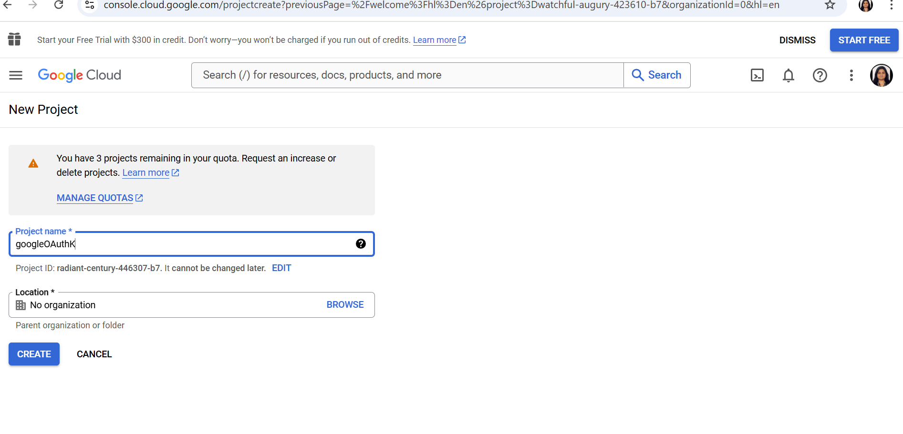
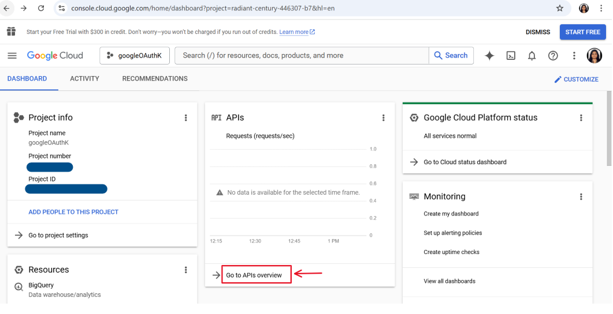
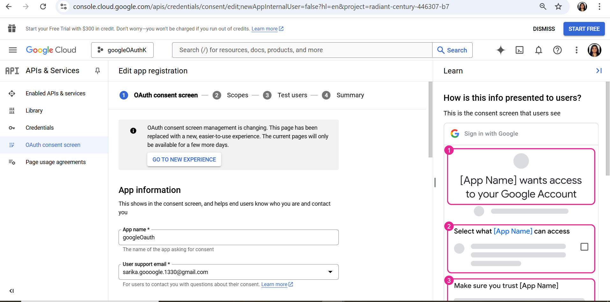
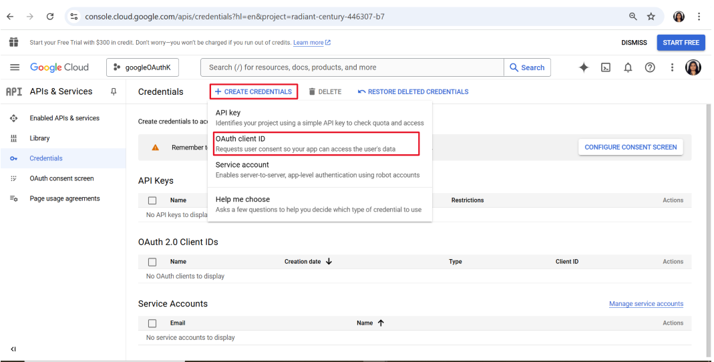
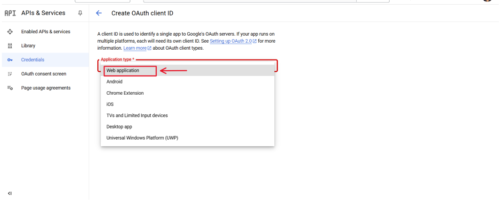
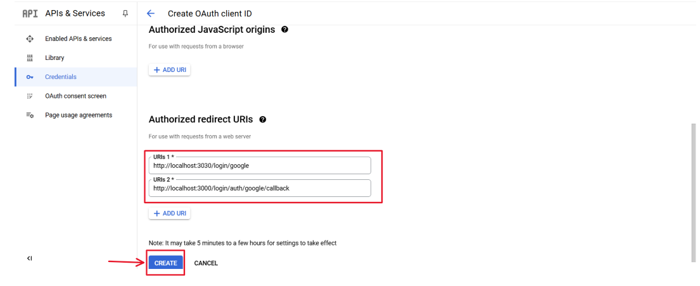
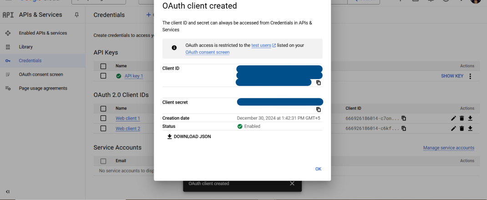

# Google OAuth Integration Guide for Node.js Applications
Google OAuth Integration is a powerful feature that enables users to authenticate their identity using their Google account. Secure Authentication Workflows ensure that user identities are verified through reliable and safe processes, minimizing the risk of unauthorized access. This process, commonly used in web applications, allows users to log in without needing to remember additional usernames or passwords. It relies on the OAuth 2.0 protocol, an industry-standard for secure authorization. As part of this, a Beginner's Guide to OAuth provides a simple introduction to how OAuth 2.0 enables secure, token-based authentication for third-party applications.

*OAuth Implementation Best Practices* ensure that OAuth is integrated securely, including practices such as using secure redirect URIs, validating tokens, and following least privilege access principles to protect user data.

## Why Use Google OAuth?

1. Users can log in with Google, avoiding the need for new credentials.
2. OAuth uses secure tokens, avoiding password storage and reducing data breach risks.
3. Users trust Google for a reliable login process.
4. Google accounts simplify password resets, recovery, and verification.
5. OAuth speeds up onboarding by skipping registration forms.
6. Users can log in across devices without separate credentials.

## How Google OAuth Works ?

1. **User Interaction:** The user clicks "Login Using Google Account" and authenticates on Google's page. 
2. **Authorization:** Google requests permission to share specific user data.
3. **Token Exchange:** An authorization code or token is sent to the application.
4. **Data Fetching:** The app uses the token to retrieve user data securely.
5. **Authentication Completion:** The app verifies data, updates the database, and starts a user session.

## Role of Passport in Google OAuth Integration
 Passport.js Integration simplifies the process of implementing OAuth in Node.js applications. By using Passport.js(**popular Node.js middleware**), developers can integrate Google OAuth seamlessly, handling the authentication flow and managing user sessions with minimal effort. With Passport, you don’t need to handle the complex details of the OAuth protocol. 

 - **Google Strategy**: 
    - Passport provides a *passport-google-oauth20* strategy specifically for integrating Google OAuth 2.0.
    - This strategy helps the application interact with Google's authentication API.
 - **Session Handling**: 
    - Passport handles user sessions automatically, making it easier to manage logged-in states.
 - **Modular Design**: 
    - Passport’s modular design allows developers to use only the strategies they need, such as Google, Facebook, or local authentication.
 - **Integration**: 
    - The *passport.use()* method registers the Google OAuth strategy.
    - *passport.serializeUser()* and *passport.deserializeUser()* are used to manage user data in sessions effectively.

## Steps for Google OAuth Integration
We will use Node.js and Google API to enable secure user authentication and data access through Google OAuth.

### Step 1 : Setup a basic Node.js App

```    
npm init -y
```
Now, create **app.js** file for the Node.js backend server.

```
// File: /app.js

const express=require("express")
const app=express()
const PORT=3030
// Express.js Middleware
app.use(express.json())

app.listen(PORT,(err)=>{
    if(err){
        console.log(err)
    }
    else{
        console.log(`Listening on PORT: ${PORT}`)
    }
})
```

### Step 2 : Install the required dependencies

- **passport** — Middleware for handling authentication in Node.js and Express applications.

- **passport-google-oauth20** — A Passport strategy that enables authentication via Google, allowing users to log in using their Google account.

- **connect-mongo** — enables MongoDB Session Storage by storing session data in a MongoDB database when used with express-session in a Node.js application. This ensures session persistence across server restarts, providing better scalability and durability than in-memory storage.

```
npm i express mongoose ejs bcrypt dotenv express-session passport passport-google-oauth20 connect-mongo
```

### Step 3 : Create **.env** file and add MongoDB Url and Secret Key to it.
- **.env file** is used to store sensitive information.
- Now, we save the MongoDB URL of the MongoDB Atlas and the Secret Key for the session

```
MONGO_URL=""
SECRET_KEY=""    
```

### Step 4 : Set up a Google Developer Console Project
1. Visit the **Google Developer Console**.
2. Create a new project or select an existing one.

    


3. Enable the Google+ API or Google Identity Platform for your project.

    


4. Set up OAuth 2.0 credentials:

    

    


5. Go to the Credentials tab. Click on Create Credentials → OAuth 2.0 Client IDs.

    

6. Click on **Application type** and choose **Web application**

    


7. Set the Authorized redirect URIs (OAuth Redirect URIs)
    (e.g., http://localhost:3030/login/google and http://localhost:3000/login/auth/google/callback for local development).

    

8. Note down the **Client ID** and **Client Secret**. These will be used in the OAuth flow.

    

9. To use these credentials, save them in a **.env** file.

    ```
    GOOGLE_CLIENT_ID=""
    GOOGLE_CLIENT_SECRET=""
    ```

### Step 5 : Connect MongoDB database using mongoose in app.js

```
// File: /app.js

const express = require("express")
const mongoose = require('mongoose');
const app = express()
const dotEnv = require("dotenv")    // import dotenv npm package
const PORT = 3030
dotEnv.config()                     // configuring dotenv
//Express.js Middleware
app.use(express.json())
//Express.js Middleware
app.use(express.urlencoded({ extended: true }))
mongoose.connect(process.env.MONGO_URL)               // fetching MONGO_URL from .env file
    .then(() => {
        console.log('database Connected!')
        app.listen(PORT, (err) => {
            if (err) {
                console.log(err)
            }
            else {
                console.log(`Listening on PORT ${PORT}`)
            }
        })
    }).catch((err) => console.log(err));

```

### Step 6 : Set up the View engine as ejs to get HTML for Login and Profile Page

```
// File: /app.js

app.set('view engine', 'ejs');         
```

### Step 7 : Create **login.ejs** and **profile.ejs** files for login and profile page respectively.

- login.ejs
    ```
    // File: views/login.ejs 

    <!DOCTYPE html>
    <html lang="en">

    <head>
    <meta charset="UTF-8" />
    <meta name="viewport" content="width=device-width, initial-scale=1.0" />
    <title>Document</title>
    </head>

    <body>
    <h1>Login Page</h1>

    <div>
        <a href="/login/google">
        <button>Login Using Google</button>
        </a>
    </div>

    </body>

    </html>
    ```
- profile.ejs
    ```
    // File: views/profile.ejs

    <!DOCTYPE html>
    <html lang="en">
    <head>
        <meta charset="UTF-8">
        <meta name="viewport" content="width=device-width, initial-scale=1.0">
        <title>Document</title>
    </head>
    <body>
        <h1>Welcome <%= username %> to the Profile Page</h1>
        
        <a href="/logout">
            <button >LOGOUT</button>
        </a>
    </body>
    </html>
    ```

### Step 8 : Configure sessions using **express-session** and **connect-mongo** for User Session Management.

```
// File: /app.js

const session = require("express-session")    // importing express-session
const MongoStore=require("connect-mongo")   // importing the connect-mongo


// configuring the session 
app.use(session({
    secret: process.env.SECRET_KEY,
    resave: false,
    saveUninitialized: true,
    store: MongoStore.create({ mongoUrl: process.env.MONGO_URL })
}))

```

### Step 9 : Define Routes

#### Root Route:
Redirect the root path (/) to the login page.
```
// File: /app.js

app.get("/", (req, res) => {
    return res.redirect("/login");
});
```

#### Login and Profile Routes:

Use separate route handlers for **/login** and **/profile**.
```
// File: /app.js

const profileHandler = require("./routes/profile");
const loginHandler = require("./routes/login");

app.use("/login", loginHandler);
app.use("/profile", profileHandler);
```

### Step 10 : Create **user** model
The User model defines the structure of the user data in the database.
```
// File: /models/user.js

const mongoose=require("mongoose")
const userSchema=new mongoose.Schema({
    googleId:{type:String},
    googleAccessToken:{type:String},
    username: {type:String}
    
})
module.exports=mongoose.model("user", userSchema)
```

- **googleId**: This field stores the unique Google ID of the user, which is used for identifying the user after they authenticate via Google OAuth.

- **googleAccessToken**: This field stores the access token received after a user logs in through Google. The access token is used to make authorized requests to Google services on behalf of the user.

- **username:** This field stores the username of the user. It will be extracted from the user's Google profile after authentication.


### Step 11 : Steps to Configure Google OAuth with Passport.js

 a. **Import modules and configure environment variables.**

     - Create a file *passport.js* in *auth* folder
     - Import required modules 
     - Configure the dotenv package to load environment variables

 b. **Define the Google OAuth 2.0 strategy, authenticate users, and handle user creation.**

     - Define the Google OAuth 2.0 Strategy by providing:

        - clientID and clientSecret from environment variables.

        - callbackURL: Redirect URI after successful login.

        - scope: Permissions requested (e.g., access to profile and email).

     - Implement the callback function to handle user authentication.

 c. **Serialize user information to store in the session.**

    - Define how user data is saved in the session:
        - Save only the user ID to reduce session size.


 d. **Deserialize user information to retrieve from the session.**
    
    - Define how user data is retrieved from the session:
        - Fetch the full user details from the database using the user ID.


 e. **Export the configured Passport for use in the application.**
    
    
        module.exports=passport
    

 f. **Integrate passport.js into an Express application, enabling it to handle user authentication and manage sessions effectively .**

```
    // File : /app.js
    
    app.use(passport.initialize());  //middleware initializes passport.js in the app
    app.use(passport.session());   //middleware enables session-based authentication in the app
    // add the above lines below the session configured
```

 ```
    // File : /auth/passport.js
    const passport = require("passport")     
    const User = require("../models/user")
    const dotEnv = require("dotenv")
    dotEnv.config()

    var GoogleStrategy = require('passport-google-oauth20').Strategy;

    passport.use(new GoogleStrategy({
        clientID: process.env.GOOGLE_CLIENT_ID,
        clientSecret: process.env.GOOGLE_CLIENT_SECRET,
        callbackURL: "http://localhost:3030/login/auth/google/callback",
        scope: ['profile', 'email']
    },
        async function (accessToken, refreshToken, profile, cb) {
            console.log("AccessToken", accessToken)
            console.log("refreshToken", refreshToken)
            console.log("profile", profile)
            
            try {
                let user = await User.findOne({
                    googleId: profile.id
                })
                if (user) return cb(null, user)
                user = await User.create({
                    googleAccessToken: accessToken,
                    googleId: profile.id,
                    username:profile.displayName,

                })
                cb(null, user)
            } catch (err) {
                cb(err, false)

            }

        }
    ));
    // serializing
    passport.serializeUser(function (user, done) {
        done(null, user.id);
    });

    // deserializing
    passport.deserializeUser(async function (id, done) {
        try {
            let user = await User.findById(id)
            done(null, user)
        } catch (err) {
            done(err, null);
        }

    });

    module.exports = passport
 
 ```


### Step 12 : Implementing Login Routes with Google OAuth

**Import Required Modules**

    - *express*: Used to create the router.
    - *passport*: Custom Passport instance for handling authentication.
    - *loginHandler*: Controller to handle login-related logic.

**Define the Root Login Route**

    - GET / :
        - Uses *loginHandler.getLogin* to serve the login page.

**Add Google OAuth Login Route**

    - GET /google :
        - Initiates authentication with Google using the Google OAuth strategy.
        - Requests access to the user's profile.

**Handle Google OAuth Callback**

    - GET /auth/google/callback :
        - Handles the callback from Google after user authentication.
        - Redirects to /profile on success or /login on failure.

**Export the Router**

    - Export the configured router so it can be used in the main app.

**CODE:**  
1. **Controller**

    ```
    // File /controllers/login.js

    const path=require("path")

    const filepath=path.join(__dirname,"../views/login.ejs")
    module.exports.getLogin=(req,res)=>{
        if(req.user){
            return res.redirect("/profile")   //  Redirect to profile if user is already logged in
        }
        res.render(filepath);                 // Render the login page if user is not logged in
    }
    ```

2. **Routes**

    ```
    // File : /routes/login.js

    const express = require("express")
    const router = express.Router()
    const myPassport = require("../auth/passport");

    router.get('/google',
        myPassport.authenticate('google', { scope: ['profile'] }));
    
    router.get('/auth/google/callback', 
        myPassport.authenticate('google', { failureRedirect: '/login' }),
        function(req, res) {
        // Successful authentication, redirect home.
        res.redirect('/profile');
        });

    module.exports = router
    ```


### Step 13 : Setting Up Profile Routes in Express.js for User Management

**Import Required Modules**

    - *express*: The Express.js library is used to create a router instance.
    - *profileHandler*: The controller that contains the logic for handling profile-related operations.

**Define the Profile Route**

    - GET /:
        - Maps the root profile route (/profile) to the getProfile method in the profileHandler controller.
        - This method is responsible for retrieving and rendering the user's profile page.

**Export the Router**

    - Export the configured router so it can be used in the main app.


**CODE:**  
1. **Controller**
    - **getProfile** controller function handles rendering the user's profile page.
        - **Authenticated User**:
            If req.user exists, the profile.ejs page is rendered with the username displayed.
        - **Unauthenticated User**:
            If req.user does not exist, the user is redirected to the login page (/login).
    ```
    // File /controllers/profile.js

    const path=require("path")
    const filepath2=path.join(__dirname,"../views/profile.ejs")

    module.exports.getProfile=(req,res)=>{
        console.log(req.user)
        if(!req.user){
            return res.redirect("/login")
        }
        res.render(filepath2,{username:req.user.username});
    }
    ```

2. **Routes**

    ```
    // File : /routes/profile.js

    const express=require("express")
    const router=express.Router()
    const profileHandler=require("../controllers/profile")
    router.get("/",  profileHandler.getProfile)
    module.exports=router
    ```

### Step 14 : Define logout Route

We define **/logout** route in app.js 

1. A user accesses the **/logout** route.
2. The **req.logout** method terminates the user session.
3. If no errors occur, the user is redirected to the **/login** page.
4. If an error occurs during the logout process, it is passed to the next middleware for proper error handling. 

```
// File: /app.js

app.get("/logout",(req,res)=>{
    req.logout(function(err) {
        if (err) { return next(err); }
        res.redirect('/login');
      });
})

```

## Implementation (refer GitHub Repo)
[GITHUB LINK](https://github.com/sarikasingh30/code_skiller_CB/tree/main/googleOauth/passport_google_oauth2.0/implementation)

## References and Resources

- [Introduction to OAuth 2.0](https://cloud.google.com/apigee/docs/api-platform/security/oauth/oauth-introduction)
- [Setting up OAuth 2.0](https://support.google.com/cloud/answer/6158849?hl=en)
- [passport.js official documentation](https://www.passportjs.org/)
- [Passport strategy for Google OAuth 2.0](https://www.passportjs.org/packages/passport-google-oauth2/)
- [NodeJS Official Documentation](https://nodejs.org/docs/latest/api/)
- [Express Documentation](https://expressjs.com/)
- [Mongoose Official Documentation](https://mongoosejs.com/docs/)
- [Express-Session npm package documentation](https://www.npmjs.com/package/express-session)
- [Connect-Mongo npm package documentation](https://www.npmjs.com/package/connect-mongo)
