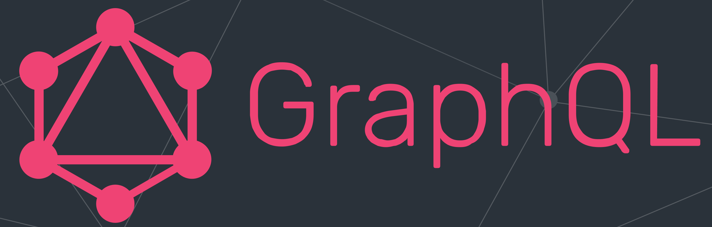
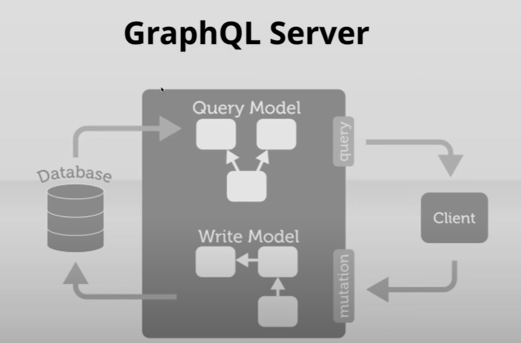
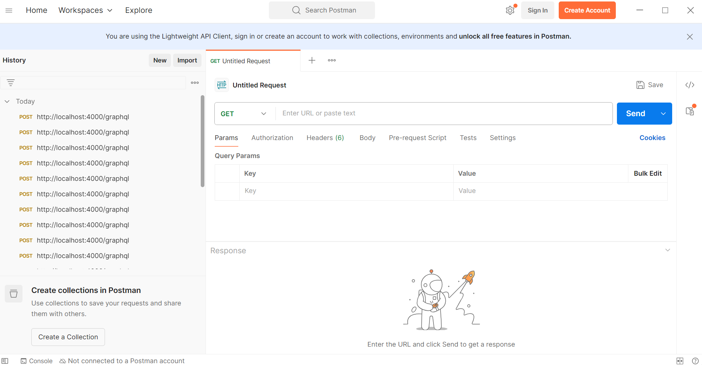
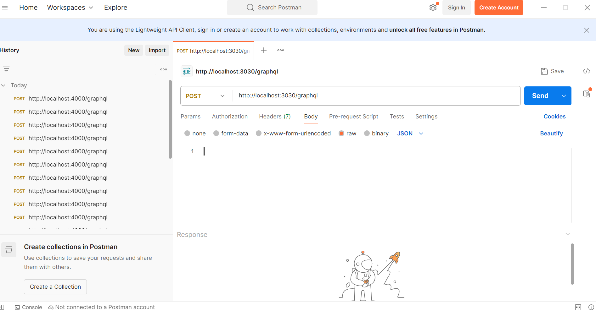
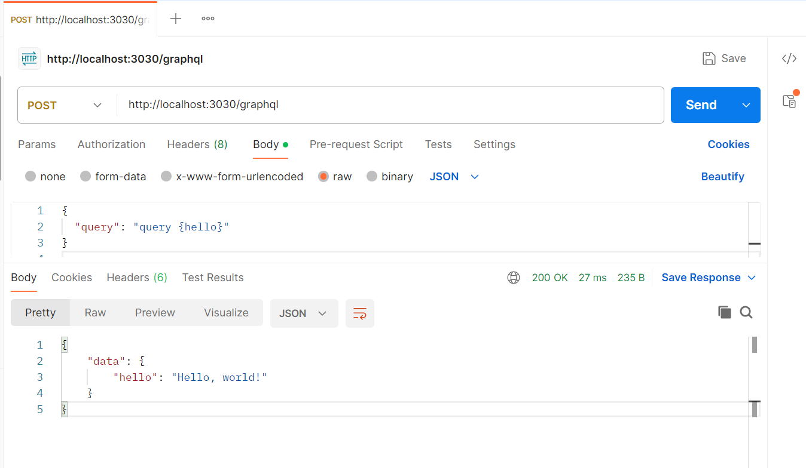
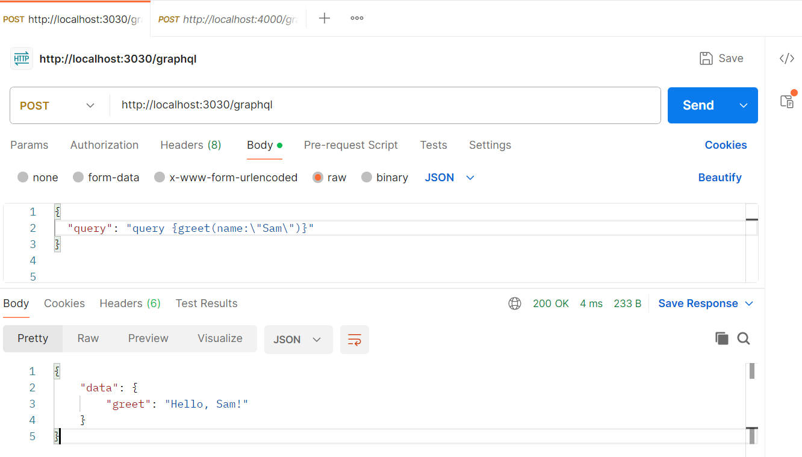
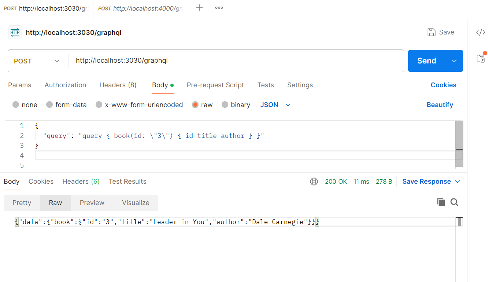
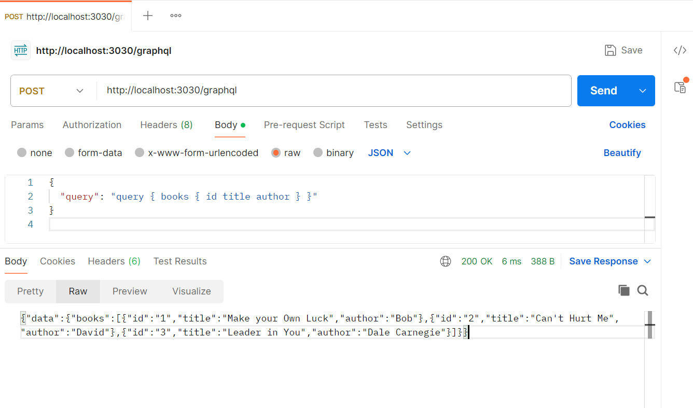

# Getting Started with GraphQL in Node.js: A Beginner’s Guide

GraphQL is a query language for APIs and a runtime for executing those queries using your existing data. It was developed by Meta (formerly Facebook) in 2012 and open-sourced in 2015. GraphQL has rapidly become a popular alternative to RESTful APIs due to its flexibility, efficiency, and powerful developer tools. It allows clients to request only the data they need, reducing the amount of over-fetching or under-fetching that can occur with traditional REST APIs.



GraphQL acts as an intermediary layer between the client and the backend services. The client interacts only with the GraphQL server, which in turn queries the relevant backend services (such as databases, other microservices, or third-party APIs). The client sends a single structured query to the GraphQL server, specifying exactly what data it needs, and the server resolves that query by aggregating the necessary data from the backend. This means:

    Client → GraphQL Server → Backend Services (Databases, APIs, etc.)

The backend services are abstracted from the client, making it easier to manage and evolve the backend without affecting the client.
    

## Key Features of GraphQL

-  **Client-Specified Data Retrieval (No Over-Fetching or Under-Fetching)** :

    The client requests exactly the data it needs and nothing more. This is because the client defines the query with precision, asking for only the specific fields required, which minimizes data transfer and improves performance.

- **Single Endpoint for All Requests** : 

    With GraphQL, the client sends a query to a single endpoint, and the server processes the request accordingly. This simplification of API design leads to fewer HTTP requests, cleaner code, and easier maintenance.

- **Aggregation of Multiple Resources in One Request** :

    In GraphQL, the client can fetch all necessary data with a single query, and the GraphQL server resolves it by querying multiple backend services (databases, APIs, etc.) and returns a unified response.

- **Strongly Typed Schema and Introspection** : 

    GraphQL offers introspection, which allows clients to query the schema itself to discover available types, fields, and operations. This makes it much easier for developers to explore the API and understand how to interact with it.

- **Reduced Overhead for Mobile and Slow Networks** :

    GraphQL's ability to request only the necessary data makes it a great choice for mobile apps. It reduces the amount of data sent over the network, leading to faster load times and better overall performance, especially in areas with slower network connections.

## GraphQL Basics: Types and Queries
In GraphQL, *types* and *queries*, plays an important role in defining and fetching data.

### Types: Describing the Data 

- GraphQL types define the structure of the data available through your API. 
- They act as a blueprint, describing what kind of data clients can query. 
- The GraphQL schema language supports the scalar types of String, Int, Float, Boolean, and ID.
- Types do not specify *how* the data is retrieved—only what data is available.

```
    type Book {
    id: ID             // type of id is ID (unique)
    title: String      // type is String
    author: String     // type is String
    }
```
### Query: Fetching the Data

- GraphQL queries specify how to retrieve that data. 
- A query in GraphQL fetches specific data from the server.

```
    query {
        books {
            id
            title
            author
        }
    }
```

## Mutations and Subscriptions: The Backbone of Dynamic GraphQL APIs

### Mutations  
    
- A mutation in GraphQL is a way to modify data on the server.
- **Working** :
    - A client sends a mutation to the server specifying what data to change.
    - The server processes the mutation and applies the changes to the database or underlying systems.
    - The server responds with the updated data.
- **Use Cases** :
    - Add a new user to the list.
    - Update a product's stock. 
    - Delete a comment on a post.

### Subscriptions 

- A subscription in GraphQL is a way for clients to receive real-time updates whenever specific data changes occur on the server.
- **Working** :
    - A client sends a subscription request to the server.
    - The server listens for changes in the specified data.
    - Whenever new data is added or modified, the server pushes an update to all subscribed clients.
- **Use Cases** :
    - Get real-time updates for new comments on a post.
    - Receive notifications when a user comes online.
    - Track live stock prices or sports scores.





## Let’s build a GraphQL Server Using *graphql-http* and *Node.js*

### Step 1 :  Setup a basic Node.js App

```    
    npm init -y
```

Now, create **app.js** file for the Node.js backend server.

```
    // File : app.js
    
    const express=require("express")
    const app=express()
    const PORT=3030
    app.use(express.json())
    app.use(express.static('public'));

    app.listen(PORT,(err)=>{
        if(err){
            console.log(err)
        }
        else{
            console.log(`Listening on PORT: ${PORT}`)
        }
    })
```

### Step 2 : Install the required dependencies

```
    npm i express              // To create a node server
    npm i graphql              // To define the GraphQL schema and resolvers
    npm i graphql-http         // To handle GraphQL requests

    //  or
    npm install express graphql graphql-http    // both will work
```

Updated dependencies in the **package.json** file 

```
    "dependencies": {
        "express": "^4.21.2",
        "graphql": "^16.10.0",
        "graphql-http": "^1.22.3"
    }
```
### Step 3 : Import Required Modules in *app.js*

```
    // File : app.js
    
    const { createHandler } = require('graphql-http/lib/use/express'); 
    const { buildSchema } = require('graphql');
```

- *createHandler* : This function integrates GraphQL with the Express server.
- *buildSchema* : This function define the structure (schema) of the GraphQL API, specifying the types of queries and data available.

### Step 4 : Define the GraphQL Schema
- Add Mock Data to app.js

    ```
        // File : app.js
        // MOCK DATA
        const booksData = [
            { id: "1", title: "Make your Own Luck", author: "Bob" },
            { id: "2", title: "Can't Hurt Me", author: "David" },
            { id: "3", title: "Leader in You", author: "Dale Carnegie" },
        ];
    ```
- Define the Schema
    ```
        // File : app.js
        // Define the GraphQL schema

        const schema = buildSchema(`
            type Query {   
                hello: String
                greet(name: String!): String                        
                book(id: ID!): Book
                books: [Book!]!
            }

            type Book {
                id: ID!
                title: String!
                author: String!
            }
        `);
    ```
    - *type Query* : Defines the available operations (queries)
        - *hello* : Returns a string.
        - *greet(name: String!)* : Accepts a name parameter (required) and returns a string.
        - *book(id: ID!)* : Fetches a single book by its id.
        - *books* : Fetches a list of all books.

    - *type Book* : Describes the structure of a Book object with fields:
        - *id (ID)* : Unique identifier.
        - *title (String)* : Title of the book.
        - *author (String)* : Author of the book.

### Step 5 : Define the Resolver Functions

These are functions that determine how the API responds to each query.

```
    // File : app.js

    // resolver function
    const rootValue = {
        hello: () => "Hello, world!",
        greet: ({ name }) => `Hello, ${name}!`,
        book: ({ id }) => booksData.find((book) => book.id === id),
        books: () => booksData
    };    
```    

### Step 6 : Attach the GraphQL Endpoint
This links the GraphQL schema to the endpoint and provides the resolver functions for handling queries.

```
    // File : app.js

    app.use('/graphql', createHandler({ schema, rootValue})); 
```
### Step 7 : Run the Application

1. **Start the server .**

    ```
    nodemon app
    ```
    *nodemon app* runs the app.js file and automatically restarts the server whenever code changes are detected.

2. **Open a GraphQL client like *Postman or Insomnia* to test the server .**

    


3. **Make a POST request to the GraphQL endpoint (http://localhost:3030/graphql)**

    

4. **Test the Query :**

    - **Fetches a simple String message.**

        

    - **Fetches a personalized greeting message based on the name argument.**

        

    - **Fetches details of a single Book by its id.**

        

    - **Fetches a list of all Book objects.**

        

### Step 8 : Testing and Debugging

1. **Handling 404 Errors (Page Not Found)** : 
    
    For routes that don’t exist, send a 404 response to indicate the resource isn’t found.

    ```
        // File : /app.js

        // Handling 404 Errors (Page Not Found)
        app.use((req, res, next) => {
            res.status(404).json({ error: 'Page not found' });
        });
    ```

2. **Basic Error-Handling Middleware** : 
    
    Set up a basic error-handling middleware that catches all errors and sends a response to the user.

    ```
        // File : /app.js

        // General error handling middleware
        app.use((err, req, res, next) => {
            console.error(err)                  // Optionally log the error for debugging
            res.status(500).json({ error: 'Something went wrong!' })
        })
    ```
3. **Use console.log to inspect incoming queries, arguments, and resolver behavior**

4. **Add error handlers for unexpected issues in resolvers** :
    ```
        // File : /app.js
        // Resolver function for fetching single book
        book: ({ id }) => {
            try {
                const book = booksData.find((book) => book.id === id)
                if (!book) throw new Error('Book not found');
                return book;
            } catch (error) {
                console.error(error);
                throw new Error('Error fetching book data');
            }
        }
    ```

5. **Return Meaningful Error Messages** : 

    If there’s an error, provide a user-friendly message without exposing sensitive information.


## Implementation (refer GitHub Repo)
[GITHUB LINK](https://github.com/sarikasingh30/code_skiller_CB/tree/main/graphQL/implementation)

## Conclusion
GraphQL is changing how we work with APIs, making them more flexible and efficient compared to traditional REST APIs. It allows clients to ask for only the data they need, reducing unnecessary data transfer and improving performance. With features like a single endpoint, strongly typed schemas, and introspection, it’s easy to use and powerful for developers. It is a great tool for modern apps, and once you get the hang of it, you can explore advanced features like real-time updates with subscriptions or optimizing performance with caching. 

## References and Resources

### Links 
- [GraphQL Documentation](https://graphql.org/learn/)
- [NodeJS Official Documentation](https://nodejs.org/docs/latest/api/)
- [Express Documentation](https://expressjs.com/)


### FAQs (Frequently Asked Questions)

1. **How is GraphQL different from REST?**

    In REST, we have multiple endpoints for different resources while GraphQL has a single endpoint. It allows clients to specify exactly what data they need, avoiding over-fetching or under-fetching.

2. **Can GraphQL replace REST APIs completely?**
    
    GraphQL is a powerful alternative but not necessarily a replacement for REST. The choice depends on your project requirements. For example, GraphQL excels in cases requiring flexible queries, while REST might be simpler for small applications.

3. **What is introspection in GraphQL?**

    Introspection is a feature that allows clients to query the schema itself to discover available types, fields, and operations. It’s helpful for debugging and understanding the API.

4. **What is the role of `graphql-http` in a GraphQL server?**

    The `graphql-http` library helps handle GraphQL requests in a Node.js server, integrating GraphQL with frameworks like Express.

5. **Is GraphQL suitable for real-time applications?**

    Yes, GraphQL supports real-time data updates using subscriptions. This makes it fit for applications like chat apps, live sports updates, and stock price tracking.

---