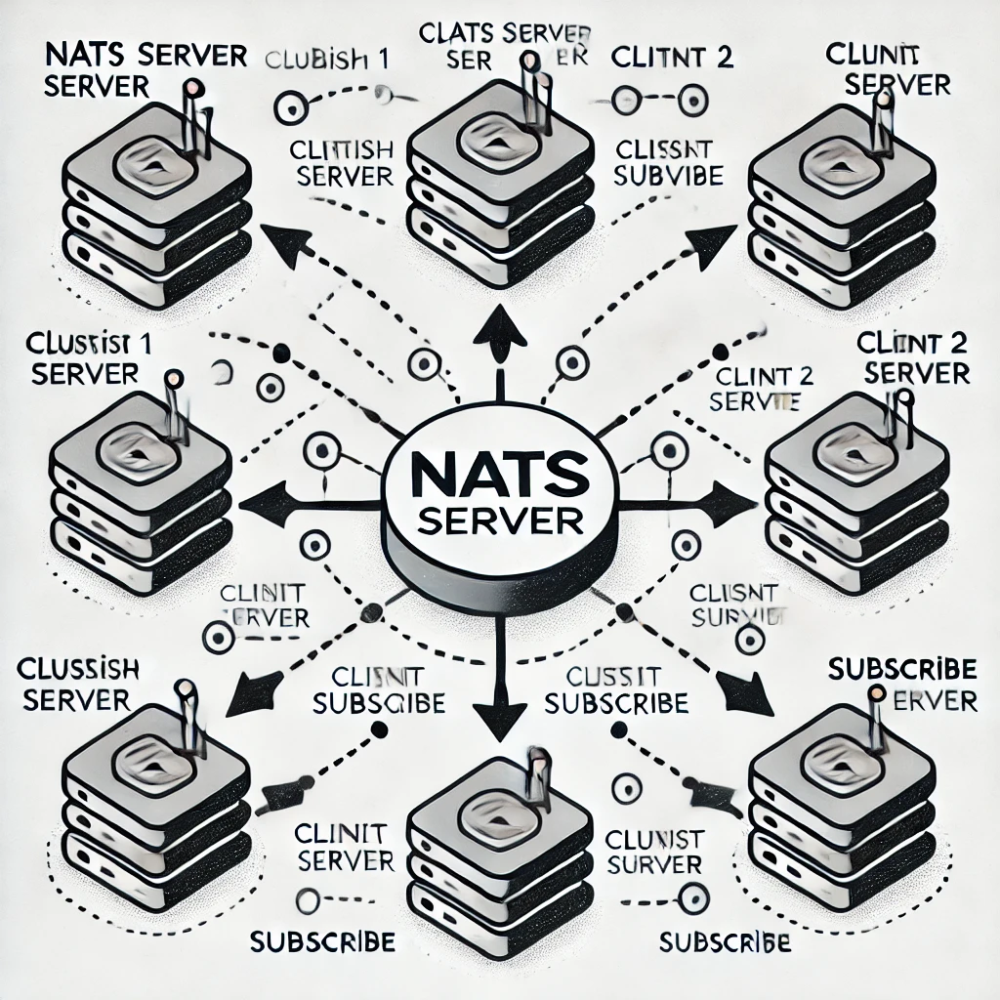

# NATS Socket Architecture: A Beginner's Guide
The NATS socket architecture is the foundation of its lightweight and high-performance messaging system. It manages how messages are sent and received between clients and the NATS server using sockets. The server can handle thousands of client connections simultaneously by sharing sockets through a process called multiplexing. To ensure efficiency, it uses event-driven methods to manage all active socket input/output (I/O) operations without causing delays or blocking other tasks.

## What is NATS?
NATS is an advanced messaging technology crafted to address the intricate communication demands of modern applications. Its design ensures flexibility, security, and high performance, making it a powerful solution for diverse, interconnected ecosystems.

  

## Key Capabilities:
**Seamless Connectivity Across Platforms**

1. **Cloud Vendors** : Facilitates communication across different cloud providers.
2. **On-Premises Infrastructure** : Integrates systems within private networks.
3. **Edge Devices** : Supports localized, resource-constrained environments.
4. **Mobile Apps and Web Applications** : Ensures reliable communication for end-user interactions.
5. **IoT Devices** : Manages the high concurrency required by connected devices.

**Open-Source Modular Design**

1. Consists of a family of tightly integrated tools.
2. Tools can function independently or as a unified system.

## What Are Sockets?
Sockets are endpoints for sending or receiving data between two systems over a network. 
In NATS, sockets are used for communication between:

- Clients (publishers or subscribers)
- The NATS server

## NATS Communication Model
At a high level, NATS uses a **publish/subscribe messaging model**, and the socket architecture ensures efficient data transfer.

**Components** :
- **Clients** : Applications that publish or subscribe to messages.
- **Server** : The central NATS server managing connections and routing messages.
- **Sockets** : The underlying mechanism used to transmit data between the client and the server.

**Key Roles of Sockets in NATS** :
- Establish *persistent TCP connections* between clients and the server.
- Enable the server to multiplex many client connections.
- Efficiently handle message routing and delivery.

## How Sockets Work in NATS ?
**Connection Establishment** =>
Connection establishment is the process of creating a persistent communication channel between a NATS client (publisher or subscriber) and the NATS server. This step is crucial to facilitate real-time data exchange between the client and the server.
1. **Client Initiates Connection** :
A client opens a socket and connects to the NATS server on its default TCP port 4222.
2. **Server Accepts Connection** :
The server accepts the client connection and establishes a persistent socket for communication.

**Message Exchange** =>
Message exchange is the process by which data (messages) is sent and received between clients (publishers and subscribers) via the NATS server. NATS supports various communication patterns like publish/subscribe, request/reply, and queue groups, all of which rely on efficient routing and handling of messages.

1. **Publishing Messages** : 
    - The publisher sends data over its socket to the server.
    - The server routes the message to relevant subscribers using other sockets.
2. **Subscribing to Messages** :
    - A subscriber registers a subject with the server.
    - When a message for the subject arrives, the server pushes it to the subscriber’s socket.

## NATS Protocol
The NATS Protocol is a lightweight, text-based protocol designed to facilitate efficient communication between clients and the NATS server. It uses sockets as the underlying transport layer, ensuring high-speed, low-latency messaging suitable for distributed systems.

##  WebSocket Support in NATS
In addition to TCP sockets, NATS supports WebSocket connections, enabling browser-based clients to communicate with the NATS server.

**Why WebSocket?**

    - Enables real-time communication over HTTP-friendly protocols.
    - Useful for web-based applications like dashboards, chats, or notifications.

## NATS Socket Workflow
1. **Connection** :
- Connection establishes the foundation for message exchange by creating a direct communication channel.
- A client begins by creating a connection to the NATS server. This can be done using either:
    - TCP: Traditional socket-based connection for high-speed, low-latency communication.
    - WebSocket: Used for communication in browser-based or lightweight client applications.

2. **Handshake** :
- Handshake ensures that only authorized clients connect and that the server understands the client’s communication capabilities.
- Once the connection is established:
    - The server authenticates the client. This may involve checking credentials (e.g., username/password or tokens).
    - The server and client negotiate connection details, such as protocol version, configuration options, and features (e.g., compression or encryption).

3. **Message Routing** :

- Message Routing enables efficient delivery of messages to the right clients without unnecessary broadcasting.
- When a client publishes a message to a specific subject, the server determines which clients are subscribed to that subject.
- The server then routes the message to the relevant subscriber sockets.
- Internally Working :
    - The server maintains a subject-to-subscriber map to track which clients are subscribed to which subjects.
    - Using this map, the server routes messages only to the appropriate sockets.

4. **Keepalive Mechanism** :

- Keepalive mechanism prevents idle connections from being dropped and ensures the client and server are still in sync.
- Periodic PING messages are sent by the client to check the server’s responsiveness.
- The server responds with a PONG message to confirm the connection is active.
- If Keepalive Fails:
    - If the server does not respond to a PING within a specified timeout, the client considers the connection lost and attempts to reconnect.
5. **Disconnection** :

- Disconnection frees up resources and ensures that disconnected clients do not continue to occupy server capacity.
- If a client decides to disconnect intentionally, it sends a DISCONNECT command to the server.
- The server closes the corresponding socket and cleans up resources.
- If a disconnection happens unexpectedly (e.g., due to network issues or a timeout), the server detects this and closes the socket.

## Key Features of NATS Socket Architecture

1.  **Event-Driven I/O** : 
    - NATS employs an event-driven model to manage socket operations. Instead of blocking threads while waiting for socket events (e.g., data arrival or connection closure), it uses an event loop to handle these events asynchronously.
    - *How It Works ?* :
        - The event loop listens for socket activities like:
        - Data ready for reading.
        - Data available for writing.
        - Connection establishment or termination.
        - When an event occurs, a callback function processes the event without interrupting other ongoing tasks.

    - *Advantages* :
        - **High Efficiency** : Prevents CPU cycles from being wasted on idle waits.
        - **Scalability** : Handles thousands of connections concurrently with minimal resource usage.

2. **Multiplexing** :
    - Multiplexing allows the NATS server to manage multiple client connections simultaneously over a single process or thread.
    - *How It Works ?* :
        - The server assigns each connected client a dedicated socket.
        - Using multiplexing, it efficiently handles all active sockets without needing a separate thread for each connection.
        - Data for different clients is processed independently within the same event loop.
    - *Advantages*:
        - **Resource Optimization** : Reduces the need for multiple threads, saving memory and CPU resources.
        - **Scalability** : Supports thousands or even millions of concurrent client connections.
    
3. **Fault Tolerance** :
    - NATS provides mechanisms to recover from socket connection failures, ensuring uninterrupted messaging.
    - *How It Works ?* :
        - If a client’s connection to the server drops, the client library attempts to reconnect automatically.
        - In a NATS cluster, clients can reconnect to another available server seamlessly.
        - Persistent data streams (using JetStream) ensure no messages are lost during reconnections.
    - *Advantages* :
        - **High Availability** : Ensures reliable communication even in case of network interruptions.
        - **Business Continuity** : Prevents downtime during failover scenarios.

4. **Security** :
    - NATS uses industry-standard encryption protocols (TLS/SSL) to secure all socket communication.

    - *How It Works ?* :
        - **TLS/SSL Encryption** : Protects data from being intercepted or tampered with during transmission.
        - **Authentication** : Verifies the client’s identity using credentials (e.g., tokens, certificates).
        - **Access Control**: Enforces permissions to ensure clients can only publish or subscribe to authorized subjects.
    - *Advantages* :
        - **Data Privacy** : Prevents eavesdropping on sensitive information.
        - **Integrity** : Ensures data is not altered during transmission.
        - **Compliance** : Meets security standards required by industries like finance and healthcare.

## Conclusion 
The NATS socket architecture is designed for:
- **Speed** : Lightweight protocol and non-blocking I/O.
- **Scalability** : Efficient multiplexing of connections.
-  **Reliability** : Fault-tolerant with reconnection support.

## References and Resources

- [NATS Documentation](https://nats.io/about/)

--- 

