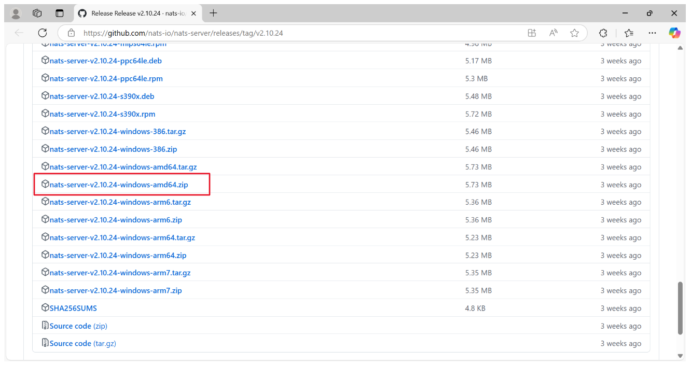
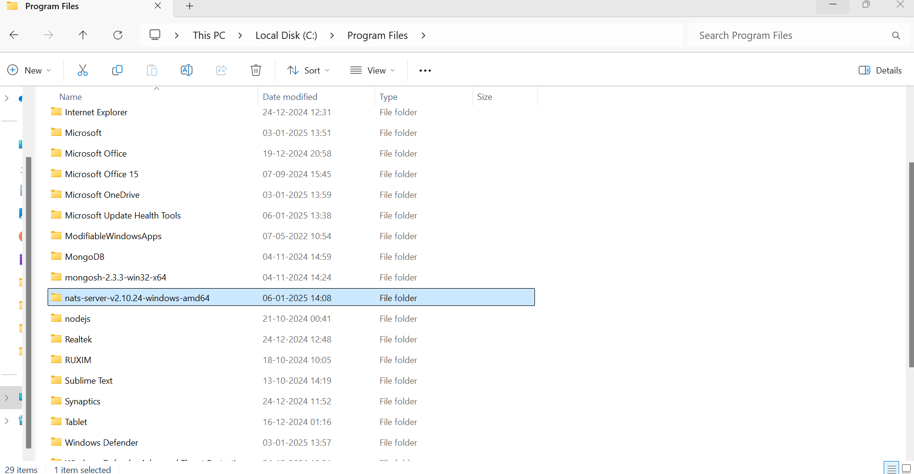
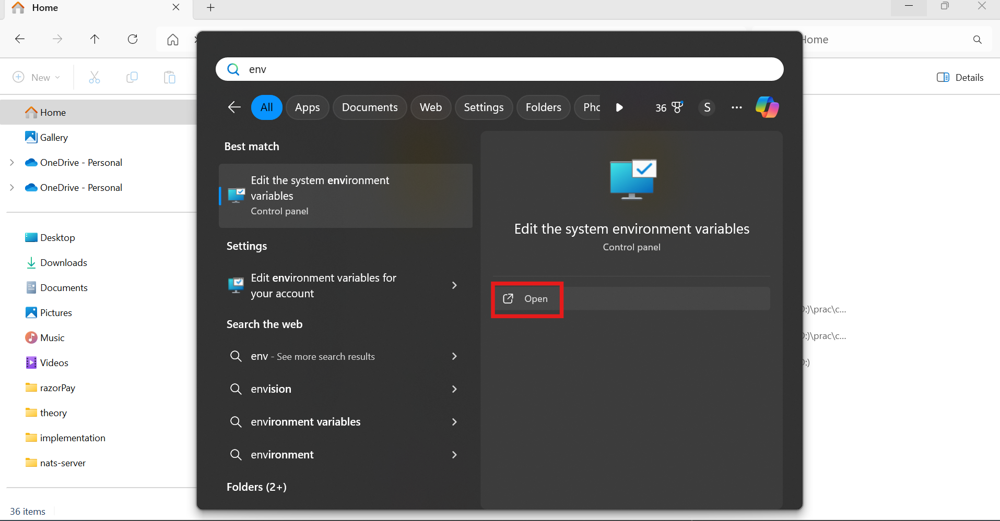
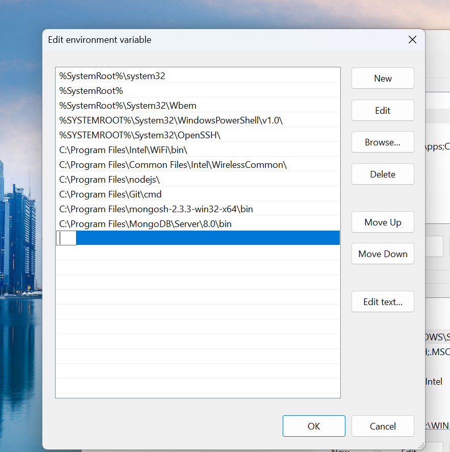
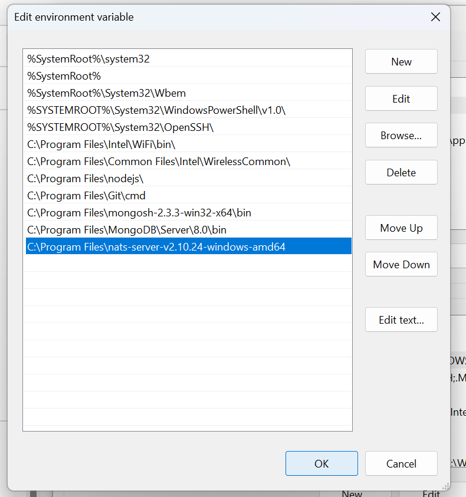
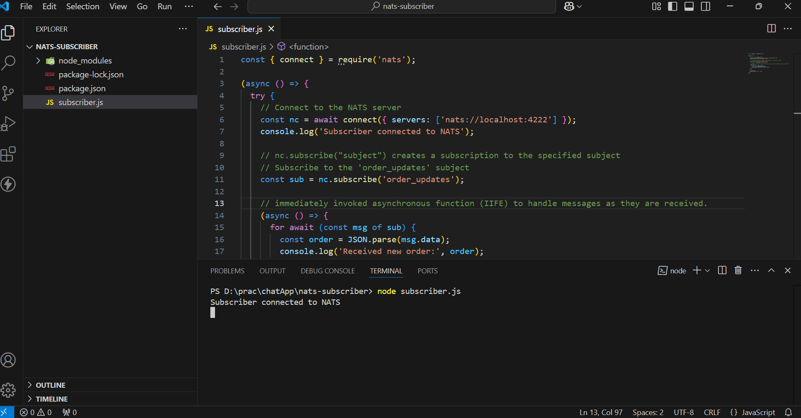
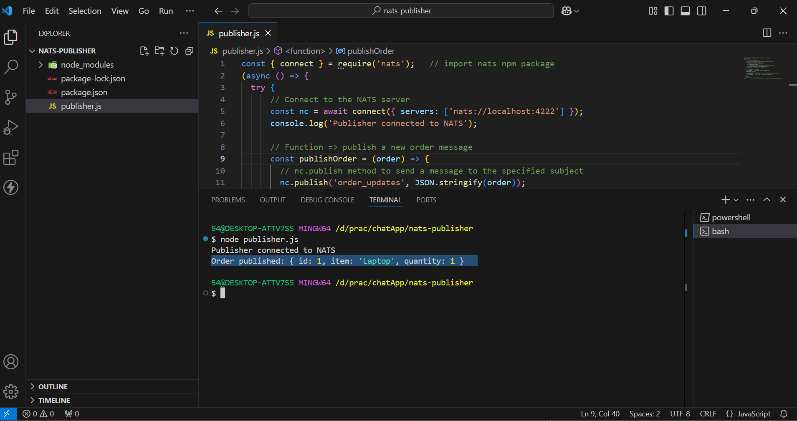
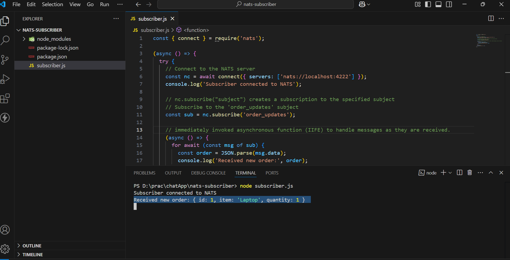
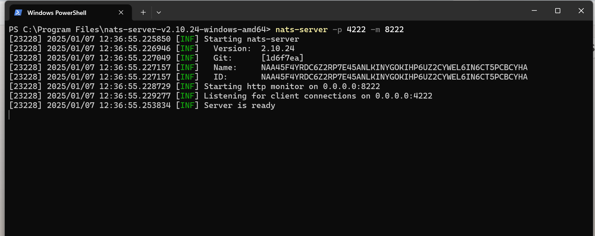
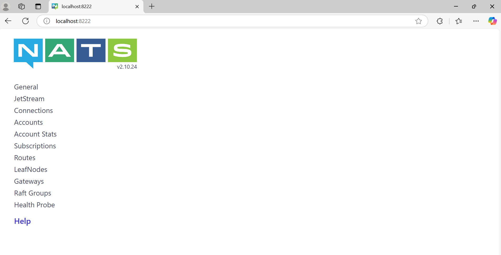

# NATS Socket Architecture: A Beginner's Guide
The NATS socket architecture is the foundation of its lightweight and high-performance messaging system. It manages how messages are sent and received between clients and the NATS server using sockets. The server can handle thousands of client connections simultaneously by sharing sockets through a process called multiplexing. To ensure efficiency, it uses event-driven methods to manage all active socket input/output (I/O) operations without causing delays or blocking other tasks.

## What is NATS?
NATS is an advanced messaging technology crafted to address the intricate communication demands of modern applications. Its design ensures flexibility, security, and high performance, making it a powerful solution for diverse, interconnected ecosystems.

  

## Key Capabilities:

**Seamless Connectivity Across Platforms** : 

1. **Cloud Vendors** : It facilitates communication across different cloud providers.
2. **On-Premises Infrastructure** : I integrates systems within private networks.
3. **Edge Devices** : It supports localized, resource-constrained environments.
4. **Mobile Apps and Web Applications** : It ensures reliable communication for end-user interactions.
5. **IoT Devices** : It manages the high concurrency required by connected devices.

**Open-Source Modular Design** : 

1. It consists of a family of tightly integrated tools.
2. Tools can function independently or as a unified system.

## What Are Sockets?
Sockets are endpoints for sending or receiving data between two systems over a network. 
In NATS, sockets are used for communication between:

- Clients (publishers or subscribers)
- The NATS server

## NATS Communication Model
At a high level, NATS uses a **publish/subscribe messaging model**, and the socket architecture ensures efficient data transfer.

**Components** :
- **Clients** : Applications that publish or subscribe to messages.
- **Server** : The central NATS server managing connections and routing messages.
- **Sockets** : The underlying mechanism used to transmit data between the client and the server.

**Key Roles of Sockets in NATS** :
- Establish *persistent TCP connections* between clients and the server.
- Enable the server to multiplex many client connections.
- Efficiently handle message routing and delivery.

## How Sockets Work in NATS ?
**Connection Establishment** =>
Connection establishment is the process of creating a persistent communication channel between a NATS client (publisher or subscriber) and the NATS server. This step is crucial to facilitate real-time data exchange between the client and the server.
1. **Client Initiates Connection** :
A client opens a socket and connects to the NATS server on its default TCP port 4222.
2. **Server Accepts Connection** :
The server accepts the client connection and establishes a persistent socket for communication.

**Message Exchange** => process by which message is sent and received between clients (publishers and subscribers) via the NATS server. NATS supports various communication patterns like publish/subscribe, request/reply, and queue groups, all of which rely on efficient routing and handling of messages.

1. **Publishing Messages** : 
    - The publisher sends data over its socket to the server.
    - The server routes the message to relevant subscribers using other sockets.
2. **Subscribing to Messages** :
    - A subscriber registers a subject with the server.
    - When a message for the subject arrives, the server pushes it to the subscriber’s socket.


## NATS Protocol
The NATS Protocol is a lightweight, text-based protocol designed to facilitate efficient communication between clients and the NATS server. It uses sockets as the underlying transport layer, ensuring high-speed, low-latency messaging suitable for distributed systems.

##  WebSocket Support in NATS
In addition to TCP sockets, NATS supports WebSocket connections, enabling browser-based clients to communicate with the NATS server.
- They enables real-time communication over HTTP-friendly protocols.
- They are useful for web-based applications like dashboards, chats, or notifications.

## NATS Socket Workflow
1. **Connection** :
- Connection establishes the foundation for message exchange by creating a direct communication channel.
- A client begins by creating a connection to the NATS server. This can be done using either:
    - TCP: Traditional socket-based connection for high-speed, low-latency communication.
    - WebSocket: Used for communication in browser-based or lightweight client applications.

2. **Handshake** :
- Handshake ensures that only authorized clients connect and that the server understands the client’s communication capabilities.
- Once the connection is established:
    - The server authenticates the client. This may involve checking credentials (e.g., username/password or tokens).
    - The server and client negotiate connection details, such as protocol version, configuration options, and features (e.g., compression or encryption).

3. **Message Routing** :

- Message Routing enables efficient delivery of messages to the right clients without unnecessary broadcasting.
- When a client publishes a message to a specific subject, the server determines which clients are subscribed to that subject.
- The server then routes the message to the relevant subscriber sockets.
- Internally Working :
    - The server maintains a subject-to-subscriber map to track which clients are subscribed to which subjects.
    - Using this map, the server routes messages only to the appropriate sockets.

4. **Keepalive Mechanism** :

- Keepalive mechanism prevents idle connections from being dropped and ensures the client and server are still in sync.
- Periodic PING messages are sent by the client to check the server’s responsiveness.
- The server responds with a PONG message to confirm the connection is active.
- If Keepalive Fails:
    - If the server does not respond to a PING within a specified timeout, the client considers the connection lost and attempts to reconnect.

5. **Disconnection** :

- Disconnection frees up resources and ensures that disconnected clients do not continue to occupy server capacity.
- If a client decides to disconnect intentionally, it sends a DISCONNECT command to the server.
- The server closes the corresponding socket and cleans up resources.
- If a disconnection happens unexpectedly (e.g., due to network issues or a timeout), the server detects this and closes the socket.

## Key Features of NATS Socket Architecture

1.  **Event-Driven I/O** : 
    - NATS employs an event-driven model to manage socket operations. Instead of blocking threads while waiting for socket events (e.g., data arrival or connection closure), it uses an event loop to handle these events asynchronously.
    - *How It Works ?* :
        - The event loop listens for socket activities like:
        - Data ready for reading.
        - Data available for writing.
        - Connection establishment or termination.
        - When an event occurs, a callback function processes the event without interrupting other ongoing tasks.

    - *Advantages* :
        - It prevents CPU cycles from being wasted on idle waits.
        - It handles thousands of connections concurrently with minimal resource usage.

2. **Multiplexing** :
    - Multiplexing allows the NATS server to manage multiple client connections simultaneously over a single process or thread.
    - *How It Works ?* :
        - The server assigns each connected client a dedicated socket.
        - Using multiplexing, it efficiently handles all active sockets without needing a separate thread for each connection.
        - Data for different clients is processed independently within the same event loop.
    - *Advantages*:
        - It reduces the need for multiple threads, saving memory and CPU resources.
        - It supports thousands or even millions of concurrent client connections.
    
3. **Fault Tolerance** :
    - NATS provides mechanisms to recover from socket connection failures, ensuring uninterrupted messaging.
    - *How It Works ?* :
        - If a client’s connection to the server drops, the client library attempts to reconnect automatically.
        - In a NATS cluster, clients can reconnect to another available server seamlessly.
        - Persistent data streams (using JetStream) ensure no messages are lost during reconnections.
    - *Advantages* :
        - It ensures reliable communication even in case of network interruptions.
        - It prevents downtime during failover scenarios.

4. **Security** :
    - NATS uses industry-standard encryption protocols (TLS/SSL) to secure all socket communication.

    - *How It Works ?* :
        - **TLS/SSL Encryption** : Protects data from being intercepted or tampered with during transmission.
        - **Authentication** : Verifies the client’s identity using credentials (e.g., tokens, certificates).
        - **Access Control**: Enforces permissions to ensure clients can only publish or subscribe to authorized subjects.
    - *Advantages* :
        - It prevents eavesdropping on sensitive information.
        - It ensures data is not altered during transmission.
        - It meets security standards required by industries like finance and healthcare.

## Using NATS for Microservices Communication
Microservices (Microservices Architecture) is a software design approach where an application is built as a collection of small, independent, and loosely coupled services. Each service in a microservices architecture focuses on a specific business capability and operates as an independent module that can be developed, deployed, and scaled separately.

Microservices communication with NATS involves using NATS as a messaging system to facilitate communication between different microservices in a distributed application architecture.

## Why Use NATS for Microservices Communication?
- *Low Latency* : Latency refers to the time taken for a message to travel from the sender to the receiver and NATS provides low-latency communication, which is crucial for real-time applications.

- *High Throughput* : Throughput is the number of messages that can be processed or delivered within a specific time frame and NATS can handle high volumes of messages efficiently.

- *Scalability* : Scalability refers to the ability of a system to handle increasing loads by adding more resources and NATS can scale horizontally to accommodate increasing loads.

- *Fault Tolerance* : Fault tolerance is the ability of a system to continue operating correctly in the event of a failure of some of its components and NATS supports automatic reconnection and message redelivery in case of failures.

- *Simplicity* : Simplicity refers to the ease of setup, configuration, and maintenance of a system and NATS is easy to set up and use, reducing the complexity of inter-service communication.

## Example - Order Processing System

- An order processing system with two microservices: 
    - Order Service (Publisher) and 
    - Inventory Service (Subscriber)  
- Using Node.js we'll set up a Publisher Service to send messages about new orders and a Subscriber Service to receive and process these messages.

### Step-by-Step Guide

1. **Prerequisites**
    - Node.js installed on the system.

2. **Setup the NATS Server** 

    - **Download NATS-Server**. [Link](https://github.com/nats-io/nats-server/releases/tag/v2.10.24)
        

    - **How to Choose the Right One?**

        - If you're downloading software for a PC or server, go for AMD/x86_64.
        - If you're on a mobile device, Apple Silicon Mac, Raspberry Pi, or a device explicitly using ARM processors, choose the ARM version.

    - **Place the extracted folder in the Program Files directory on the C drive**
        

    - **Add NATS Server to System PATH** 
        
        To make nats-server accessible globally, add its directory to the system's PATH variable:

        - Open Environment variables 
            
            

        - Add nats-server directory path here

                

        - Click "OK" 

            
        
        - To verify, open Command Prompt (cmd) and type:
            
            ```
            nats-server --version
            ```
            
        
3. **Run the NATS Server** 

    - **Navigate to the NATS Server Directory** : 
        - Open a terminal (Command Prompt, PowerShell, or terminal application).
        - Navigate to the directory where you extracted the NATS server.
        - Start the NATS Server :
            ```
            nats-server -p 4222 -m 8222
            ```
            - **-p 4222** : Sets the port for client connections.
            - **-m 8222** : Sets the port for the monitoring endpoint.
            
            
4.  **Order Service (Publisher)**
    - **About** : 
        - Publishes messages about new orders to the NATS server.
        - *Subject*: order_updates.
        - We will create a simple NATS Publisher using Node.js that connects to the server, publishes a message to the specified subject, and ensures all messages are processed before closing the connection.
    
    - **Initialize the Node.js Project** :
        ```
        mkdir nats-publisher   // make a directory(folder) named "nats-publisher"
        cd nats-publisher     // change the current working directory to "nats-publisher"
        npm init -y           // initial the project with default values
        ```
    - **Install Dependencies** :
        ```
        npm install nats
        ```
    - **Create a file *publisher.js*** :

        ```
        const { connect } = require('nats');   // import nats npm package

        (async () => {
        try {
            // Connect to the NATS server
            const nc = await connect({ servers: ['nats://localhost:4222'] });
            console.log('Publisher connected to NATS');

            // Function => publish a new order message
            const publishOrder = (order) => {
                // nc.publish method to send a message to the specified subject
                nc.publish('order_updates', JSON.stringify(order));
                console.log('Order published:', order);
            };

            // Order need to be published
            const newOrder = { id: 1, item: 'Laptop', quantity: 1 };
            publishOrder(newOrder);

            // Close the connection when done
            await nc.flush();   // ensures that all published messages have been processed
            await nc.close();   // closes the connection to the NATS server
        } 
        catch (err) {
            console.error('Error:', err);
        }
        })();            // it starts an  asynchronous IIFE (Immediately Invoked Function Expression)
 
        ```
5. **Inventory Service (Subscriber)**
    - **About** :
        - Subscribes to order_updates subject.
        - Receives new order messages and processes them (e.g., updating inventory, notifying other services).
        - We will create a simple NATS Subscriber using Node.js that connects to the server, subscribes to the specified subject, and processes incoming messages.

    - **Initialize the Node.js Project** :
        ```
        mkdir nats-subscriber   // make a directory(folder) named "nats-subscriber"
        cd nats-subscriber     // change the current working directory to "nats-subscriber"
        npm init -y           // initial the project with default values
        ```
    - **Install Dependencies** :
        ```
        npm install nats
        ```
    - **Create a file *subscriber.js*** :

        ```
        const { connect } = require('nats');     // import nats npm package

        (async () => {
        try {
            // Connect to the NATS server
            const nc = await connect({ servers: ['nats://localhost:4222'] });
            console.log('Subscriber connected to NATS');

            // nc.subscribe("subject") creates a subscription to the specified subject
            // Subscribe to the 'order_updates' subject
            const sub = nc.subscribe('order_updates');

            // IIFE to handle messages as they are received.
            (async () => {
            for await (const msg of sub) {
                const order = JSON.parse(msg.data);
                console.log('Received new order:', order);
            }
            })();

        } catch (err) {
            console.error('Error:', err);
        }
        })();

        ```


6. **Run the Services**
    - **Start the NATS Subscriber Service :**
        ```
        node subscriber.js
        ```

        

    - **Start the NATS Publisher Service :**
        ```
        node publisher.js
        ```

        

    - **Received Message of Order at Subscriber :**

        


7. **Testing and Debugging** 
    1. **Verify the NATS Server** :
        - Once the server is running, the output in the terminal indicates that the server is up and running.

            

        - We can access the NATS server dashboard using our web browser at the following URL:

            ```
            http://localhost:8222
            ```
            

    2. **Simple Try-Catch for Async Functions** : Wrap asynchronous code inside a try-catch block to handle any unexpected errors.

    3. **Return Meaningful Error Messages** : If there’s an error, provide a user-friendly message without exposing sensitive information.


## Conclusion 
The NATS socket architecture is designed for:
- **Speed** : Lightweight protocol and non-blocking I/O.
- **Scalability** : Efficient multiplexing of connections.
-  **Reliability** : Fault-tolerant with reconnection support.

NATS provides several key advantages that make it an ideal choice for microservices communication. Its low latency and high throughput ensure fast and efficient message delivery. The system's scalability and fault tolerance make it robust and capable of handling growing demands and unexpected failures. Additionally, NATS's simplicity reduces the complexity of managing inter-service communication, making it a developer-friendly solution for modern distributed systems.

## References and Resources

### Links
- [NATS Documentation](https://nats.io/about/)
- [Download NATS-Server](https://github.com/nats-io/nats-server/releases/tag/v2.10.24)


### FAQs (Frequently Asked Questions)
1. **Can NATS support WebSocket-based communication?**
    
    Yes, NATS supports WebSocket connections for browser-based clients, enabling real-time communication over HTTP-friendly protocols.

2. **How does NATS handle message routing for multiple subscribers?**
    
    The server maintains a subject-to-subscriber map, ensuring messages are routed only to relevant subscribers.

3. **What happens if a client disconnects unexpectedly from the NATS server?**

    The server detects the disconnection, closes the socket, and cleans up resources. The client library automatically attempts to reconnect.

--- 

