# NGINX Server : A Beginner's Guide

Nginx (**pronounced as "engine-x"**) is a powerful web server that operates using a non-threaded, event-driven architecture, making it highly efficient and capable of handling a large number of concurrent connections. It is widely used for various purposes, including load balancing, HTTP caching, and acting as a reverse proxy.


In a typical HTTP connection setup, the client sends requests to a server running Node.js directly.


 However, when Nginx is used, it acts as an intermediary that enhances performance and scalability.

## NginX Server Architecture

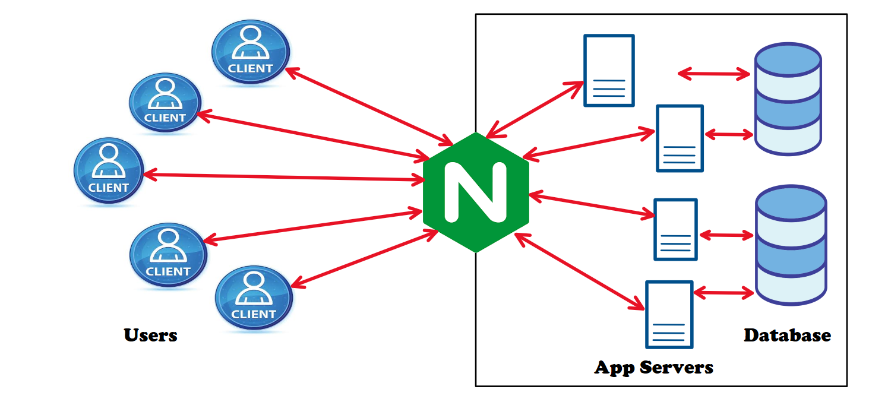

- The Nginx server architecture acts as a *reverse proxy*, efficiently managing client requests and routing them to backend servers. 
- When multiple users (clients) send requests, Nginx receives them and decides which backend server should handle it. This decision-making process is programmable, allowing developers to define rules based on their needs and forwards them to appropriate application servers, ensuring *load balancing* and efficient resource utilization. 
- These app servers interact with the database to fetch or store data, process the request, and return a response. Nginx then sends the processed response back to the respective client. 
- Nginx is also widely used as an *HTTP cache*. For instance, if a client requests an image, Nginx can store that image in its cache. When another client requests the same image, Nginx can serve it directly from its cache instead of contacting the backend server, reducing response time and server load.
- This setup improves scalability, security, and performance by handling high traffic, reducing direct exposure of backend servers, enabling caching, and optimizing request distribution.


## Key Benefits of Using Nginx

✔ **Load Balancing** – Distributes traffic among multiple backend servers.

✔ **Security** – Acts as a shield to prevent direct access to backend servers.

✔ **Caching** – Reduces repeated database requests, improving speed.

✔ **Scalability** – Handles large traffic loads efficiently.

✔ **API Gateway** – Acts as a central point to route API requests to the appropriate microservices or backend servers.

✔ **Serve and Cache Static Files** – Efficiently serves static files like images, videos, and other media, and caches them to reduce server load.

✔ **Act as a Reverse Proxy** – Forwards client requests to appropriate backend servers, hiding the identity of the server from the client.


## Forward Proxy Server and Reverse Proxy Server

 | **Forward Proxy**                                                                                 | **Reverse Proxy**                                                                               |
---------------------------------------------------------------------------------------------------|------------------------------------------------------------------------------------------------|
| Many clients send their requests to the proxy, which passes them to the destination server.       | One client sends requests to the proxy, which sends them to different backend servers.         |
| The destination server doesn’t know which client made the request.                               | The client doesn’t know which server handled their request.                                     |
| Used for hiding the client’s identity, bypassing restrictions, or accessing blocked content.     | Used for sharing traffic, improving performance, and routing requests to the right server.     |
| Commonly used with VPNs (Virtual Private Networks).                                             | Nginx is a popular tool for this.                                                              |
| 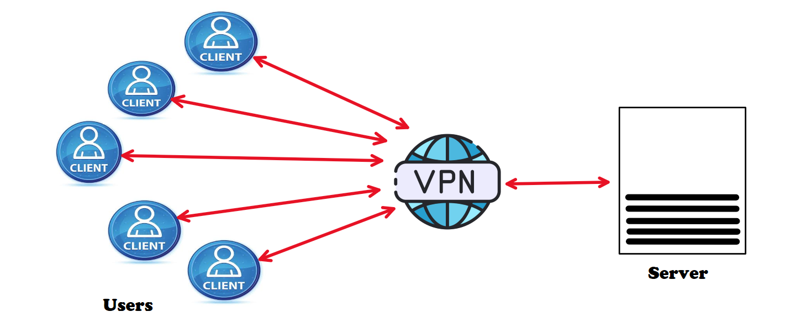                                             | 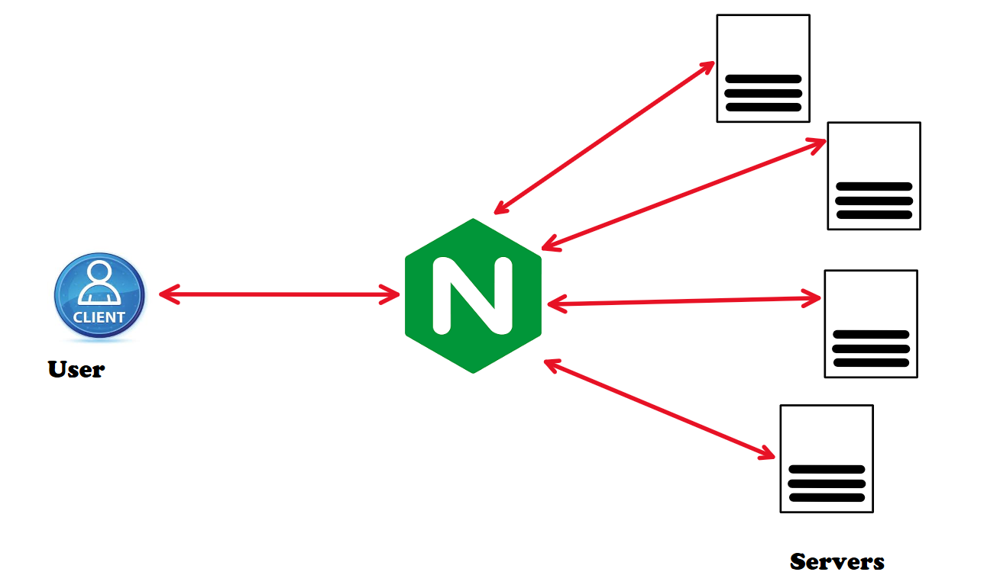                                            |

## Install and Setup Nginx

To install Nginx, we use **Docker** since we will be running **Nginx** on **Ubuntu**, regardless of whether our system is macOS or Windows.

### Step 1 : Open Powershell and Check Running Docker Containers

```
    docker ps
```


### Step 2 : Run an Interactive Ubuntu Container with Port Mapping

Command : `docker run -it -p <host-port>:<container-port> <image-name>`

```
    docker run -it -p 8080:80 ubuntu
```
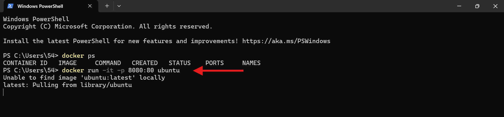

### Step 3 : Check system's OS name

```
    uname
```

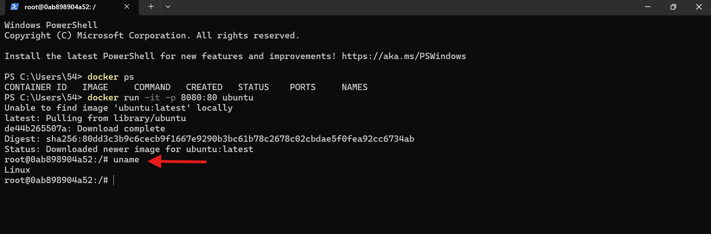

### Step 4 : Updating Package Lists

```
    apt-get update
```

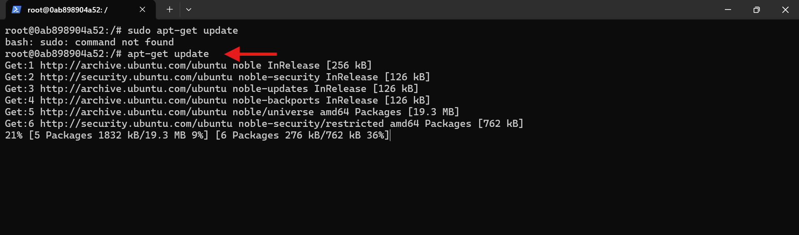

### Step 5 : Install Nginx 

```
    apt-get install nginx
```
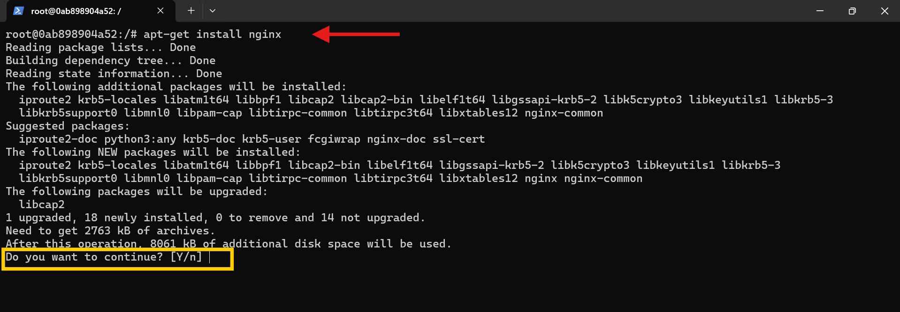

Type `y` or `Y` and press `Enter`

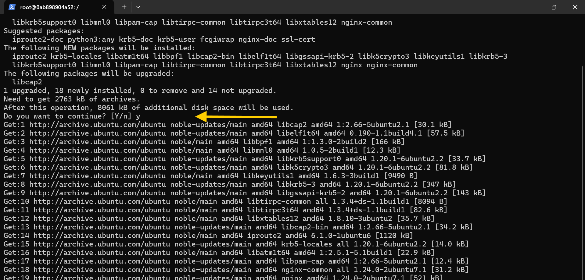


### Step 6 : Verify Nginx

1. **Check Nginx Version**

    ```
        nginx -v
    ```
    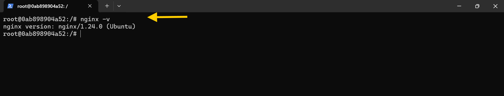

    **NOTE => By default nginx run on Port 80**

2. **Open `http://localhost:80` in the browser**

    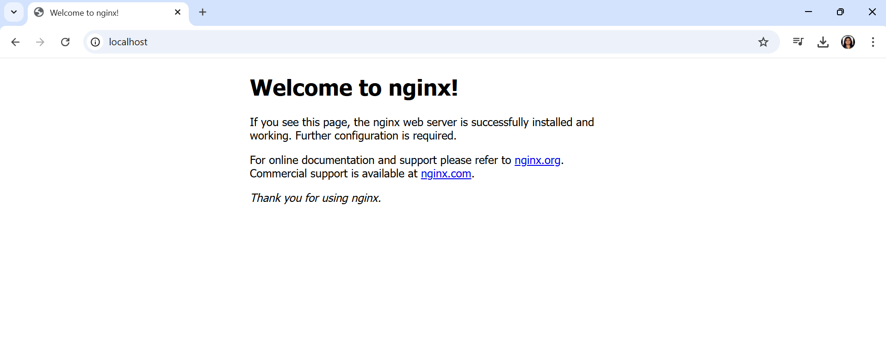

3. **If nothing comes in the browser or if Nginx is not running**

    Run the following command

    ```
        service nginx start
    ```
     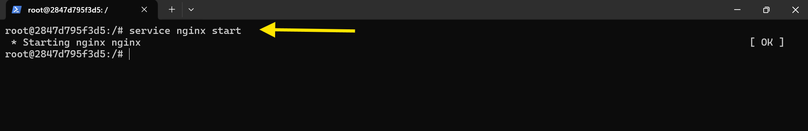

4. **Open `http://localhost:80` in the browser (Repeat Point 2 to check)**

    


### Step 7 : Check the Server Now

1. Open `http://localhost:80` in the browser.
2. Inspect it. **(Right Click => Inspect | CTRL+SHIFT+I)**
3. Go to Header Section 
4. Check Server Name

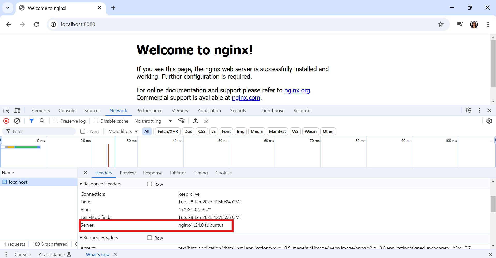


### Step 8 : Testing and Debugging

1. **Checking if Docker is Installed**
    Open your terminal and run the following command to check if Docker is installed and running:

        ```
            docker --version
        ```
    If Docker is installed, it will display the installed version. If not, you may need to install Docker first.

2. **If nothing comes in the browser or if Nginx is not running**

    Run the following command :

    ```
        service nginx start
    ```
     


## Conclusion 

Nginx is a powerful web server that improves performance, scalability, and security. This guide shows how to set up Nginx in an Ubuntu Docker container. It covers steps like installing Nginx, verifying its installation, and restarting it if needed. The server runs on port 80 by default, and you can check its status using service nginx start.

## References and Resources

### Links 
- [nginx Documentation](https://nginx.org/)
- [Docker Documentation](https://docs.docker.com/get-started/)
- [Docker Hub](https://hub.docker.com/)


### FAQs (Frequently Asked Questions)

1. **What is Nginx used for?**

    Nginx is used as a web server and reverse proxy server to serve web pages, handle multiple requests efficiently, and balance traffic between multiple servers.

2. **How do I start Nginx?**

    To start Nginx, open your terminal and run the following command:

    ```
        service nginx start
    ```

3. **How do I check if Nginx is running?**

    You can check if Nginx is running by opening your browser and going to `http://localhost`. If you see a default Nginx page, then Nginx is running.

4. **What is a reverse proxy?**

    A reverse proxy like Nginx forwards requests from clients to backend servers. It helps in load balancing, caching, and increasing security by hiding the backend server from direct client access.

5. **How do I stop Nginx?**

    To stop Nginx, use the command:
    ```
        service nginx stop
    ```
6. **What is the default port for Nginx?**

    By default, Nginx listens on port 80 for HTTP traffic and port 443 for HTTPS traffic.

7. **Can Nginx serve static files?**

    Yes, Nginx can serve static files like images, videos, and HTML pages. You just need to specify the location of the files in the Nginx configuration.

8. **How do I restart Nginx after making changes to the config?**

    To restart Nginx and apply configuration changes, run the following command:
    ```
        service nginx restart
    ```

---