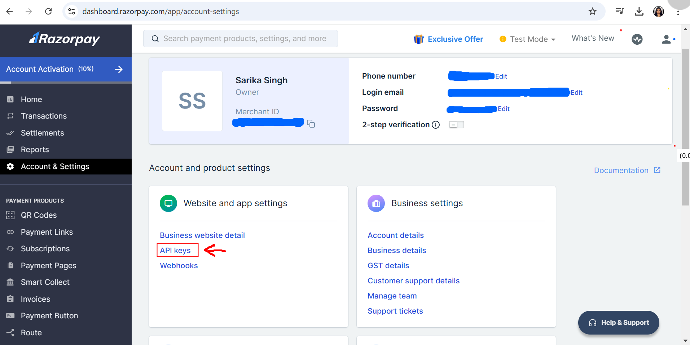
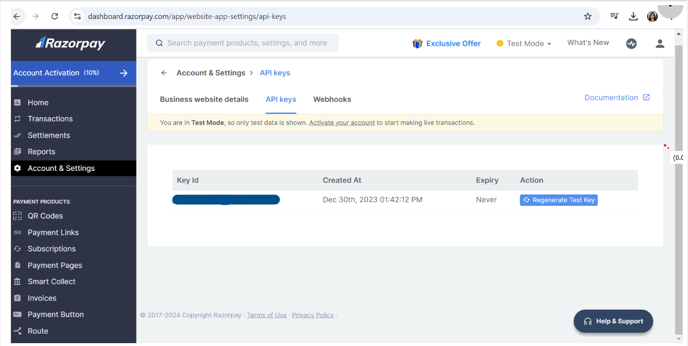
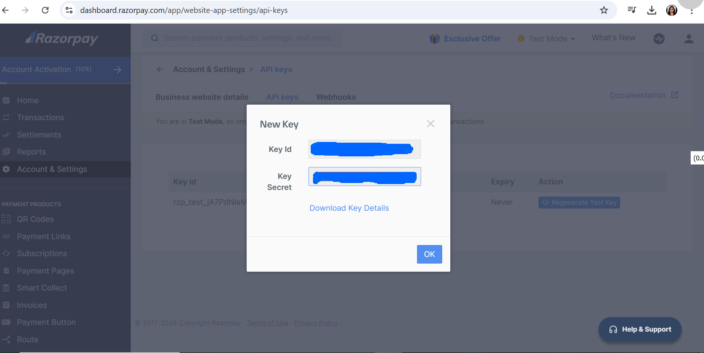

# Razorpay Payment Integration using Node.js

Razorpay is a cutting-edge payment gateway solution designed to simplify and secure online transactions for businesses and customers alike. Acting as a middle channel, Razorpay enables e-commerce platforms, mobile applications, and other online businesses to accept and process payments seamlessly. 
With its robust technology, Razorpay creates a secure pathway for facilitating financial transactions while ensuring the authentication and safety of both the customer and the business.

Razorpay empowers businesses to accept payments through multiple modes, including:
- **Credit and Debit Cards**
- **UPI**
- **Net Banking**
- **Wallets**  

These payments can be processed directly on your website or mobile app.

Trusted by countless businesses, Razorpay provides a:
- **Fast** and **reliable** payment gateway solution.
- **Developer-friendly** platform for seamless integration.
- Comprehensive tools to cater to all your payment needs.

It is suitable for all business sizes whether you’re running a **small startup**, or a **large-scale enterprise**

To integrate the Razorpay payment gateway into a Node.js application, we will use the 
**razorpay** npm package. 


## Flowchart of servers-frontend communication


## Steps to integrate Razorpay with Node.

Follow the steps given below to get started:

### Step 1 : Setup a basic Node.js App

```    
npm init -y
```
Now, create **app.js** file for the Node.js backend server.

```
const express=require("express")
const app=express()
const PORT=8080
app.use(express.json())

app.listen(PORT,(err)=>{
    if(err){
        console.log(err)
    }
    else{
        console.log(`Listening on PORT: ${PORT}`)
    }
})
```

### Step 2 : Install the required dependencies

```
npm i express            // To run a Node.js server
npm i razorpay           // To use Razorpay utilities
npm i ejs                // To use EJS template engine for frontend

//  or
npm i express razorpay ejs       // both will work

```

Updated dependencies in the **package.json** file 
```
"dependencies": {
    "ejs": "^3.1.10",
    "express": "^4.21.2",
    "razorpay": "^2.9.5"
  }
```
### Step 3 : Generate API credentials from Razorpay.

To access Razorpay APIs, you need API keys. 

1. Register on Razorpay.

2. Go to Dashboard after logging in

3. Go to **Account&Settings** in dashboard. Click on **API keys**

    

4. Click on **Regenerate Test Key**

    

5. Copy both the credentials (**Key Id and Key Secret**)

    

6. To use these credentials, save them in a **.env** file. First, install the **dotenv** package and then store the credentials there.

    ```
    npm i dotenv
    ```
    


### Step 4 : Import and Setup Razorpay

Import Razorpay and create a new instance in **app.js** to access Razorpay resources.

```
const express=require("express")       // import express
const Razorpay=require("razorpay")    // import razorpay
const dotEnv=require("dotenv")       // import dotenv
dotEnv.config()
const app=express()
const PORT=8080


// initializing razorpay 
const razorpay = new Razorpay({
    key_id: process.env.RAZORPAY_KEY_ID,
    key_secret: process.env.RAZORPAY_KEY_SECRET,
});

app.listen(PORT,(err)=>{
    if(err){
        console.log(err)
    }
    else{
        console.log(`Listening on PORT: ${PORT}`)
    }
})

```

### Step 5: Sending Order Information from Frontend to Our Node.js Server
This step involves the frontend (HTML/JavaScript) making a request to the backend (Node.js server) to create a payment order using Razorpay.

Let's break this down step by step:

1. #### Backend (Node.js) Rendering the Frontend using EJS

    a. Create **index.ejs** file in **views** folder
    
    

    b. Set up EJS Template Engine and render in **app.js** 

    ```
    const express=require("express")
    const Razorpay=require("razorpay")
    const path = require('path');
    const dotEnv=require("dotenv")
    dotEnv.config()
    const app=express()
    const PORT=8080
    app.set('view engine', 'ejs');  // Setting up the EJS View Engine
    app.use(express.json())
    app.use(express.urlencoded({extended:true}))
    filepath=path.join(__dirname,"/views/index.ejs")

    // initializing razorpay
    const razorpay = new Razorpay({
        key_id: process.env.RAZORPAY_KEY_ID,
        key_secret: process.env.RAZORPAY_KEY_SECRET,
    });


    app.get("/", (req, res) => {
        res.render(filepath);      // Rendering index.ejs
    });

    app.listen(PORT,(err)=>{
        if(err){
            console.log(err)
        }
        else{
            console.log(`Listening on PORT: ${PORT}`)
        }
    })

    ```

    c. HTML Structure in **index.ejs**
    ```
        
    
    ```