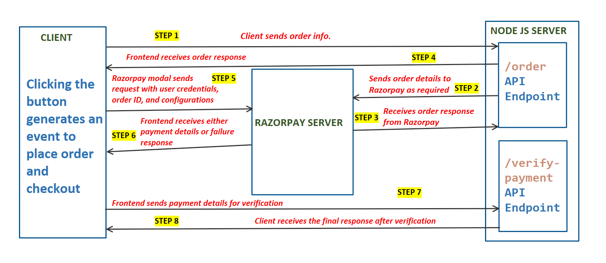
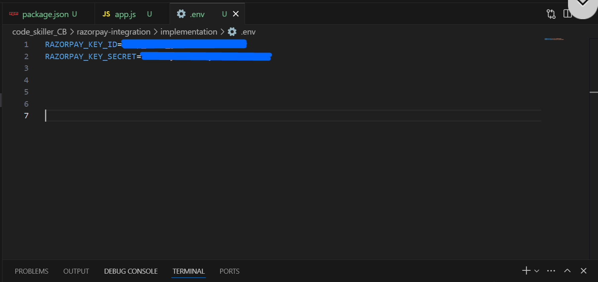
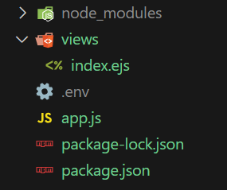
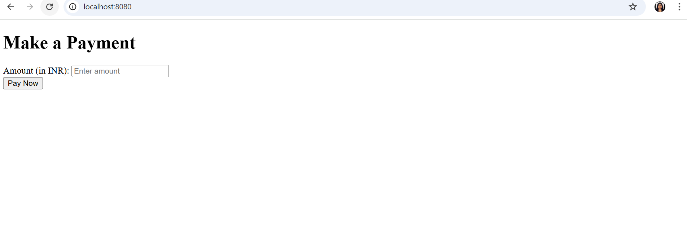
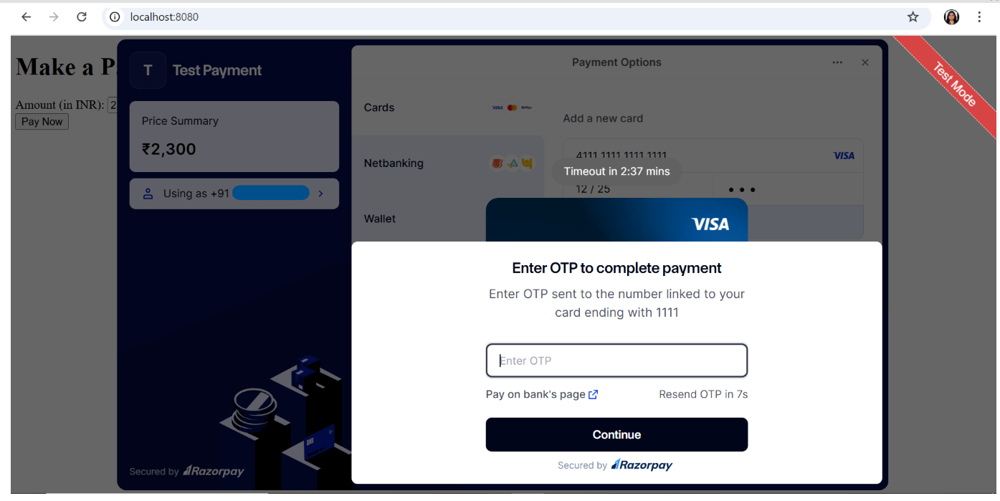
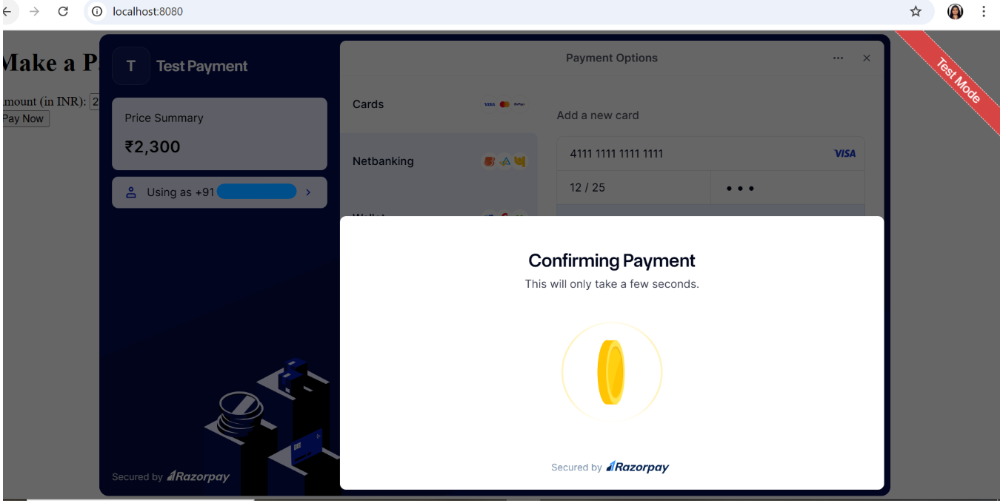
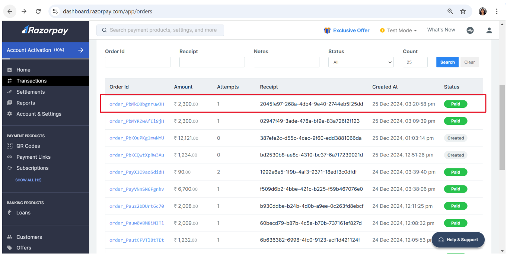

# Razorpay Payment Integration using Node.js

Razorpay is a cutting-edge payment gateway solution designed to simplify and secure online transactions for businesses and customers alike. Acting as a middle channel, Razorpay enables e-commerce platforms, mobile applications, and other online businesses to accept and process payments seamlessly. 
With its robust technology, Razorpay creates a secure pathway for facilitating financial transactions while ensuring the authentication and safety of both the customer and the business.

Razorpay empowers businesses to accept payments through multiple modes, including:
- **Credit and Debit Cards**
- **UPI**
- **Net Banking**
- **Wallets**  

These payments can be processed directly on your website or mobile app.

Trusted by countless businesses, Razorpay provides a:
- **Fast** and **reliable** payment gateway solution.
- **Developer-friendly** platform for seamless integration.
- Comprehensive tools to cater to all your payment needs.

It is suitable for all business sizes whether you’re running a **small startup**, or a **large-scale enterprise**

To integrate the Razorpay payment gateway into a Node.js application, we will use the 
**razorpay** npm package. 

## Prerequisites

1. **Basic Knowledge of JavaScript** : Understand ES6 syntax and asynchronous programming with promises or async/await.
2. **Familiarity with Node.js** : Know how to create and run basic Node.js applications using npm.
3. **Basic Knowledge of Express.js** : Be comfortable with routing, middleware, and setting up APIs.
4. **Familiarity with EJS** : Understand how to render dynamic templates using EJS.
5. **Understanding of REST APIs** : Know how to work with APIs to send requests and process responses.
6. **Postman/REST Client** : Use tools like Postman to test and debug API endpoints.
7. **dotenv for Environment Variables** : Securely store and access sensitive data using .env files.
8. **Concept of Payment Gateways** : Have a basic understanding of how online payment systems operate.
9. **HTML and Frontend Basics** : Create simple forms and interact with client-side JavaScript.
10. **Basic Command Line Knowledge** : Use terminal commands to install packages and run applications.
11. **Familiarity with UUID and Crypto Libraries** : Use libraries like *uuid* for unique IDs and *crypto* for secure hashing.
12. **Razorpay Account** : Set up a Razorpay account to obtain API keys for integration. 

## Flowchart of servers-frontend communication




## Steps to integrate Razorpay with Node

Follow the steps given below to get started:

### Step 1 : Setup a basic Node.js App

```    
npm init -y
```
Now, create **app.js** file for the Node.js backend server.

```
const express=require("express")
const app=express()
const PORT=8080
app.use(express.json())

app.listen(PORT,(err)=>{
    if(err){
        console.log(err)
    }
    else{
        console.log(`Listening on PORT: ${PORT}`)
    }
})
```

### Step 2 : Install the required dependencies

```
npm i express            // To run a Node.js server
npm i razorpay           // To use Razorpay utilities
npm i ejs                // To use EJS template engine for frontend

//  or
npm i express razorpay ejs       // both will work

```

Updated dependencies in the **package.json** file 
```
"dependencies": {
    "ejs": "^3.1.10",
    "express": "^4.21.2",
    "razorpay": "^2.9.5"
  }
```
### Step 3 : Generate API credentials from Razorpay.

To access Razorpay APIs, you need API keys. 

1. Register on Razorpay.

2. Go to Dashboard after logging in

3. Go to **Account&Settings** in dashboard. Click on **API keys**

    

4. Click on **Regenerate Test Key**

    

5. Copy both the credentials (**Key Id and Key Secret**)

    

6. To use these credentials, save them in a **.env** file. First, install the **dotenv** package and then store the credentials there.

    ```
    npm i dotenv
    ```
    


### Step 4 : Import and Setup Razorpay

Import Razorpay and create a new instance in **app.js** to access Razorpay resources.

```
const express=require("express")       // import express
const Razorpay=require("razorpay")    // import razorpay
const dotEnv=require("dotenv")       // import dotenv
dotEnv.config()
const app=express()
const PORT=8080


// initializing razorpay 
const razorpay = new Razorpay({
    key_id: process.env.RAZORPAY_KEY_ID,
    key_secret: process.env.RAZORPAY_KEY_SECRET,
});

app.listen(PORT,(err)=>{
    if(err){
        console.log(err)
    }
    else{
        console.log(`Listening on PORT: ${PORT}`)
    }
})

```

### Step 5: Sending Order Information from Frontend to Our Node.js Server
This step involves the frontend (HTML/JavaScript) making a request to the backend (Node.js server) to create a payment order using Razorpay.

Let's break this down step by step:

1. #### Backend (Node.js) Rendering the Frontend using EJS

    a. Create **index.ejs** file in **views** folder
    
    

    b. Set up EJS Template Engine and render in **app.js** 

    ```
    const express=require("express")
    const Razorpay=require("razorpay")
    const path = require('path');
    const dotEnv=require("dotenv")
    dotEnv.config()
    const app=express()
    const PORT=8080
    app.set('view engine', 'ejs');  // Setting up the EJS View Engine
    app.use(express.json())
    app.use(express.urlencoded({extended:true}))
    filepath=path.join(__dirname,"/views/index.ejs")

    // initializing razorpay
    const razorpay = new Razorpay({
        key_id: process.env.RAZORPAY_KEY_ID,
        key_secret: process.env.RAZORPAY_KEY_SECRET,
    });


    app.get("/", (req, res) => {
        res.render(filepath);      // Rendering index.ejs
    });

    app.listen(PORT,(err)=>{
        if(err){
            console.log(err)
        }
        else{
            console.log(`Listening on PORT: ${PORT}`)
        }
    })

    ```

    c. HTML Structure in **index.ejs**
    ```
        <!--

        <!DOCTYPE html>
        <html lang="en">

        <head>
            <meta charset="UTF-8">
            <meta name="viewport" content="width=device-width, initial-scale=1.0">
            <title>Razorpay Payment</title>
            <!-- the below script tag loads a js file from the Razorpay server. 
            It has some code inside it, which is responsible for executing this whole code snippet. -->
            <script src="https://checkout.razorpay.com/v1/checkout.js"></script>
        </head>

        <body>
            <h1>Make a Payment</h1>
            <form id="payment-form">
                <label for="amount">Amount (in INR):</label>
                <input type="number" id="amount" name="amount" placeholder="Enter amount" required>

                <div>
                    <button type="button" id="pay-button">Pay Now</button>
                </div>
            </form>

            
        </body>

    </html>
        -->
    
    ```

    d. **API Route for Creating an Order:** 

      i. Set up an API route **(/order)** to handle Razorpay order creation.

      ii. Trigger this route from the frontend, capture order details.
        **(In Razorpay, the amount is required to be in the smallest currency unit i.e., paise in INR. Therefore, we need to multiply it by 100 to change in rupees.)**

      iii. Send a request to Razorpay to create an order. 
    
      iv. Upon success, return the order ID to the frontend for integration with Razorpay Checkout. 

    ```
        const express=require("express")
        const Razorpay=require("razorpay")
        const path = require('path');
        const dotEnv=require("dotenv")
        const {v4: uuidv4} =require("uuid")
        dotEnv.config()
        const app=express()
        const PORT=8080
        app.set('view engine', 'ejs');
        app.use(express.json())
        app.use(express.urlencoded({extended:true}))
        filepath=path.join(__dirname,"/views/index.ejs")

        // initializing razorpay
        const razorpay = new Razorpay({
            key_id: process.env.RAZORPAY_KEY_ID,
            key_secret: process.env.RAZORPAY_KEY_SECRET,
        });

        app.get("/", (req, res) => {
            res.render(filepath);
        });

        // API Route "/order"
        app.post('/order', async (req, res) => {
            
            // setting up options for razorpay order. (getting values from frontend)
            const options = {
                amount: req.body.amount*100,      // changing paise in rupees
                currency: req.body.currency,
                receipt: uuidv4(),              // used uuid package to create unique receipt field
                payment_capture: 1
            };

            try {
                // Sending a request to Razorpay(Sending order information from NodeJS Server to Razorpay Server)
                const response = await razorpay.orders.create(options)

                // returning response(Received from Razorpay) to the frontend
                res.json({
                    order_id: response.id,
                    currency: response.currency,
                    amount: response.amount,
                })
            } catch (err) {
            res.status(400).send('Not able to create order. Please try again!');
            }
        });

        app.listen(PORT,(err)=>{
            if(err){
                console.log(err)
            }
            else{
                console.log(`Listening on PORT: ${PORT}`)
            }
        })
    ```
    e. **Frontend (JavaScript) Initiating the Request:**
    
    When the user enters an amount and clicks the "Pay Now" button, the JavaScript in the frontend listens for that click event. **(Add script tag to the index.ejs)**

    ```
    <script>
        // added event listener to the button
        document.getElementById('pay-button').addEventListener('click', async () => {
            const amount = document.getElementById('amount').value;
            if (!amount || amount <= 0) {
                alert("Please enter a valid amount.");
                return;
            }
            try {
                // making request to backend route "/order:
                const response = await fetch('/order', {
                    method: 'POST',
                    headers: { 'Content-Type': 'application/json' },
                    body: JSON.stringify({ amount, currency: "INR" }),
                });
                const result = await response.json();

                if (response.ok) {
                    const options = {
                        key: '<%= process.env.RAZORPAY_KEY_ID %>', // Razorpay Key ID
                        amount: result.amount,
                        currency: result.currency,
                        name: "Test Payment",
                        description: "Pay securely using Razorpay",
                        order_id: result.order_id,
                        handler: function (response) {
                            const paymentData = {
                                razorpay_payment_id: response.razorpay_payment_id,
                                razorpay_order_id: response.razorpay_order_id,
                                razorpay_signature: response.razorpay_signature,
                            };
                        },
                        theme: {
                            color: "#020c4f",
                        },
                    };
                    const razorpay = new Razorpay(options);
                    razorpay.open();
                } else {
                    alert("Failed to create order. Please try again.");
                }
            } catch (error) {
                console.error("Error:", error);
                alert("An error occurred while creating the order.");
            }
        });
    </script>
    ```

#### Step 5: Verify authenticity and respond to the User accordingly.

a. **Set Up API Route:**
    Create an API route **(/verify-payment)** specifically for payment capture and verification. 

b. **Receive Payment Details:**
    Collect razorpay_order_id, razorpay_payment_id, and razorpay_signature from Razorpay after payment.

c. **Verify Payment:**
    Use Razorpay's verification logic to validate the received payment details.
    To verify the payment:

    Generate Signature on Server:
    Create a signature on your server using the order_id and razorpay_payment_id from the response.
    We use crypto npm package to generate signature.

    Use the Secret Key:
    Utilize the key_secret obtained earlier from the Razorpay dashboard while generating API keys.

    Apply SHA256 Algorithm:
    Use the SHA256 cryptographic function to generate a hash. This function takes arguments (e.g., order_id, payment_id) and the secret key to produce a crypto hash.

    Validate Authenticity:
    Compare the generated signature with razorpay_signature to confirm the payment's authenticity.

d. **Confirm Payment Success:**
    Send a verified response to the frontend, confirming payment success.

```
    //API Route for veifying payments (add this to app.js)
    app.post("/verify-payment", (req, res) => {
        const {razorpay_order_id, razorpay_payment_id, razorpay_signature } = req.body;
        const keySecret = process.env.RAZORPAY_KEY_SECRET;

        const hmac = crypto.createHmac("sha256", keySecret);
        hmac.update(razorpay_order_id + "|" + razorpay_payment_id);

        const generatedSignature = hmac.digest("hex");

        if (generatedSignature === razorpay_signature) {
            res.status(200).json({ status: "success", message: "Payment verified" });
        } else {
            res.status(400).json({ status: "failure", message: "Invalid signature" });
        }
    });     

```

e. **Integrate Callback Function:**
    Implement a callback function on the frontend to trigger verification and handle the result seamlessly.
    Update script tag in **index.ejs**

```
    <script>
        // function to verify Payment
        function verifyPayment(paymentData) {
            fetch("http://localhost:8080/verify-payment", {
                method: "POST",
                headers: {
                    "Content-Type": "application/json",
                },
                body: JSON.stringify(paymentData),
            })
                .then((response) => response.json())
                .then((data) => {
                    if (data.status === "success") {
                        alert("Payment verified successfully!");
                    } else {
                        alert("Payment verification failed: " + data.message);
                    }
                })
                .catch((error) => {
                    console.error("Error verifying payment:", error);
                });
        }

        // added event listener to the button
        document.getElementById('pay-button').addEventListener('click', async () => {
            const amount = document.getElementById('amount').value;
            if (!amount || amount <= 0) {
                alert("Please enter a valid amount.");
                return;
            }
            try {
                // making request to backend route "/order:
                const response = await fetch('/order', {
                    method: 'POST',
                    headers: { 'Content-Type': 'application/json' },
                    body: JSON.stringify({ amount, currency: "INR" }),
                });
                const result = await response.json();
                console.log(result)
                if (response.ok) {
                    const options = {
                        key: '<%= process.env.RAZORPAY_KEY_ID %>', // Razorpay Key ID
                        amount: result.amount,
                        currency: result.currency,
                        name: "Test Payment",
                        description: "Pay securely using Razorpay",
                        order_id: result.order_id,

                        handler: function (response) {

                            const paymentData = {
                                razorpay_payment_id: response.razorpay_payment_id,
                                razorpay_order_id: response.razorpay_order_id,
                                razorpay_signature: response.razorpay_signature,
                            };

                            // Send payment details to the backend for verification
                            verifyPayment(paymentData);
                        },
                        theme: {
                            color: "#020c4f",
                        },
                    };
                    const razorpay = new Razorpay(options);

                    razorpay.open();
                } else {
                    alert("Failed to create order. Please try again.");
                }
            } catch (error) {
                console.error("Error:", error);
                alert("An error occurred while creating the order.");
            }
        });
    </script>
    
```

## DEMO SCREENSHOTS








   


## Implementation (refer GitHub Repo)
[GITHUB LINK](https://github.com/sarikasingh30/code_skiller_CB/tree/main/razorpay-integration/implementation)

## References and Resources

- [Razorpay Documentation](https://razorpay.com/docs/#home-payments)
- [NodeJS Official Documentation](https://nodejs.org/docs/latest/api/)
- [Express Documentation](https://expressjs.com/)
- [EJS Documentation](https://github.com/mde/ejs/wiki/Using-EJS-with-Express)