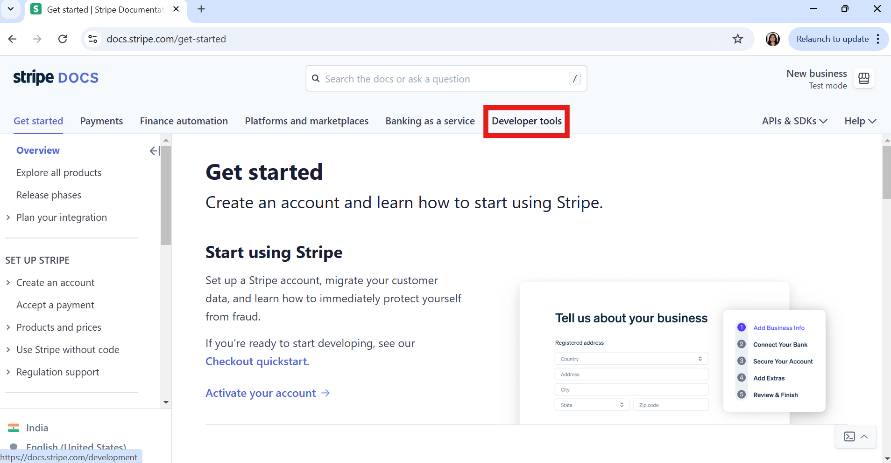
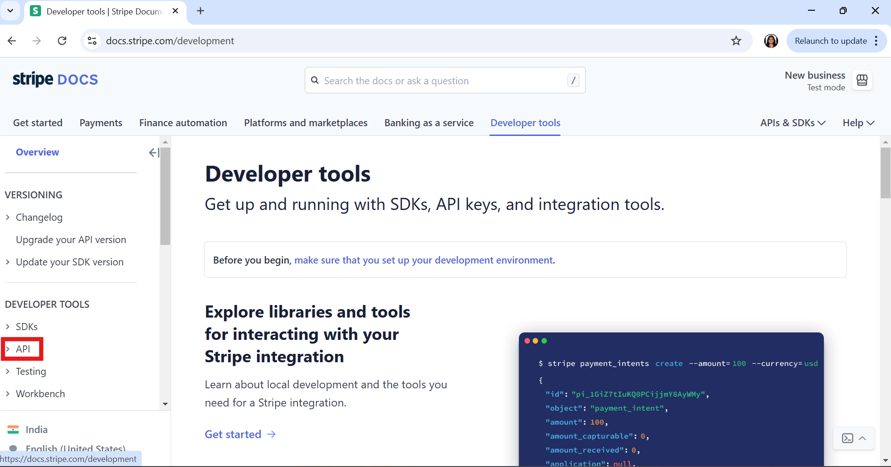
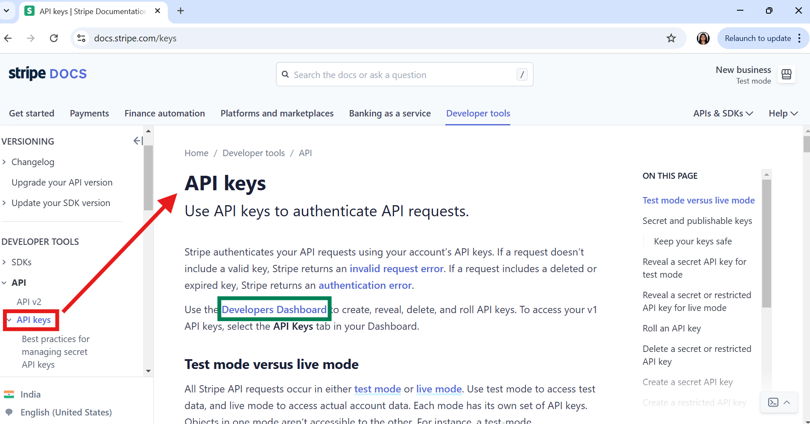
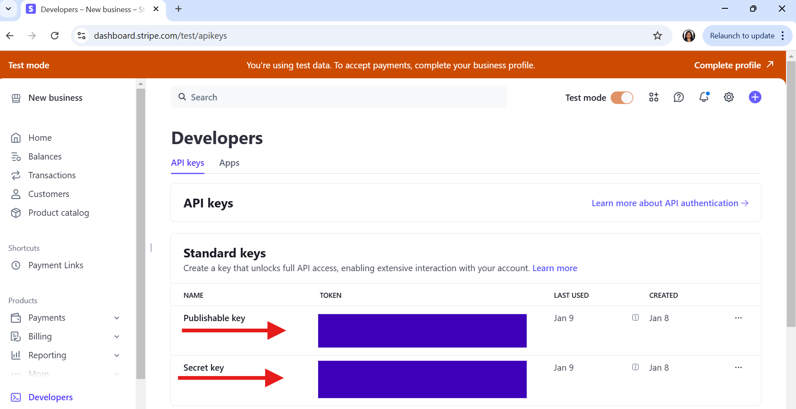
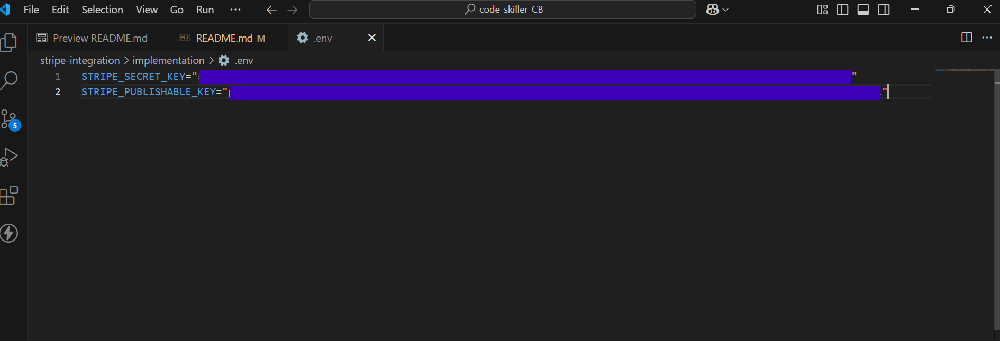
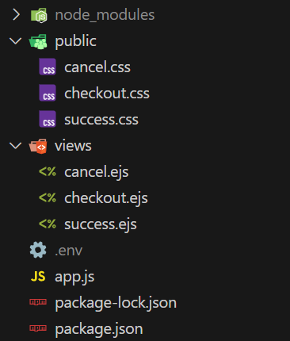

# Stripe Payment Integration using Node.js
Integrating Stripe into our website can be a game-changer for a business. Stripe is a powerful payment gateway that allows you to accept online payments, manage subscriptions, and handle invoicing with ease. It supports various payment methods, including credit cards, digital wallets, and bank transfers. 
Stripe is flexible and scalable, making it great for startups to large enterprises.


## Why Choose Stripe?

- It provides multiple integration options, including no-code and low-code solutions, so we can start using it even without deep technical expertise.

- It uses advanced security measures to protect sensitive payment data, ensuring safe and secure transactions.

- It supports payments in multiple currencies and countries, allowing our business to expand internationally.

- We can customize the payment experience to align with our brand and business needs.

- It offers features like subscriptions, invoicing, and multiparty payments, making it a full payment solution.

## How to Integrate Stripe ?

### Step 1 : Setup a basic Node.js App

```    
    npm init -y
```

Now, create **app.js** file for the Node.js backend server.

```
    // File : app.js
    const express=require("express")
    const app=express()
    const PORT=3030
    app.use(express.json())
    app.use(express.static('public'));

    app.listen(PORT,(err)=>{
        if(err){
            console.log(err)
        }
        else{
            console.log(`Listening on PORT: ${PORT}`)
        }
    })
```

### Step 2 : Install the required dependencies

```
    npm i express              // To run a Node.js server
    npm i stripe              // To use stripe library to interact with the Stripe API for payments
    npm i dotenv             // loads environment variables from a .env file into process.env
    npm i ejs                // To use EJS template engine for frontend

    //  or
    npm i express stripe ejs dotenv       // both will work

```

Updated dependencies in the **package.json** file 

```
    "dependencies": {
        "express": "^4.21.2",
        "stripe": "^17.5.0",
        "dotenv": "^16.4.7",
        "ejs": "^3.1.10"
    }
```

### Step 3 : Sign Up for a Stripe Account

Once signed up, we’ll have access to the Stripe Dashboard, where we can manage our account, see transactions, and configure settings.
[Link to Sign Up](https://dashboard.stripe.com/register)

### Step 4 : Obtain API Keys

1. **Navigate to the Developer tools in the Stripe Dashboard**

    


2. **Go to API section in Developer tools**

    

3. **Go to Developers Dashboard**

    

4. **Copy these two Publishable key and Secret key**

     


5. **Paste these keys in *.env file* to use in the project**

    

### Step 5 : Create Basic Cart Page to Redirect Customer to the Stripe Checkout

1. **Set up and render EJS Template Engine in *app.js***

    ```
        // File : app.js
        const express=require("express")
        const app=express()
        const PORT=3030
        app.use(express.json())
        app.use(express.static('public'));
        app.set("view engine","ejs")       // // setting up view engine as ejs
        
        app.listen(PORT,(err)=>{
            if(err){
                console.log(err)
            }
            else{
                console.log(`Listening on PORT: ${PORT}`)
            }
        })
    ```
2. **Create GET route for checkout page in *app.js*** 

        // Pass this products list to the checkout page to map

        const items = [
            {   
                name: 'T-shirt', 
                price: 2000, 
                quantity: 1, 
                description:"A comfortable cotton t-shirt",   
                image: "https://d1xv5jidmf7h0f.cloudfront.net/circleone/images/products_gallery_images/Custom-Printed-T-Shirt-Round-Neck.jpg" 
            },
            { 
                name: 'Coffee Mug', 
                price: 1500, 
                quantity: 2, 
                description:"A stylish ceramic coffee mug", 
                image: "https://encrypted-tbn0.gstatic.com/images?q=tbn:ANd9GcQ_UjZMmVcOiKnb8Lzbu907WTnqCA7Tmg13nw&s" 
            },
            { 
                name: 'Notebook', 
                price: 800, 
                quantity: 3, 
                description:"A handy notebook for daily use", 
                image: "https://www.thestylesalad.in/cdn/shop/products/him1_1024x1024_2x_77d00e04-776a-4c99-83e2-0070925df8f4.jpg?v=1542106281"
            }
        ];

    ```
        // File : app.js

        // sending publish key and items to frontend 
        app.get("/checkout",(req,res)=>{
            res.render('checkout',{publishKey:process.env.STRIPE_PUBLISHABLE_KEY,items})
        })
    ```

3. **Create *views* folder and make *checkout.ejs* file in it**

    **Folder Structure** : 

    

    **checkout.ejs**

    ```
        // File : /views/checkout.ejs
        <html>
            <head>
                <title>Checkout Products</title>
                <link rel="stylesheet" href="checkout.css">

                // below tag allows any newly created Stripe objects to be globally accessible in code
                <script src="https://js.stripe.com/v3/"></script>
            </head>
            <body>
                <h1>YOUR CART ...</h1>
                <section>
                    <div class="products">
                        <% items.map(item=> { %>
                            <div class="product">
                                <div>" alt="<%= item.name %>"></div>
                                <div class="description">
                                    <h3><%= item.name %></h3>
                                    <p><%= item.description %></p>
                                    <p>Price: $<%= item.price %></p>
                                    <p>Quantity: <%= item.quantity %></p>
                                </div>
                            </div>
                        <% }); %>
                    </div>
                </section>
                <!-- Checkout Button -->
                <form id="checkout-form">
                    <button type="button" id="checkout-button">Checkout</button>
                </form>
            </body>
        </html>
    ```