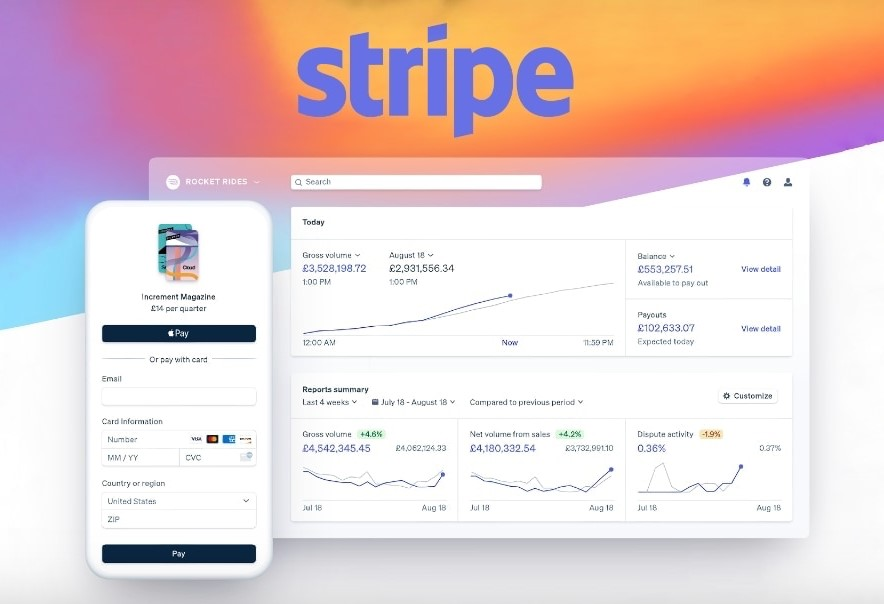
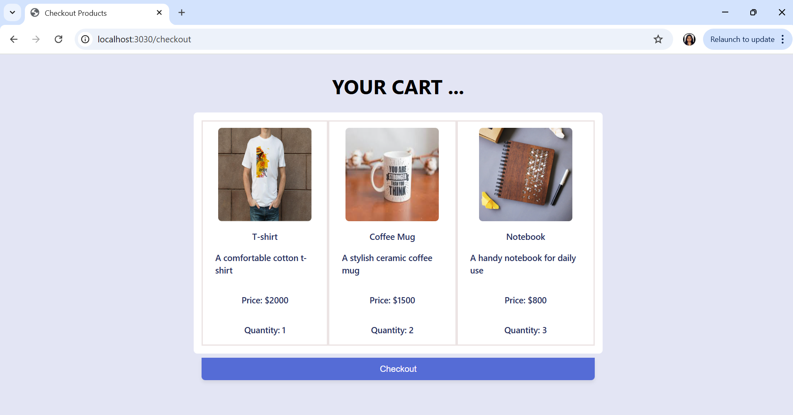
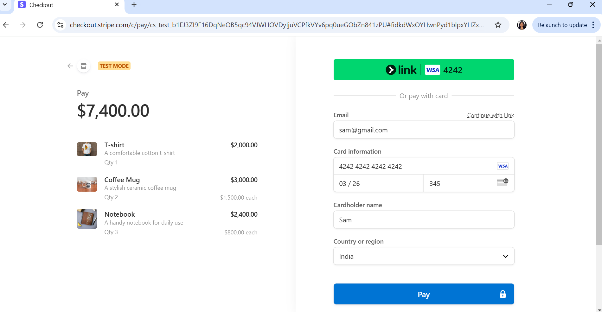

# Stripe Payment Integration using Node.js
Integrating Stripe into our website can be a game-changer for a business. Stripe is a powerful payment gateway that allows you to accept online payments, manage subscriptions, and handle invoicing with ease. It supports various payment methods, including credit cards, digital wallets, and bank transfers. 
Stripe is flexible and scalable, making it great for startups to large enterprises.



## Why Choose Stripe?

- It provides multiple integration options, including no-code and low-code solutions, so we can start using it even without deep technical expertise.

- It uses advanced security measures to protect sensitive payment data, ensuring safe and secure transactions.

- It supports payments in multiple currencies and countries, allowing our business to expand internationally.

- We can customize the payment experience to align with our brand and business needs.

- It offers features like subscriptions, invoicing, and multiparty payments, making it a full payment solution.

## How to Integrate Stripe ?

### Step 1 : Setup a basic Node.js App

```    
    npm init -y
```

Now, create **app.js** file for the Node.js backend server.

```
    // File : app.js
    const express=require("express")
    const app=express()
    const PORT=3030
    app.use(express.json())
    app.use(express.static('public'));

    app.listen(PORT,(err)=>{
        if(err){
            console.log(err)
        }
        else{
            console.log(`Listening on PORT: ${PORT}`)
        }
    })
```

### Step 2 : Install the required dependencies

```
    npm i express              // To run a Node.js server
    npm i stripe              // To use stripe library to interact with the Stripe API for payments
    npm i dotenv             // loads environment variables from a .env file into process.env
    npm i ejs                // To use EJS template engine for frontend

    //  or
    npm i express stripe ejs dotenv       // both will work

```

Updated dependencies in the **package.json** file 

```
    "dependencies": {
        "express": "^4.21.2",
        "stripe": "^17.5.0",
        "dotenv": "^16.4.7",
        "ejs": "^3.1.10"
    }
```

### Step 3 : Sign Up for a Stripe Account

Once signed up, we’ll have access to the Stripe Dashboard, where we can manage our account, see transactions, and configure settings.
[Link to Sign Up](https://dashboard.stripe.com/register)

### Step 4 : Obtain API Keys

1. **Navigate to the Developer tools in the Stripe Dashboard**

    


2. **Go to API section in Developer tools**

    

3. **Go to Developers Dashboard**

    

4. **Copy these two Publishable key and Secret key**

     


5. **Paste these keys in *.env file* to use in the project**

    

### Step 5 : Create Basic Cart Page to Redirect Customer to the Stripe Checkout

1. **Set up and render EJS Template Engine in *app.js***

    ```
        // File : app.js
        const express=require("express")
        const app=express()
        const PORT=3030
        app.use(express.json())
        app.use(express.static('public'));
        app.set("view engine","ejs")       // // setting up view engine as ejs
        
        app.listen(PORT,(err)=>{
            if(err){
                console.log(err)
            }
            else{
                console.log(`Listening on PORT: ${PORT}`)
            }
        })
    ```
2. **Create GET route for checkout page in *app.js*** 

        // Pass this products list to the checkout page to map

        const items = [
            {   
                name: 'T-shirt', 
                price: 2000, 
                quantity: 1, 
                description:"A comfortable cotton t-shirt",   
                image: "https://d1xv5jidmf7h0f.cloudfront.net/circleone/images/products_gallery_images/Custom-Printed-T-Shirt-Round-Neck.jpg" 
            },
            { 
                name: 'Coffee Mug', 
                price: 1500, 
                quantity: 2, 
                description:"A stylish ceramic coffee mug", 
                image: "https://encrypted-tbn0.gstatic.com/images?q=tbn:ANd9GcQ_UjZMmVcOiKnb8Lzbu907WTnqCA7Tmg13nw&s" 
            },
            { 
                name: 'Notebook', 
                price: 800, 
                quantity: 3, 
                description:"A handy notebook for daily use", 
                image: "https://www.thestylesalad.in/cdn/shop/products/him1_1024x1024_2x_77d00e04-776a-4c99-83e2-0070925df8f4.jpg?v=1542106281"
            }
        ];

    ```
        // File : app.js

        // sending publish key and items to frontend 
        app.get("/checkout",(req,res)=>{
            res.render('checkout',{publishKey:process.env.STRIPE_PUBLISHABLE_KEY,items})
        })
    ```

3. **Create a folder named *views* and within it, add a file named *checkout.ejs*.**

    **Folder Structure** : 

    

    **checkout.ejs**

    ```
        // File : /views/checkout.ejs
        // add css accordingly
        <html>
            <head>
                <title>Checkout Products</title>
                    <link rel="stylesheet" href="checkout.css">

                    // below tag allows any newly created Stripe objects to be globally accessible in code
                    <script src="https://js.stripe.com/v3/"></script>   
            </head>
            <body>
                <h1>YOUR CART ...</h1>
                <section>
                    <div class="products">
                        <% items.map(item=> { %>
                            <div class="product">
                                <div>" alt="<%= item.name %>"></div>
                                <div class="description">
                                    <h3><%= item.name %></h3>
                                    <p><%= item.description %></p>
                                    <p>Price: $<%= item.price %></p>
                                    <p>Quantity: <%= item.quantity %></p>
                                </div>
                            </div>
                        <% }); %>
                    </div>
                </section>
                <!-- Checkout Button -->
                <form id="checkout-form">
                    <button type="button" id="checkout-button">Checkout</button>
                </form>
            </body>
        </html>
            
    ```
4. **Create GET route for success page and cancel page in *app.js***

    Specifying URLs for **success** ("/success") and **cancel** ("/cancel") pages. They’re publicly accessible so Stripe can redirect customers to them.

    ```
        // File: app.js
        
        app.get("/success",(req,res)=>{
            res.render('success')
        })

        app.get("/cancel",(req,res)=>{
            res.render('cancel')
        })
    ```

5. **Create *Success.ejs* and *Cancel.ejs* Files in *views* folder**

    **success.ejs**

    ```
        // File: /views/success.ejs

        <!DOCTYPE html>
        <html lang="en">

            <head>
                <meta charset="UTF-8">
                <meta name="viewport" content="width=device-width, initial-scale=1.0">
                <title>Payment Success</title>
                <link rel="stylesheet" href="success.css">
            </head>

            <body>
                <section class="success-container">
                    <div class="success-content">
                        <h1 class="success-title">Thank You for Your Purchase!</h1>
                        <p class="success-message">Your payment was successfully processed. We appreciate your business!
                        </p>
                        <div class="success-image">
                            
                        </div>
                        <div class="cta-buttons">
                            <button class="btn-home">Go Back to Homepage</button>
                        </div>
                    </div>
                </section>
            </body>

        </html>
    ```

    **cancel.ejs**

    ```
        // File: /views/cancel.ejs

        <!DOCTYPE html>
        <html lang="en">
            <head>
                <meta charset="UTF-8">
                <meta name="viewport" content="width=device-width, initial-scale=1.0">
                <title>Payment Canceled</title>
                <link rel="stylesheet" href="cancel.css">
            </head>

            <body>
                <section class="cancel-container">
                    <div class="cancel-content">
                        <h1 class="cancel-title">Oops! Payment Canceled</h1>
                        <p class="cancel-message">
                            We're sorry, but your payment was not completed. If you have any issues please contact us.
                        </p>
                        <div class="cancel-image">
                            
                        </div>
                        <div class="cta-buttons">
                            <button class="btn-home">Return to Homepage</button>
                        </div>
                    </div>
                </section>
            </body>
        </html>
    ```
### Step 6 : Create a Checkout Session

- A Checkout Session controls what your customer sees on the payment page such as **line items**, the **order amount** and **currency**, and **acceptable payment methods**. 
- Cards and other common payment methods are enabled for us by default. 
- We can enable or disable payment methods directly in the Stripe Dashboard.
- We will add an endpoint on our server **(app.js)** that creates a Checkout Session.

```
    // File : app.js
    // import stripe also

    const stripe = require('stripe')(process.env.STRIPE_SECRET_KEY);

    app.post('/create-checkout-session', async (req, res) => {
        try {
            // Map items to Stripe's line_items format
            const lineItems = items.map(item => {
                const productData = {
                    name: item.name,
                    images: [item.image],
                };
                // Only add the description if it exists
                if(item.description && item.description.trim() !== ""){
                    productData.description = item.description;
                }
                return {
                    price_data: {
                        currency: 'usd',
                        product_data: productData,
                        unit_amount: item.price, // Price in cents
                    },
                    quantity: item.quantity,
                };
            });
            
            // Create a Stripe Checkout session
            const session = await stripe.checkout.sessions.create({
                payment_method_types: ['card'],
                line_items: lineItems,
                mode: 'payment', 
                success_url: `http://localhost:${PORT}/success`,
                cancel_url: `http://localhost:${PORT}/cancel`,
            });

            // Send the session URL back to the frontend
            res.json({ url: session.url });
        } catch (error) {
            console.error('Error creating checkout session:', error);
            res.status(500).send('Internal Server Error');
        }
    });

```

### Step 7 : Linking Checkout Button in *checkout.ejs* to POST Request for "/create-checkout-session"
When our customers clicks the checkout button, they’re redirected to the Stripe-hosted payment page. For that we add script tag in the *checkout.ejs*.

```
    // File : /views/checkout.ejs

    <script>
        const stripe = Stripe('<%= publishKey%>');

        document.getElementById('checkout-button').addEventListener('click', async () => {
            // Create checkout session
            const response = await fetch('/create-checkout-session', {
            method: 'POST',
            headers: { 'Content-Type': 'application/json' }
            });
            const { url } = await response.json();
            window.location = url; // Redirect to Stripe Checkout
        });
    </script>

```

### Step 8 : Run the Application

1. **Start the server :**

    ```
    nodemon app
    ```
2. **Open `http://localhost:3030/checkout` in the browser**

     

3. **After clicking on the `Checkout`, we will redirect to Stripe Payment Gateway**

    

    **Important :**
    - To simulate a successful payment for a specific card brand, use test cards from the list provided by the Stripe. [Link](https://docs.stripe.com/testing) 
    - CVV => Any 3 digits
    - Date => Any Future Date

4. **If payment got successful, it will redirect to success page.**

    

5. **If payment got cancelled, it will redirect to cancel page.**

    


### Step 9 : Testing and Debugging

1. **Test card numbers for different scenarios :**

    **4242424242424242** =>	Succeeds and immediately processes the payment.

    **4000000000003220** =>	Requires 3D Secure 2 authentication for a successful payment.

    **4000000000009995** =>	Always fails with a decline code of insufficient_funds.

2. **Handling 404 Errors (Page Not Found)** : 
    
    For routes that don’t exist, send a 404 response to indicate the resource isn’t found.

    ```
        // File : /app.js

        // Handling 404 Errors (Page Not Found)
        app.use((req, res, next) => {
            res.status(404).json({ error: 'Page not found' });
        });
    ```

3. **Basic Error-Handling Middleware** : 
    
    Set up a basic error-handling middleware that catches all errors and sends a response to the user.

    ```
        // File : /app.js

        // General error handling middleware
        app.use((err, req, res, next) => {
            console.error(err)       // Optionally log the error for debugging
            res.status(500).json({ error: 'Something went wrong!' })
        })
    ```
4. **Return Meaningful Error Messages** : 

    If there’s an error, provide a user-friendly message without exposing sensitive information.

## Implementation (refer GitHub Repo)
[GITHUB LINK](https://github.com/sarikasingh30/code_skiller_CB/tree/main/stripe-integration/implementation)

## Conclusion 

Integrating Stripe with Node.js simplifies payment processing by enabling businesses to accept various payment methods securely. The setup involves creating a basic Node.js server, configuring Stripe with API keys, and setting up routes for checkout, success, and cancel pages using EJS templates. Stripe's Checkout Session handles transactions seamlessly, while test cards facilitate debugging.This guide highlights the process step-by-step, making it accessible for businesses to incorporate Stripe efficiently.

## References and Resources

### Links 
- [Stripe Documentation](https://docs.stripe.com/)
- [NodeJS Official Documentation](https://nodejs.org/docs/latest/api/)
- [Express Documentation](https://expressjs.com/)
- [EJS Documentation](https://github.com/mde/ejs/wiki/Using-EJS-with-Express)


## FAQs (Frequently Asked Questions)

1. **What is the purpose of the .env file in Stripe integration?**

    The .env file securely stores sensitive data, such as the Stripe Publishable Key and Secret Key, used in the application.

2. **How do I obtain Stripe API keys?**
    
    Log in to your Stripe dashboard, navigate to the Developer tools, and copy the Publishable Key and Secret Key.

3. **What is a Checkout Session in Stripe?**

    A Checkout Session defines the payment details, such as line items, payment methods, and redirect URLs for success or cancellation.

4. **What is the role of the *stripe.js* library?**

    The `stripe.js` library provides the client-side integration to redirect customers to the Stripe-hosted payment page.

5. **Can I customize the Stripe Checkout experience?**

    Yes, Stripe allows customization of branding, including logo, color, and language, via the Stripe dashboard.

6. **What happens if the success or cancel URL is incorrect?**

    Stripe will not redirect the user correctly. Ensure the URLs are valid and publicly accessible.

7. **Is Stripe compatible with multiple currencies?**

    Yes, Stripe supports transactions in multiple currencies, configurable via the Stripe dashboard.

8. **How can I debug issues in the integration?**

    Check the Stripe dashboard logs, use test cards, and review the backend error logs for insights.

9. **What are the advantages of using Stripe?**

    Stripe offers a secure, scalable solution with multi-currency support, advanced features, and easy integration for businesses of all sizes.

---